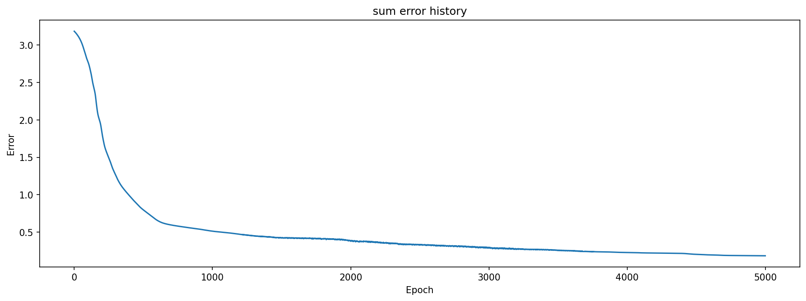
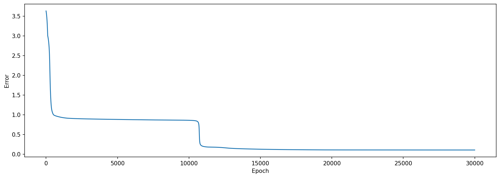
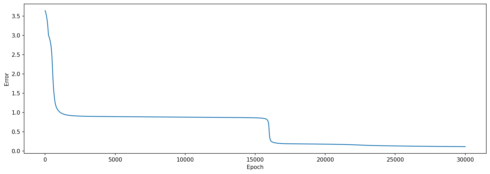
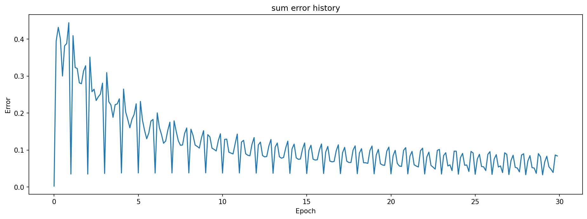

## towards_few_shot_learning
Jupyter notebook with some steps towards few shot learning


```python
%%writefile _code_.py


NN2_file_identifier = '_' + str(do_batch_training) + '_' + str(hidden_size) # used for the pickle file to reload pretrained files with different parameters

if use_bias:
    NN2_file_identifier += 'b_'
if do_pm:
    NN2_file_identifier += 'pm'
    
if few_shot_more_at_once != 1:
    print('Special few shot configuration, using additional data in every shot. Not the standard understanding of few shot!!!')
if load_mnist:
    print('labels (last two are used for few_shot)', all_labels)
    
#np.seterr(under='ignore', over='ignore')

def sigmoid(x):
    if do_pm:
        return np.tanh(x)
    xx = scale_sigmoid * (x - shift_sigmoid)
    return 1 / (1 + np.exp(-xx)) #* 2 -1

def sigmoid_derivative(x):
    if do_pm:
        return 1-np.tanh(x)**2
    xx = scale_sigmoid * (x - shift_sigmoid)
    return scale_sigmoid * (np.exp(-xx) / (np.exp(-xx) + 1) ** 2)

def transform_01_mp(x):
    return 2*x - 1

def run_load_mnist(show_msg = True, use_test = False, limit_labels = None, only_load_num = None):
    #global inputs, outputs, bbs
    # simelar to https://www.python-course.eu/neural_network_mnist.php
    #image_size = 28 # width and length
    #no_of_different_labels = 10 #  i.e. 0, 1, 2, 3, ..., 9
    #image_pixels = image_size * image_size
    if not load_mnist:
        print('This should not happen!!')
    data_path = "test_few_shot/data/mnist/" # makes it possible to use kernel from jupyter notebook
    
    # speedup loading
    fac = 0.99 / 255
    if not use_emnist:
        try:
            with open(data_path + "pickled_mnist.pkl", "br") as fh:
                (train_data, test_data) = pickle.load(fh)
        except:
            train_data = np.loadtxt(data_path + "mnist_train.csv", 
                                    delimiter=",")
            test_data = np.loadtxt(data_path + "mnist_test.csv", 
                               delimiter=",") 
            with open(data_path + "pickled_mnist.pkl", "bw") as fh:
                pickle.dump((train_data, test_data), fh)
                
        
        if use_test:
            used_imgs = np_array(test_data[:, 1:]) * fac + 0.01
            dataset_name = 'Test dataset'
            used_labels = np_array(test_data[:, :1])
        else:
            used_imgs = np_array(train_data[:, 1:]) * fac + 0.01
            dataset_name = 'Train dataset'
            used_labels = np_array(train_data[:, :1])
    else:
        if use_test:
            dataset_name = 'Test dataset'
            (used_imgs, used_labels) = extract_test_samples('digits')
        else:
            dataset_name = 'Train dataset'
            (used_imgs, used_labels) = extract_training_samples('digits')
        used_imgs = np_array(used_imgs.reshape(-1, 28*28)) * fac + 0.01
        used_labels = used_labels.reshape(-1,1)
        
    if limit_labels is not None:
        new_imgs = []
        new_labels = []
        for i in range(len(used_labels)):
            if int(used_labels[i][0]) in limit_labels:
                new_imgs.append(used_imgs[i].tolist())
                new_labels.append(used_labels[i].tolist())
                if only_load_num is not None and len(new_labels) >= only_load_num:
                    break
        used_imgs = np_array(new_imgs)
        used_labels = np_array(new_labels)
    
    
    if num_outputs == 1:
        used_labels = np.around(1 - np.sign(np.abs(used_labels - label_to_one)))
    elif num_outputs == 10:
        label_transform = np.zeros((10, 10), int)
        np.fill_diagonal(label_transform, 1)
        label_transform = label_transform.tolist()
        used_labels = [label_transform[int(np.around(x[0]))] for x in used_labels]
        used_labels = np_array(used_labels)
#        raise Exception('not yet implementd')
    else:
        raise Exception('not yet implementd')

    inputs = used_imgs[:first_n_to_use]     
    outputs = used_labels[:first_n_to_use]
    bbs = ''
    for l in np.around(outputs):
        bbs += str(int(l[0]))
    if show_msg:
        if num_outputs == 10:
            if verbose > 0:
                print('loaded mnist', dataset_name,' with 10 labels', limit_labels)
        else:
            print('loaded mnist', dataset_name,' with output labels ',label_to_one,' resulting in learning labels', bbs[:10], '....')
    if len(bbs) > 50:
        bbs = 'to long to plot'
    if do_pm:
        inputs = transform_01_mp(inputs)
        outputs = transform_01_mp(outputs)
    return (inputs, outputs, bbs)


if load_mnist:
    (inputs, outputs, bbs) = run_load_mnist()
else:
    if do_pm: # prepare the fixed inputs, load_mnist does it in the function
        inputs = transform_01_mp(inputs)
        outputs = transform_01_mp(outputs)


vertical_distance_between_layers = 6
horizontal_distance_between_neurons = 2
neuron_radius = 0.5
neuron_scale_line = 2.0
number_of_neurons_in_widest_layer = 4
class Neuron():
    def __init__(self, x, y):
        self.x = x
        self.y = y

    def draw(self, v):
        if v > 0:
            circle = pyplot.Circle((self.x, self.y), radius=neuron_radius, fill=False, color='green', linewidth = 3)
        else:
            circle = pyplot.Circle((self.x, self.y), radius=neuron_radius, fill=False, color='gray', linewidth = 3)
        pyplot.gca().add_patch(circle)

class Layer():
    def __init__(self, network, number_of_neurons, weights, bias, values, slow_learning):
        self.previous_layer = self.__get_previous_layer(network)
        self.y = self.__calculate_layer_y_position()
        self.neurons = self.__intialise_neurons(number_of_neurons)
        self.weights = weights
        if weights is not None:
            self.stability = np.zeros(weights.shape)
        self.drop_weights = None
        self.bias = bias
        self.values = values
        self.slow_learning = slow_learning

    def __intialise_neurons(self, number_of_neurons):
        neurons = []
        x = self.__calculate_left_margin_so_layer_is_centered(number_of_neurons)
        for iteration in range(number_of_neurons):
            neuron = Neuron(x, self.y)
            neurons.append(neuron)
            x += horizontal_distance_between_neurons
        return neurons

    def __calculate_left_margin_so_layer_is_centered(self, number_of_neurons):
        return horizontal_distance_between_neurons * (number_of_neurons_in_widest_layer - number_of_neurons) / 2

    def __calculate_layer_y_position(self):
        if self.previous_layer:
            return self.previous_layer.y + vertical_distance_between_layers
        else:
            return 0

    def __get_previous_layer(self, network):
        if len(network.layers) > 0:
            return network.layers[-1]
        else:
            return None

    def __line_between_two_neurons(self, neuron1, neuron2, linewidth, graylevel = None, usage = None):
        angle = atan((neuron2.x - neuron1.x) / float(neuron2.y - neuron1.y))
        if graylevel is None:
            nr = neuron_radius * neuron_scale_line
        else:
            nr = neuron_radius * 1.4
        x_adjustment = nr * sin(angle)
        y_adjustment = nr * cos(angle)
        line_x_data = (neuron1.x - x_adjustment, neuron2.x + x_adjustment)
        line_y_data = (neuron1.y - y_adjustment, neuron2.y + y_adjustment)
        if linewidth > 0:
            c = 'green'
        else:
            c = 'red'
        
        lw = linewidth * scale_linewidth
        if graylevel is not None:
            #graylevel = (graylevel +1)/2
            if graylevel < 0: graylevel = 0
            if graylevel > 1: graylevel = 1
            c = (0, 0, 1, graylevel)
            lw = linewidth
        if usage is not None:
            #graylevel = (graylevel +1)/2
            if usage < 0: usage = 0
            if usage > 1: usage = 1
            c = (1, 1- usage / 3, 1 - usage)
            lw = linewidth
            
        line = pyplot.Line2D(line_x_data, line_y_data, linewidth=np.abs(lw), color = c)
        pyplot.gca().add_line(line)

    def draw(self, usage):
        for this_layer_neuron_index in range(len(self.neurons)):
            neuron = self.neurons[this_layer_neuron_index]
            neuron.draw(round(self.values[this_layer_neuron_index]))
            if self.previous_layer:
                for previous_layer_neuron_index in range(len(self.previous_layer.neurons)):
                    previous_layer_neuron = self.previous_layer.neurons[previous_layer_neuron_index]
                    weight = self.previous_layer.weights[previous_layer_neuron_index, this_layer_neuron_index]
                    stability = self.previous_layer.stability[previous_layer_neuron_index, this_layer_neuron_index]
                    used = 0
                    if weight > 0:
                        used = self.previous_layer.values[previous_layer_neuron_index] * self.values[this_layer_neuron_index]
                    else:
                        used = self.previous_layer.values[previous_layer_neuron_index] * (1 - self.values[this_layer_neuron_index])
                                                              
                    #print("connection %2d %2d    %6.3f    %6.3f    %6.3f    %6.3f used: %6.3f" % (previous_layer_neuron_index, this_layer_neuron_index, self.previous_layer.values[previous_layer_neuron_index], self.values[this_layer_neuron_index], weight, stability, used))
                    if usage:
                        self.__line_between_two_neurons(neuron, previous_layer_neuron, 4, usage = used)
                    else:
                        if use_stability:
                            self.__line_between_two_neurons(neuron, previous_layer_neuron, 4, stability)
                        else:
                            self.__line_between_two_neurons(neuron, previous_layer_neuron, 4, 0.3)
                    self.__line_between_two_neurons(neuron, previous_layer_neuron, weight)
                    
    def backward(self, post_error):
        
        error_between_sigmoid_and_full = post_error * sigmoid_derivative(self.between_full_sigmoid) # post layer may be wrong!!!!!!!!
        
        pre_error = np.dot(error_between_sigmoid_and_full, self.weights.T) 
        d_weights = np.dot(self.values.T, error_between_sigmoid_and_full) / len(post_error) # scale learning rate per input
        d_bias = np.sum(error_between_sigmoid_and_full, axis = 0) /len(post_error) 
        
        self.change_weights(d_weights, d_bias)
        return pre_error
    
    def forward(self, pre_layer, dostability):
        self.values = pre_layer
        if self.weights is None:
            return pre_layer
        self.between_full_sigmoid = np.dot(pre_layer, self.weights)
        if use_bias:
            self.between_full_sigmoid += self.bias
        post_layer = sigmoid(self.between_full_sigmoid)
        if dostability:
            post_l = np.expand_dims(post_layer,-2)
            pre_l_2d = np.expand_dims(pre_layer, -2)
            
            # this is necessary if 0 1 neurons are used, not if -1 1 ones
            post_l = transform_01_mp(post_l)
            pre_l = transform_01_mp(pre_l_2d)
            
            #print(np.transpose(post_l[2]), pre_l[2])
            stability = (np.tanh(scale_for_neuron_diff * np.matmul(pre_l.swapaxes(-1,-2), post_l)) * np.tanh(self.weights / weight_tanh_scale) + 1) / 2
            stability = pre_l_2d.swapaxes(-1,-2) * stability # only active inputs count for stability
            if len(stability.shape) == 2:
                stability = np.expand_dims(stability, 0) # handle single and multi inputs
            stability = np.sum(stability, axis = 0) / len(stability)
            #print(stability)
            #self.stability = stability_mean * pre_layer.T * stability + (1 - stability_mean * pre_layer.T) * self.stability
            self.stability = stability_mean * stability + (1 - stability_mean) * self.stability
        return post_layer
        
    def change_weights(self, d_weights, d_bias):
        if use_stability:
            direct = 1 - self.stability
        else:
            direct = np_array([1])
        #print('direct', direct)
        self.weights += d_weights * lr * direct * self.slow_learning
        self.bias +=  d_bias *lr * np.sum(direct, axis = 0) * self.slow_learning
        np.clip(self.weights, -clip_weights, clip_weights, self.weights)
        np.clip(self.bias, -clip_bias, clip_bias, self.bias)
        if self.drop_weights is not None:
            self.weights *= self.drop_weights
            
        
class DrawNet():
    def __init__(self):
        self.layers = []
        self.epoch_list = []
        self.error_history = []
        self.error = None

        # batch handling, as cuda might not have enough memory to hold all inputs
        self.all_input = None
        self.all_output = None
        self.batch_pos = None
        self.batch_size = None
        
    def add_layer(self, number_of_neurons, weights, bias, values, slow_learning = 1):
        layer = Layer(self, number_of_neurons, weights, bias, values, slow_learning)
        self.layers.append(layer)
    
    def forward(self, dostability = False):
        outp = self.layers[0].values
        for layer in self.layers:
            outp = layer.forward(outp, dostability)
        #self.layers[-1].values = outp
        self.error = self.y - self.layers[-1].values
        if check_for_nan:
            if np.any(np.isnan(self.error)):
                print('nan')
        return outp
    
    def backward(self):
        #self.error = pre_error = self.y - self.layers[-1].values # forward must be called first anyway
        pre_error = self.error
        for layer in reversed(self.layers[:-1]):
            #print('pre_error', pre_error.flatten())
            pre_error = layer.backward(pre_error)
        return pre_error
    
    def train(self, epochs=1000):
        self.epochs = epochs # just to know how it was trained for output
        self.error_history = []
        self.epoch_list = []
        for epoch in tqdm(range(epochs), mininterval = 10, disable=disable_progressbar):
            # flow forward and produce an output
            self.forward(True)
            # go back though the network to make corrections based on the output
            self.backward()
            self.next_batch()
            # keep track of the error history over each epoch
            self.error_history.append(np.sum(np.square(self.error)))
            self.epoch_list.append(epoch)
        self.forward() # to update the output layer, if one needs to print infos...
    
    def plot_train_history(self):
        pyplot.figure(figsize=(15,5))
        pyplot.plot(self.epoch_list, self.error_history)
        pyplot.xlabel('Epoch')
        pyplot.ylabel('Error')
        pyplot.show()
        pyplot.close()

    def set_input(self, new_input, new_output, batch_size = None):
        self.all_input = new_input
        self.all_output = new_output
        self.batch_size = batch_size
        if batch_size is not None:
            self.layers[0].values = new_input[:batch_size]
            self.y = new_output[:batch_size]
        else:
            self.layers[0].values = new_input
            self.y = new_output
        self.batch_pos = self.batch_size
        
    def next_batch(self):
        if self.batch_size is not None:
            self.layers[0].values = self.all_input[self.batch_pos : self.batch_pos+self.batch_size]
            self.y = self.all_output[self.batch_pos : self.batch_pos+self.batch_size]
            # if len(self.y) == 0:
            #     self.batch_pos = self.batch_size
            #     self.layers[0].values = self.all_input[:self.batch_pos]
            #     self.y = self.all_output[:self.batch_pos]
            if len(self.y) < self.batch_size:
                self.batch_pos = self.batch_size - len(self.y)
                self.layers[0].values = np.concatenate((self.layers[0].values, self.all_input[:self.batch_pos]))
                self.y = np.concatenate((self.y, self.all_output[:self.batch_pos]))
            else:
                self.batch_pos += self.batch_size
            
            
    def draw(self, result = None, usage = False, display_title = None):
        c = 0
        for layer in self.layers:
            c+=1
            #print('layer',c)
            layer.draw(usage)
        if result is not None:
            if result[0] > 0:
                circle = pyplot.Circle((self.layers[-1].neurons[0].x, self.layers[-1].neurons[0].y), radius=neuron_radius+0.3, fill=False, color='green', linewidth = 3)
            else:
                circle = pyplot.Circle((self.layers[-1].neurons[0].x, self.layers[-1].neurons[0].y), radius=neuron_radius+0.3, fill=False, color='gray', linewidth = 3)
            pyplot.gca().add_patch(circle)
        pyplot.axis('scaled')
        if display_title is not None:
            pyplot.title(display_title)
        pyplot.show()
        pyplot.close()
        
    def predict(self, new_input, oo = None, drawit=False, usage = False, display_title = None):
        self.set_input(new_input, oo)
        prediction = self.forward(False)
        if oo is not None:
            self.error = oo - prediction
        if drawit:
            self.draw(oo, usage, display_title)
        return prediction
    
    def count_parameters(self):
        count = 0
        drops = 0
        for l in self.layers:
            if l.weights is not None:
                count += l.weights.size
                if use_bias:
                    count += l.bias.size
                if l.drop_weights is not None:
                    drops += l.drop_weights.size - np.sum(l.drop_weights)
        return count, drops

def setup_net():
    NN2 = DrawNet()
    input_len = len(inputs[0])
    if test_from_random_input:
        input_len = i_bits
    NN2.add_layer(input_len, init_rand_ampl0 * np_array(np.random.rand(input_len, hidden_size) - 0.5), init_rand_ampl0 * np_array(np.random.rand(hidden_size) - 0.5), None, slow_learning = initial_net_first_layer_slow_learning)
    if two_hidden_layers:
        NN2.add_layer(hidden_size, init_rand_ampl * np_array(np.random.rand(hidden_size, hidden_size) - 0.5), init_rand_ampl * np_array(np.random.rand(hidden_size) - 0.5), None)
    NN2.add_layer(hidden_size, init_rand_ampl * np_array(np.random.rand(hidden_size, num_outputs)- 0.5), init_rand_ampl * np_array(np.random.rand(num_outputs) - 0.5), None)
    NN2.add_layer(num_outputs, None, None, None)
    NN2.set_input(inputs, outputs)
    count_drops = 0
    for l in range(len(do_drop_weights)):
        if do_drop_weights[l] > 0:
            NN2.layers[l].drop_weights = np.random.rand(NN2.layers[l].weights.size).reshape(NN2.layers[l].weights.shape) > do_drop_weights[l]
            count_drops += NN2.layers[l].drop_weights.size - np.sum(NN2.layers[l].drop_weights)
    num_params, count_drops = NN2.count_parameters()
    if verbose > 0:
        print('Network parameters: ', num_params, 'dropped', count_drops, 'real parameters', num_params - count_drops, 'drop definition', do_drop_weights)
    
    return NN2


def creat_output_from_int(bb, length=8):
    output = [0]*length
    bbs = ('{0:0'+str(length)+'b}').format(bb)
    for l in range(len(bbs)): 
        if bbs[l] =='1':
            output[l] = [1]
        else:
            output[l] = [0]
    output = np_array(output)
    if do_pm:
        output = transform_01_mp(output)
    return output, bbs

if do_check_all > 0:
    # checks all possible input output combinations to check, if the neural net is capable of learning in
    notok = 0
    sum_error_history = None
    for bb in range(0, check_output_limit):
        # bbs = '{0:08b}'.format(bb)
        # for l in range(len(bbs)): 
        #     if bbs[l] =='1':
        #         outputs[l] = 1
        #     else:
        #         outputs[l] = 0
        (outputs, bbs) = creat_output_from_int(bb)
        NN2 = setup_net()
        NN2.train(do_check_all)
        err = np.sum(NN2.error**2)
        ok = '*'
        if err < 0.2: 
            ok = ' '
        else:
            notok += 1
        if sum_error_history is None:
            sum_error_history = np_array(NN2.error_history)
        else:
            sum_error_history += np_array(NN2.error_history)
        if verbose > 1:
            #print(bbs, '{0:5.3f}'.format(float(err)),ok,notok)
            pyplot.figure(figsize=(15,5))
            pyplot.plot(NN2.epoch_list, NN2.error_history)
            pyplot.xlabel('Epoch')
            pyplot.ylabel('Error')
            pyplot.title(bbs)
            pyplot.show()
            pyplot.close()
        print("Label %8s error %6.3f" % (bbs, err), ok, "total fails yet:", notok)
    pyplot.figure(figsize=(15,5))
    pyplot.plot(NN2.epoch_list, (sum_error_history / check_output_limit).tolist())
    pyplot.xlabel('Epoch')
    pyplot.ylabel('Error')
    pyplot.title('sum error history')
    pyplot.show()
    pyplot.close()


        

# train neural network
#NN2.train()

#testing single inputs for few shot learning
askuser = True
stopit = False
few_shot = (multi_test > 0)


#NN2 = setup_net()
sum_error_history = None
if do_batch_training > 0:
    loaded_pretrained = False
    if try_load_pretrained:
        try:
            with open("pickled_NN2" + NN2_file_identifier + ".pkl", "br") as fh:
                NN2 = pickle.load(fh)
            num_params, count_drops = NN2.count_parameters()
            print('Network parameters: ', num_params, 'dropped', count_drops, 'real parameters', num_params - count_drops, 'drop definition', do_drop_weights)
            loaded_pretrained = True
            print('loaded pretrained net !!!!!!!!!!!!!!!!!!!!!!!!!!!!')
        except Exception as e:
            print('loading pretrained NN2 failed:', e)
            NN2 = setup_net()
    else:
        NN2 = setup_net()    
    if try_mnist_few_shot > 0:
        if loaded_pretrained:
            (inputs, outputs, bbs) = run_load_mnist(limit_labels= all_labels[:-2], only_load_num=few_shot_fast_load_num)
        else:
            (inputs, outputs, bbs) = run_load_mnist(limit_labels= all_labels[:-2])
    NN2.set_input(inputs, outputs, batch_size=1000)
    if not loaded_pretrained:
        try:
            print('start', datetime.now().strftime("%H:%M:%S"))
            NN2.train(do_batch_training)
            print('end', datetime.now().strftime("%H:%M:%S"))
            with open("pickled_NN2" + NN2_file_identifier + ".pkl", "bw") as fh:
                pickle.dump(NN2, fh)
        except KeyboardInterrupt:
            print('Interrupted by keyboard')
    NN2.forward() # most of the time, this should result in an OK net, but not safe, as train could be interrupted at any position
    pyplot.figure(figsize=(15,5))
    pyplot.plot(NN2.epoch_list, (np_array(NN2.error_history) / len(NN2.error)).tolist())
    pyplot.xlabel('Batches')
    pyplot.ylabel('Error')
    pyplot.title('trained with epochs: ' + str(NN2.epochs))
    pyplot.show()
    pyplot.close()
    
    if num_outputs == 1:
        print('train', len(outputs), 'batch_size', NN2.batch_size, '1', int(np.sum(NN2.y > 0.5)), 'wrong', int(np.sum((NN2.y > 0.5) * (NN2.error**2 > 0.25))), 'Ratio', int(np.sum((NN2.y > 0.5) * (NN2.error**2 > 0.25))) / int(np.sum(NN2.y > 0.5)), 'Error', float(np.sum(NN2.error**2) / len(NN2.error)))
    else:
        print('train', len(outputs), 'batch_size', NN2.batch_size, 'correct', float((NN2.layers[-1].values.argmax(axis = 1) == NN2.y.argmax(axis=1)).sum()), 'of', len(NN2.y), 'Ratio', float((NN2.layers[-1].values.argmax(axis = 1) == NN2.y.argmax(axis=1)).sum()) / len(NN2.y), 'Error', float(np.sum(NN2.error**2) / len(NN2.error)))
    
    if try_mnist_few_shot > 0:
        (inputs, outputs, bbs) = run_load_mnist(use_test = True,limit_labels=all_labels[:-2], only_load_num=few_shot_fast_load_num)
    else:
        (inputs, outputs, bbs) = run_load_mnist(use_test = True)
        
    NN2.set_input(inputs, outputs, batch_size=1000)
    NN2.forward()
    if num_outputs == 1:
        print('test ', len(outputs), 'batch_size', NN2.batch_size, '1', int(np.sum(NN2.y > 0.5)), 'wrong', int(np.sum((NN2.y > 0.5) * (NN2.error**2 > 0.25))), 'Ratio', int(np.sum((NN2.y > 0.5) * (NN2.error**2 > 0.25))) / int(np.sum(NN2.y > 0.5)), 'Error', float(np.sum(NN2.error**2) / len(NN2.error)))
    else:
        print('test', len(outputs), 'batch_size', NN2.batch_size, 'correct', float((NN2.layers[-1].values.argmax(axis = 1) == NN2.y.argmax(axis=1)).sum()), 'of', len(NN2.y), 'Ratio', float((NN2.layers[-1].values.argmax(axis = 1) == NN2.y.argmax(axis=1)).sum()) / len(NN2.y), 'Error', float(np.sum(NN2.error**2) / len(NN2.error)))

    print('Testing if new lables were not learned !!!!!!!!!')
    if try_mnist_few_shot > 0:
        (inputs, outputs, bbs) = run_load_mnist(use_test = True,limit_labels=all_labels[-2:], only_load_num=few_shot_fast_load_num)
    else:
        (inputs, outputs, bbs) = run_load_mnist(use_test = True)
        
    NN2.set_input(inputs, outputs, batch_size=1000)
    NN2.forward()
    if num_outputs == 1:
        print('new  ', len(outputs), 'batch_size', NN2.batch_size, '1', int(np.sum(NN2.y > 0.5)), 'wrong', int(np.sum((NN2.y > 0.5) * (NN2.error**2 > 0.25))), 'Ratio', int(np.sum((NN2.y > 0.5) * (NN2.error**2 > 0.25))) / int(np.sum(NN2.y > 0.5)), 'Error', float(np.sum(NN2.error**2) / len(NN2.error)))
    else:
        print('new  ', len(outputs), 'batch_size', NN2.batch_size, 'correct', float((NN2.layers[-1].values.argmax(axis = 1) == NN2.y.argmax(axis=1)).sum()), 'of', len(NN2.y), 'Ratio', float((NN2.layers[-1].values.argmax(axis = 1) == NN2.y.argmax(axis=1)).sum()) / len(NN2.y), 'Error', float(np.sum(NN2.error**2) / len(NN2.error)))

    # now try a few shot learning for some steps
    # load with labels [8,9] and train every to a measure
    #
    # criteria label correct: (NN2.layers[-1].values.argmax(axis = 1) == NN2.y.argmax(axis=1))[0] true
    # distance to second largest label
    # biggest_two = np.partition(NN2.layers[-1].values[0], -2)[-2:]
    # ratio = biggest_two[-1] / [-2] > threshold
    
    # max_iter is the maximal number of try's to optimize one data point in few_shot
    pos_1 = 0
    pos_2 = 0
    try:
        print('few shot accuracy results')
        print('shot     try       old labels            new labels  new labels (forced)              over all')
        for i_shot in range(try_mnist_few_shot): # some shots
            if change_first_layers_slow_learning is not None:
                for l in range(len(change_first_layers_slow_learning)):
                    before = NN2.layers[l].slow_learning
                    NN2.layers[l].slow_learning = change_first_layers_slow_learning[l]
                    if verbose > 0:
                        print('slow learning of layer',l,'changed from', before, 'to', NN2.layers[l].slow_learning)
            before = lr
            lr = lr_few_shot
            if verbose > 0:
                print('\n',i_shot + 1,'. shot --- lr changed from',before,'to', lr)
            (inputs, outputs, bbs) = run_load_mnist(use_test = False)
            few1 = all_labels[-2]
            few2 = all_labels[-1]
            while outputs[pos_1].argmax() != few1:
                pos_1 += 1
            while outputs[pos_2].argmax() != few2:
                pos_2 += 1
            inp_1 = inputs[pos_1:pos_1+few_shot_more_at_once]
            outp_1 = outputs[pos_1:pos_1+few_shot_more_at_once]
            inp_2 = inputs[pos_2:pos_2+few_shot_more_at_once]
            outp_2 = outputs[pos_2:pos_2+few_shot_more_at_once]
            pos_1 += few_shot_more_at_once # prepare the next shot
            pos_2 += few_shot_more_at_once
            for m in range(use_every_shot_n_times):
                for (inp,outp) in [(inp_1,outp_1), (inp_2,outp_2)]:
                    if verbose > 0:
                        print('start training', outp)
                    epoch = 0
                    NN2.set_input(inp, outp)
                    while epoch < few_shot_max_try:
                        NN2.forward()
                        NN2.backward()
                        # criterium for stopping is only used for the first element, which is the one few shot is done for. The other elements are not checked, but only used for stabilizing old learned data
                        if (NN2.layers[-1].values.argmax(axis = 1) == NN2.y.argmax(axis=1))[0]:
                            biggest_two = np.partition(NN2.layers[-1].values[0], -2)[-2:]
                            if do_pm:
                                ratio = (biggest_two[-1] + 1) / (biggest_two[-2] + 1) / 2 # do_pm means rsults between -1 and 1
                            else:
                                ratio = biggest_two[-1] / biggest_two[-2]
                            if verbose > 0:
                                print(biggest_two, ratio)
                            if ratio > few_shot_threshold_ratio and biggest_two[-1] > few_shot_threshold:
                                break
                if verbose > 0:
                    print('Results after few shot', i_shot + 1, 'used the ', m + 1, '. time')
                    (inputs, outputs, bbs) = run_load_mnist(use_test = False,limit_labels=all_labels[:-2], only_load_num=few_shot_fast_load_num)
                    NN2.set_input(inputs, outputs, batch_size=1000)
                    NN2.forward()
                    print('outputs', len(outputs), 'batch_size', NN2.batch_size, 'few1:', np.sum(NN2.layers[-1].values.argmax(axis = 1) == few1), 'few2:', np.sum(NN2.layers[-1].values.argmax(axis = 1) == few2), 'correct', float((NN2.layers[-1].values.argmax(axis = 1) == NN2.y.argmax(axis=1)).sum()), 'of', len(NN2.y), 'Ratio', float((NN2.layers[-1].values.argmax(axis = 1) == NN2.y.argmax(axis=1)).sum()) / len(NN2.y), 'Error', float(np.sum(NN2.error**2) / len(NN2.error)))
                    (inputs, outputs, bbs) = run_load_mnist(use_test = False,limit_labels=all_labels[-2:], only_load_num=few_shot_fast_load_num)
                    NN2.set_input(inputs, outputs, batch_size=1000)
                    NN2.forward()
                    print('outputs', len(outputs), 'batch_size', NN2.batch_size, 'few1:', np.sum(NN2.layers[-1].values.argmax(axis = 1) == few1), 'few2:', np.sum(NN2.layers[-1].values.argmax(axis = 1) == few2), 'correct', float((NN2.layers[-1].values.argmax(axis = 1) == NN2.y.argmax(axis=1)).sum()), 'of', len(NN2.y), 'Ratio', float((NN2.layers[-1].values.argmax(axis = 1) == NN2.y.argmax(axis=1)).sum()) / len(NN2.y), 'Error', float(np.sum(NN2.error**2) / len(NN2.error)))
                (inputs, outputs, bbs) = run_load_mnist(use_test = True,limit_labels=all_labels[:-2], only_load_num=few_shot_fast_load_num)
                NN2.set_input(inputs, outputs, batch_size=1000)
                NN2.forward()
                acc_only_old_labels = float((NN2.layers[-1].values.argmax(axis = 1) == NN2.y.argmax(axis=1)).sum()) / len(NN2.y)
                if verbose > 0:
                    print('outputs', len(outputs), 'batch_size', NN2.batch_size, 'few1:', np.sum(NN2.layers[-1].values.argmax(axis = 1) == few1), 'few2:', np.sum(NN2.layers[-1].values.argmax(axis = 1) == few2), 'correct', float((NN2.layers[-1].values.argmax(axis = 1) == NN2.y.argmax(axis=1)).sum()), 'of', len(NN2.y), 'Ratio', float((NN2.layers[-1].values.argmax(axis = 1) == NN2.y.argmax(axis=1)).sum()) / len(NN2.y), 'Error', float(np.sum(NN2.error**2) / len(NN2.error)))
                (inputs, outputs, bbs) = run_load_mnist(use_test = True,limit_labels=all_labels[-2:], only_load_num=few_shot_fast_load_num)
                NN2.set_input(inputs, outputs, batch_size=1000)
                NN2.forward()
                acc_only_new_labels = float((NN2.layers[-1].values.argmax(axis = 1) == NN2.y.argmax(axis=1)).sum()) / len(NN2.y)
                if verbose > 0:
                    print('outputs', len(outputs), 'batch_size', NN2.batch_size, 'few1:', np.sum(NN2.layers[-1].values.argmax(axis = 1) == few1), 'few2:', np.sum(NN2.layers[-1].values.argmax(axis = 1) == few2), 'correct', float((NN2.layers[-1].values.argmax(axis = 1) == NN2.y.argmax(axis=1)).sum()), 'of', len(NN2.y), 'Ratio', float((NN2.layers[-1].values.argmax(axis = 1) == NN2.y.argmax(axis=1)).sum()) / len(NN2.y), 'Error', float(np.sum(NN2.error**2) / len(NN2.error)))
                
                # here only the few_shot trained lables are considdered
                res_values = NN2.layers[-1].values
                mask = [0] * len(all_labels)
                for l in all_labels[-2:]:
                    mask[l] = 1
                mask = np_array([mask])
                res_values = res_values * mask
                # deb = float((res_values.argmax(axis = 1) == NN2.y.argmax(axis=1)).sum())
                acc_only_new_labels_forced = float((res_values.argmax(axis = 1) == NN2.y.argmax(axis=1)).sum()) / len(NN2.y)
                if verbose > 0:
                    print('using only the few shot trained labels for possible output of neural net')
                    print('outputs', len(outputs), 'batch_size', NN2.batch_size, 'few1:', np.sum(res_values.argmax(axis = 1) == few1), 'few2:', np.sum(res_values.argmax(axis = 1) == few2), 'correct', float((res_values.argmax(axis = 1) == NN2.y.argmax(axis=1)).sum()), 'of', len(NN2.y), 'Ratio', float((res_values.argmax(axis = 1) == NN2.y.argmax(axis=1)).sum()) / len(NN2.y), 'Error', float(np.sum(NN2.error**2) / len(NN2.error)))
                
                
                
                (inputs, outputs, bbs) = run_load_mnist(use_test = True, only_load_num=few_shot_fast_load_num)
                NN2.set_input(inputs, outputs, batch_size=1000)
                NN2.forward()
                acc_only_overall_labels = float((NN2.layers[-1].values.argmax(axis = 1) == NN2.y.argmax(axis=1)).sum()) / len(NN2.y)
                if verbose > 0:
                    print('outputs', len(outputs), 'batch_size', NN2.batch_size, 'few1:', np.sum(NN2.layers[-1].values.argmax(axis = 1) == few1), 'few2:', np.sum(NN2.layers[-1].values.argmax(axis = 1) == few2), 'correct', float((NN2.layers[-1].values.argmax(axis = 1) == NN2.y.argmax(axis=1)).sum()), 'of', len(NN2.y), 'Ratio', float((NN2.layers[-1].values.argmax(axis = 1) == NN2.y.argmax(axis=1)).sum()) / len(NN2.y), 'Error', float(np.sum(NN2.error**2) / len(NN2.error)))
                print("%4d    %3d           %7.3f               %7.3f              %7.3f               %7.3f" % (i_shot + 1, m + 1, acc_only_old_labels, acc_only_new_labels, acc_only_new_labels_forced, acc_only_overall_labels))
    except KeyboardInterrupt:
        print('Interrupted')
else:
    NN2 = setup_net()

multi = 0
while multi <= multi_test:
    # tries to do a few shot learning multiple times and checks, how fast it is learned
    # initializes the last layer weights when the label is changed
    pos_under_few_shot = 0
    if test_from_random_input:
        inp = []
        while len(inp) < 8:
            r = random.randrange(0,2**i_bits-1)
            if r not in inp:
                inp.append(r)
        inputs = []
        for bb in inp:
            v= [0]*i_bits
            bbs = ('{0:0'+str(i_bits)+'b}').format(bb)
            for l in range(len(bbs)): 
                if bbs[l] =='1':
                    v[l] = 1
                else:
                    v[l] = 0
            inputs.append(v)
        inputs = np_array(inputs)
    if not load_mnist:
        (outputs, bbs) = creat_output_from_int(random.randrange(0,check_output_limit - 1)) # first output always 0, as sigmoid network is not capable of outputting 1 here
        disp_label = bbs
    else:
        label_to_one = random.randrange(0, 9) # change the label used
        run_load_mnist(False)
        disp_label = label_to_one
        
    # reset weights in the last layer
    NN2.layers[-2].weights = init_rand_ampl * np_array(np.random.rand(hidden_size, 1)- 0.5)
    NN2.layers[-2].bias = init_rand_ampl * np_array(np.random.rand(1)- 0.5)

    NN2.set_input(inputs, outputs)
    # used to reset whole NN every time
    #NN2 = setup_net()

    error_history = []
    epoch_list = []
    epoch = 0
    while epoch < max_iter:
        for i in range(len(inputs)):
            same = True
            first = True
            fl = 0
            while same:
                if not few_shot:
                    same = False
                if askuser and multi_test == 0:
                    same = True
                    NN2.predict(inputs[i], outputs[i], True, usage = False)
                    # t = '3' 
                    doask = True
                    while doask:
                        doask = False
                        t = input(str(i)+' '+str(NN2.error)+' (1: same, 2:next, 3:stop asking, 4:exit, 5:few_shot, 6: change max epoch num)?')
                        if t.isdigit():
                            t = int(t)
                            if t == 2:
                                same = False
                                break
                            if t == 3:
                                askuser = False
                                same = False
                            if t == 4:
                                stopit = True
                                break
                            if t == 5:
                                few_shot = True
                                askuser = False
                            if t == 6:
                                max_iter = int(input('change max epoch num ' + str(max_iter) + ' '))
                                doask = True
                NN2.set_input(inputs[i:i+1], outputs[i:i+1])
                NN2.forward(dostability = first)
                NN2.backward()
                first = False
                this_error = sum(np.square(NN2.error))
                if this_error[0] > few_shot_end:
                    pos_under_few_shot = epoch + 1
                if len(epoch_list) == 0 or (len(epoch_list) > 0 and epoch_list[-1] != epoch + i / len(inputs)):
                    epoch_list.append(epoch + i / len(inputs))
                    error_history.append(this_error)
                fl += 1
                if fl > few_shot_max_try:
                    break
                if few_shot:
                    if abs(NN2.error[0]) < few_shot_end:
                        break
            if stopit:
                break
        if stopit:
            break
        NN2.set_input(inputs, outputs)
        NN2.forward()
        err = outputs - NN2.layers[-1].values
        NN2.predict(inputs[0], outputs[0], multi_test == 0, display_title = str(epoch)+': '+'{0:6.3f}'.format(float(np.sum(err**2))))
        epoch += 1
    

    if multi_test == 0:
        for i in range(len(inputs)):
            print(NN2.predict(inputs[i], outputs[i], drawit= (multi_test > 0), usage = True), 'correct', outputs[i])
    
    # plot the error over the entire training duration
    if sum_error_history is None:
        sum_error_history = np_array(error_history)
    else:
        sum_error_history += np_array(error_history)
    if verbose > 0:
        pyplot.figure(figsize=(15,5))
        pyplot.plot(epoch_list, error_history)
        pyplot.xlabel('Epoch')
        pyplot.ylabel('Error')
        pyplot.title(str(multi)+ ' ' + bbs)
        pyplot.show()
        pyplot.close()
    
    print("%3d Label %3s Error %6.3f     Ready %3d" % (multi, str(disp_label), np.sum(np_array(error_history[-8:])), pos_under_few_shot))
    multi += 1
if sum_error_history is not None:
        pyplot.figure(figsize=(15,5))
        pyplot.plot(epoch_list, (sum_error_history / multi_test).tolist())
        pyplot.xlabel('Epoch')
        pyplot.ylabel('Error')
        pyplot.title('sum error history')
        pyplot.show()
        pyplot.close()

```

    Overwriting _code_.py


```python
#import cupy as np # helps with the math (Cuda supported: faster for hidden_size > 256 probably and most mnist cases with batch training)
import numpy as np # helps with the math (if no Cuda is availible or size is small for simple tests)
from matplotlib import pyplot
from math import cos, sin, atan
import random
import pickle
from datetime import datetime
from tqdm import tqdm
from emnist import extract_training_samples, extract_test_samples

def np_array(x):
    return np.array(x)# , dtype = np.float32) # float32 is 3 times faster on batch training with GTX1070Ti and 70 times faster than i7-4790K with float64, cpu does not help float32 a lot)
check_for_nan = True

pyplot.rcParams['figure.dpi'] = 150
pyplot.interactive(False) # seems not to fix memory issue

verbose = 0

do_check_all = 500000 #1000            # 0 to turn off
check_output_limit = 128        # number of output combinations, as not every neural net is capable of learning input 0 0 0 -> output 1, if 128 the output to the first input is always 0    

multi_test = -1 #1000             # -1 to turn off
max_iter = 30

hidden_size = 8
two_hidden_layers = True
use_bias = False

lr = 2
lr_few_shot = 0.5
use_stability = False
stability_mean = 0.1
clip_weights = 1 # (clipping to 1 was used for most tests)
clip_bias = 1
init_rand_ampl = 0.1
init_rand_ampl0 = 0.1 # for first layer    (2 was used for most tests to make the first layer a mostly random layer)

# drawing parameters
scale_linewidth = 0.1
weight_tanh_scale = 0.1
scale_for_neuron_diff = 1

scale_sigmoid = 3
shift_sigmoid = 1

few_shot_end = 0.7 # for early tests (no mnist)
few_shot_max_try = 100
few_shot_threshold_ratio = 1.5 # for mnist
few_shot_threshold = 0.3

# if 1 it is standard understanding of few shot learning, giving on data point at each shot, otherwize it adds more data points from availible training data to each shot
few_shot_more_at_once = 1


all_labels = [0, 1, 9, 3, 4, 5, 6, 7, 8, 2]
# random.shuffle(all_labels)    # if shuffeld, preloading can not work !!!!!

try_load_pretrained = False
few_shot_fast_load_num = 4000 # should also handle the batch_sizes for displaying batch training results properly

test_from_random_input = False
i_bits = 8

# input data
inputs = np_array([[0, 0, 0],
                   [0, 0, 1],
                   [0, 1, 0],
                   [0, 1, 1],
                   [1, 0, 0],
                   [1, 0, 1],
                   [1, 1, 0],
                   [1, 1, 1]])

# output data
outputs = np_array([[0], [0], [1], [0], [1], [1], [0], [1]])

# swith to tanh and making input and output 1 -1 instead of 1 0
do_pm = False

use_emnist = False
load_mnist = False

do_batch_training = 0
do_drop_weights = [] # [0.9,0.9]
initial_net_first_layer_slow_learning = 0.1 # most tests are done with 0.1 here, just try if it was really necessary

first_n_to_use = 600000
label_to_one = 5

num_outputs = 1 # most early test need this to be 1, later with mnist dataset this can be set to 10 eg.

try_mnist_few_shot = 10
use_every_shot_n_times = 10 # every data is used n times. so one shot means the data from first shot is used n times
change_first_layers_slow_learning = [0.1, 1] # [0, 0.1]

disable_progressbar = True
# End of constant definitions
```


```python
outputs
```


    array([[0],
           [0],
           [1],
           [0],
           [1],
           [1],
           [0],
           [1]])


```python
def bbs_to_output(x):
    res = []
    for c in x:
        res.append([int(c)])
    return np_array(res)
```


```python
%%writefile _code_.py 
# uncomment line before to run in jupyter notebook with command after constant definition


NN2_file_identifier = '_' + str(do_batch_training) + '_' + str(hidden_size) # used for the pickle file to reload pretrained files with different parameters

if use_bias:
    NN2_file_identifier += 'b_'
if do_pm:
    NN2_file_identifier += 'pm'
    
if few_shot_more_at_once != 1:
    print('Special few shot configuration, using additional data in every shot. Not the standard understanding of few shot!!!')
if load_mnist:
    print('labels (last two are used for few_shot)', all_labels)
    
#np.seterr(under='ignore', over='ignore')

def sigmoid(x):
    if do_pm:
        return np.tanh(x)
    xx = scale_sigmoid * (x - shift_sigmoid)
    return 1 / (1 + np.exp(-xx)) #* 2 -1

def sigmoid_derivative(x):
    if do_pm:
        return 1-np.tanh(x)**2
    xx = scale_sigmoid * (x - shift_sigmoid)
    return scale_sigmoid * (np.exp(-xx) / (np.exp(-xx) + 1) ** 2)

def transform_01_mp(x):
    return 2*x - 1

def run_load_mnist(show_msg = True, use_test = False, limit_labels = None, only_load_num = None):
    #global inputs, outputs, bbs
    # simelar to https://www.python-course.eu/neural_network_mnist.php
    #image_size = 28 # width and length
    #no_of_different_labels = 10 #  i.e. 0, 1, 2, 3, ..., 9
    #image_pixels = image_size * image_size
    if not load_mnist:
        print('This should not happen!!')
    data_path = "test_few_shot/data/mnist/" # makes it possible to use kernel from jupyter notebook
    
    # speedup loading
    fac = 0.99 / 255
    if not use_emnist:
        try:
            with open(data_path + "pickled_mnist.pkl", "br") as fh:
                (train_data, test_data) = pickle.load(fh)
        except:
            train_data = np.loadtxt(data_path + "mnist_train.csv", 
                                    delimiter=",")
            test_data = np.loadtxt(data_path + "mnist_test.csv", 
                               delimiter=",") 
            with open(data_path + "pickled_mnist.pkl", "bw") as fh:
                pickle.dump((train_data, test_data), fh)
                
        
        if use_test:
            used_imgs = np_array(test_data[:, 1:]) * fac + 0.01
            dataset_name = 'Test dataset'
            used_labels = np_array(test_data[:, :1])
        else:
            used_imgs = np_array(train_data[:, 1:]) * fac + 0.01
            dataset_name = 'Train dataset'
            used_labels = np_array(train_data[:, :1])
    else:
        if use_test:
            dataset_name = 'Test dataset'
            (used_imgs, used_labels) = extract_test_samples('digits')
        else:
            dataset_name = 'Train dataset'
            (used_imgs, used_labels) = extract_training_samples('digits')
        used_imgs = np_array(used_imgs.reshape(-1, 28*28)) * fac + 0.01
        used_labels = used_labels.reshape(-1,1)
        
    if limit_labels is not None:
        new_imgs = []
        new_labels = []
        for i in range(len(used_labels)):
            if int(used_labels[i][0]) in limit_labels:
                new_imgs.append(used_imgs[i].tolist())
                new_labels.append(used_labels[i].tolist())
                if only_load_num is not None and len(new_labels) >= only_load_num:
                    break
        used_imgs = np_array(new_imgs)
        used_labels = np_array(new_labels)
    
    
    if num_outputs == 1:
        used_labels = np.around(1 - np.sign(np.abs(used_labels - label_to_one)))
    elif num_outputs == 10:
        label_transform = np.zeros((10, 10), int)
        np.fill_diagonal(label_transform, 1)
        label_transform = label_transform.tolist()
        used_labels = [label_transform[int(np.around(x[0]))] for x in used_labels]
        used_labels = np_array(used_labels)
#        raise Exception('not yet implementd')
    else:
        raise Exception('not yet implementd')

    inputs = used_imgs[:first_n_to_use]     
    outputs = used_labels[:first_n_to_use]
    bbs = ''
    for l in np.around(outputs):
        bbs += str(int(l[0]))
    if show_msg:
        if num_outputs == 10:
            if verbose > 0:
                print('loaded mnist', dataset_name,' with 10 labels', limit_labels)
        else:
            print('loaded mnist', dataset_name,' with output labels ',label_to_one,' resulting in learning labels', bbs[:10], '....')
    if len(bbs) > 50:
        bbs = 'to long to plot'
    if do_pm:
        inputs = transform_01_mp(inputs)
        outputs = transform_01_mp(outputs)
    return (inputs, outputs, bbs)


if load_mnist:
    (inputs, outputs, bbs) = run_load_mnist()
else:
    if do_pm: # prepare the fixed inputs, load_mnist does it in the function
        inputs = transform_01_mp(inputs)
        outputs = transform_01_mp(outputs)


vertical_distance_between_layers = 6
horizontal_distance_between_neurons = 2
neuron_radius = 0.5
neuron_scale_line = 2.0
number_of_neurons_in_widest_layer = 4
class Neuron():
    def __init__(self, x, y):
        self.x = x
        self.y = y

    def draw(self, v):
        if v > 0:
            circle = pyplot.Circle((self.x, self.y), radius=neuron_radius, fill=False, color='green', linewidth = 3)
        else:
            circle = pyplot.Circle((self.x, self.y), radius=neuron_radius, fill=False, color='gray', linewidth = 3)
        pyplot.gca().add_patch(circle)

class Layer():
    def __init__(self, network, number_of_neurons, weights, bias, values, slow_learning):
        self.previous_layer = self.__get_previous_layer(network)
        self.y = self.__calculate_layer_y_position()
        self.neurons = self.__intialise_neurons(number_of_neurons)
        self.weights = weights
        if weights is not None:
            self.stability = np.zeros(weights.shape)
        self.drop_weights = None
        self.bias = bias
        self.values = values
        self.slow_learning = slow_learning

    def __intialise_neurons(self, number_of_neurons):
        neurons = []
        x = self.__calculate_left_margin_so_layer_is_centered(number_of_neurons)
        for iteration in range(number_of_neurons):
            neuron = Neuron(x, self.y)
            neurons.append(neuron)
            x += horizontal_distance_between_neurons
        return neurons

    def __calculate_left_margin_so_layer_is_centered(self, number_of_neurons):
        return horizontal_distance_between_neurons * (number_of_neurons_in_widest_layer - number_of_neurons) / 2

    def __calculate_layer_y_position(self):
        if self.previous_layer:
            return self.previous_layer.y + vertical_distance_between_layers
        else:
            return 0

    def __get_previous_layer(self, network):
        if len(network.layers) > 0:
            return network.layers[-1]
        else:
            return None

    def __line_between_two_neurons(self, neuron1, neuron2, linewidth, graylevel = None, usage = None):
        angle = atan((neuron2.x - neuron1.x) / float(neuron2.y - neuron1.y))
        if graylevel is None:
            nr = neuron_radius * neuron_scale_line
        else:
            nr = neuron_radius * 1.4
        x_adjustment = nr * sin(angle)
        y_adjustment = nr * cos(angle)
        line_x_data = (neuron1.x - x_adjustment, neuron2.x + x_adjustment)
        line_y_data = (neuron1.y - y_adjustment, neuron2.y + y_adjustment)
        if linewidth > 0:
            c = 'green'
        else:
            c = 'red'
        
        lw = linewidth * scale_linewidth
        if graylevel is not None:
            #graylevel = (graylevel +1)/2
            if graylevel < 0: graylevel = 0
            if graylevel > 1: graylevel = 1
            c = (0, 0, 1, graylevel)
            lw = linewidth
        if usage is not None:
            #graylevel = (graylevel +1)/2
            if usage < 0: usage = 0
            if usage > 1: usage = 1
            c = (1, 1- usage / 3, 1 - usage)
            lw = linewidth
            
        line = pyplot.Line2D(line_x_data, line_y_data, linewidth=np.abs(lw), color = c)
        pyplot.gca().add_line(line)

    def draw(self, usage):
        for this_layer_neuron_index in range(len(self.neurons)):
            neuron = self.neurons[this_layer_neuron_index]
            neuron.draw(round(self.values[this_layer_neuron_index]))
            if self.previous_layer:
                for previous_layer_neuron_index in range(len(self.previous_layer.neurons)):
                    previous_layer_neuron = self.previous_layer.neurons[previous_layer_neuron_index]
                    weight = self.previous_layer.weights[previous_layer_neuron_index, this_layer_neuron_index]
                    stability = self.previous_layer.stability[previous_layer_neuron_index, this_layer_neuron_index]
                    used = 0
                    if weight > 0:
                        used = self.previous_layer.values[previous_layer_neuron_index] * self.values[this_layer_neuron_index]
                    else:
                        used = self.previous_layer.values[previous_layer_neuron_index] * (1 - self.values[this_layer_neuron_index])
                                                              
                    #print("connection %2d %2d    %6.3f    %6.3f    %6.3f    %6.3f used: %6.3f" % (previous_layer_neuron_index, this_layer_neuron_index, self.previous_layer.values[previous_layer_neuron_index], self.values[this_layer_neuron_index], weight, stability, used))
                    if usage:
                        self.__line_between_two_neurons(neuron, previous_layer_neuron, 4, usage = used)
                    else:
                        if use_stability:
                            self.__line_between_two_neurons(neuron, previous_layer_neuron, 4, stability)
                        else:
                            self.__line_between_two_neurons(neuron, previous_layer_neuron, 4, 0.3)
                    self.__line_between_two_neurons(neuron, previous_layer_neuron, weight)
                    
    def backward(self, post_error):
        
        error_between_sigmoid_and_full = post_error * sigmoid_derivative(self.between_full_sigmoid) # post layer may be wrong!!!!!!!!
        
        pre_error = np.dot(error_between_sigmoid_and_full, self.weights.T) 
        d_weights = np.dot(self.values.T, error_between_sigmoid_and_full) / len(post_error) # scale learning rate per input
        d_bias = np.sum(error_between_sigmoid_and_full, axis = 0) /len(post_error) 
        
        self.change_weights(d_weights, d_bias)
        return pre_error
    
    def forward(self, pre_layer, dostability):
        self.values = pre_layer
        if self.weights is None:
            return pre_layer
        self.between_full_sigmoid = np.dot(pre_layer, self.weights)
        if use_bias:
            self.between_full_sigmoid += self.bias
        post_layer = sigmoid(self.between_full_sigmoid)
        if dostability:
            post_l = np.expand_dims(post_layer,-2)
            pre_l_2d = np.expand_dims(pre_layer, -2)
            
            # this is necessary if 0 1 neurons are used, not if -1 1 ones
            post_l = transform_01_mp(post_l)
            pre_l = transform_01_mp(pre_l_2d)
            
            #print(np.transpose(post_l[2]), pre_l[2])
            stability = (np.tanh(scale_for_neuron_diff * np.matmul(pre_l.swapaxes(-1,-2), post_l)) * np.tanh(self.weights / weight_tanh_scale) + 1) / 2
            stability = pre_l_2d.swapaxes(-1,-2) * stability # only active inputs count for stability
            if len(stability.shape) == 2:
                stability = np.expand_dims(stability, 0) # handle single and multi inputs
            stability = np.sum(stability, axis = 0) / len(stability)
            #print(stability)
            #self.stability = stability_mean * pre_layer.T * stability + (1 - stability_mean * pre_layer.T) * self.stability
            self.stability = stability_mean * stability + (1 - stability_mean) * self.stability
        return post_layer
        
    def change_weights(self, d_weights, d_bias):
        if use_stability:
            direct = 1 - self.stability
        else:
            direct = np_array([1])
        #print('direct', direct)
        self.weights += d_weights * lr * direct * self.slow_learning
        self.bias +=  d_bias *lr * np.sum(direct, axis = 0) * self.slow_learning
        np.clip(self.weights, -clip_weights, clip_weights, self.weights)
        np.clip(self.bias, -clip_bias, clip_bias, self.bias)
        if self.drop_weights is not None:
            self.weights *= self.drop_weights
            
        
class DrawNet():
    def __init__(self):
        self.layers = []
        self.epoch_list = []
        self.error_history = []
        self.error = None

        # batch handling, as cuda might not have enough memory to hold all inputs
        self.all_input = None
        self.all_output = None
        self.batch_pos = None
        self.batch_size = None
        
    def add_layer(self, number_of_neurons, weights, bias, values, slow_learning = 1):
        layer = Layer(self, number_of_neurons, weights, bias, values, slow_learning)
        self.layers.append(layer)
    
    def forward(self, dostability = False):
        outp = self.layers[0].values
        for layer in self.layers:
            outp = layer.forward(outp, dostability)
        #self.layers[-1].values = outp
        self.error = self.y - self.layers[-1].values
        if check_for_nan:
            if np.any(np.isnan(self.error)):
                print('nan')
        return outp
    
    def backward(self):
        #self.error = pre_error = self.y - self.layers[-1].values # forward must be called first anyway
        pre_error = self.error
        for layer in reversed(self.layers[:-1]):
            #print('pre_error', pre_error.flatten())
            pre_error = layer.backward(pre_error)
        return pre_error
    
    def train(self, epochs=1000):
        self.epochs = epochs # just to know how it was trained for output
        self.error_history = []
        self.epoch_list = []
        for epoch in tqdm(range(epochs), mininterval = 10, disable=disable_progressbar):
            # flow forward and produce an output
            self.forward(True)
            # go back though the network to make corrections based on the output
            self.backward()
            self.next_batch()
            # keep track of the error history over each epoch
            self.error_history.append(np.sum(np.square(self.error)))
            self.epoch_list.append(epoch)
        self.forward() # to update the output layer, if one needs to print infos...
    
    def plot_train_history(self):
        pyplot.figure(figsize=(15,5))
        pyplot.plot(self.epoch_list, self.error_history)
        pyplot.xlabel('Epoch')
        pyplot.ylabel('Error')
        pyplot.show()
        pyplot.close()

    def set_input(self, new_input, new_output, batch_size = None):
        self.all_input = new_input
        self.all_output = new_output
        self.batch_size = batch_size
        if batch_size is not None:
            self.layers[0].values = new_input[:batch_size]
            self.y = new_output[:batch_size]
        else:
            self.layers[0].values = new_input
            self.y = new_output
        self.batch_pos = self.batch_size
        
    def next_batch(self):
        if self.batch_size is not None:
            self.layers[0].values = self.all_input[self.batch_pos : self.batch_pos+self.batch_size]
            self.y = self.all_output[self.batch_pos : self.batch_pos+self.batch_size]
            # if len(self.y) == 0:
            #     self.batch_pos = self.batch_size
            #     self.layers[0].values = self.all_input[:self.batch_pos]
            #     self.y = self.all_output[:self.batch_pos]
            if len(self.y) < self.batch_size:
                self.batch_pos = self.batch_size - len(self.y)
                self.layers[0].values = np.concatenate((self.layers[0].values, self.all_input[:self.batch_pos]))
                self.y = np.concatenate((self.y, self.all_output[:self.batch_pos]))
            else:
                self.batch_pos += self.batch_size
            
            
    def draw(self, result = None, usage = False, display_title = None):
        c = 0
        for layer in self.layers:
            c+=1
            #print('layer',c)
            layer.draw(usage)
        if result is not None:
            if result[0] > 0:
                circle = pyplot.Circle((self.layers[-1].neurons[0].x, self.layers[-1].neurons[0].y), radius=neuron_radius+0.3, fill=False, color='green', linewidth = 3)
            else:
                circle = pyplot.Circle((self.layers[-1].neurons[0].x, self.layers[-1].neurons[0].y), radius=neuron_radius+0.3, fill=False, color='gray', linewidth = 3)
            pyplot.gca().add_patch(circle)
        pyplot.axis('scaled')
        if display_title is not None:
            pyplot.title(display_title)
        pyplot.show()
        pyplot.close()
        
    def predict(self, new_input, oo = None, drawit=False, usage = False, display_title = None):
        self.set_input(new_input, oo)
        prediction = self.forward(False)
        if oo is not None:
            self.error = oo - prediction
        if drawit:
            self.draw(oo, usage, display_title)
        return prediction
    
    def count_parameters(self):
        count = 0
        drops = 0
        for l in self.layers:
            if l.weights is not None:
                count += l.weights.size
                if use_bias:
                    count += l.bias.size
                if l.drop_weights is not None:
                    drops += l.drop_weights.size - np.sum(l.drop_weights)
        return count, drops

def setup_net():
    NN2 = DrawNet()
    input_len = len(inputs[0])
    if test_from_random_input:
        input_len = i_bits
    NN2.add_layer(input_len, init_rand_ampl0 * np_array(np.random.rand(input_len, hidden_size) - 0.5), init_rand_ampl0 * np_array(np.random.rand(hidden_size) - 0.5), None, slow_learning = initial_net_first_layer_slow_learning)
    if two_hidden_layers:
        NN2.add_layer(hidden_size, init_rand_ampl * np_array(np.random.rand(hidden_size, hidden_size) - 0.5), init_rand_ampl * np_array(np.random.rand(hidden_size) - 0.5), None)
    NN2.add_layer(hidden_size, init_rand_ampl * np_array(np.random.rand(hidden_size, num_outputs)- 0.5), init_rand_ampl * np_array(np.random.rand(num_outputs) - 0.5), None)
    NN2.add_layer(num_outputs, None, None, None)
    NN2.set_input(inputs, outputs)
    count_drops = 0
    for l in range(len(do_drop_weights)):
        if do_drop_weights[l] > 0:
            NN2.layers[l].drop_weights = np.random.rand(NN2.layers[l].weights.size).reshape(NN2.layers[l].weights.shape) > do_drop_weights[l]
            count_drops += NN2.layers[l].drop_weights.size - np.sum(NN2.layers[l].drop_weights)
    num_params, count_drops = NN2.count_parameters()
    if verbose > 0:
        print('Network parameters: ', num_params, 'dropped', count_drops, 'real parameters', num_params - count_drops, 'drop definition', do_drop_weights)
    
    return NN2

def bbs_to_output(x):
    res = []
    for c in x:
        res.append([int(c)])
    return np_array(res)

def creat_output_from_int(bb, length=8):
    bbs = ('{0:0'+str(length)+'b}').format(bb)
    #output = [0]*length
    #for l in range(len(bbs)): 
    #    if bbs[l] =='1':
    #        output[l] = [1]
    #    else:
    #        output[l] = [0]
    #output = np_array(output)
    output = bbs_to_output(bbs)
    if do_pm:
        output = transform_01_mp(output)
    return output, bbs

if do_check_all > 0:
    # checks all possible input output combinations to check, if the neural net is capable of learning in
    notok = 0
    sum_error_history = None
    for bb in range(0, check_output_limit):
        # bbs = '{0:08b}'.format(bb)
        # for l in range(len(bbs)): 
        #     if bbs[l] =='1':
        #         outputs[l] = 1
        #     else:
        #         outputs[l] = 0
        (outputs, bbs) = creat_output_from_int(bb)
        NN2 = setup_net()
        NN2.train(do_check_all)
        err = np.sum(NN2.error**2)
        ok = '*'
        if err < 0.2: 
            ok = ' '
        else:
            notok += 1
        if sum_error_history is None:
            sum_error_history = np_array(NN2.error_history)
        else:
            sum_error_history += np_array(NN2.error_history)
        if verbose > 1:
            #print(bbs, '{0:5.3f}'.format(float(err)),ok,notok)
            pyplot.figure(figsize=(15,5))
            pyplot.plot(NN2.epoch_list, NN2.error_history)
            pyplot.xlabel('Epoch')
            pyplot.ylabel('Error')
            pyplot.title(bbs)
            pyplot.show()
            pyplot.close()
        print("Label %8s error %6.3f" % (bbs, err), ok, "total fails yet:", notok)
    pyplot.figure(figsize=(15,5))
    pyplot.plot(NN2.epoch_list, (sum_error_history / check_output_limit).tolist())
    pyplot.xlabel('Epoch')
    pyplot.ylabel('Error')
    pyplot.title('sum error history')
    pyplot.show()
    pyplot.close()


        

# train neural network
#NN2.train()

#testing single inputs for few shot learning
askuser = True
stopit = False
few_shot = (multi_test > 0)


#NN2 = setup_net()
sum_error_history = None
if do_batch_training > 0:
    loaded_pretrained = False
    if try_load_pretrained:
        try:
            with open("pickled_NN2" + NN2_file_identifier + ".pkl", "br") as fh:
                NN2 = pickle.load(fh)
            num_params, count_drops = NN2.count_parameters()
            print('Network parameters: ', num_params, 'dropped', count_drops, 'real parameters', num_params - count_drops, 'drop definition', do_drop_weights)
            loaded_pretrained = True
            print('loaded pretrained net !!!!!!!!!!!!!!!!!!!!!!!!!!!!')
        except Exception as e:
            print('loading pretrained NN2 failed:', e)
            NN2 = setup_net()
    else:
        NN2 = setup_net()    
    if try_mnist_few_shot > 0:
        if loaded_pretrained:
            (inputs, outputs, bbs) = run_load_mnist(limit_labels= all_labels[:-2], only_load_num=few_shot_fast_load_num)
        else:
            (inputs, outputs, bbs) = run_load_mnist(limit_labels= all_labels[:-2])
    NN2.set_input(inputs, outputs, batch_size=1000)
    if not loaded_pretrained:
        try:
            print('start', datetime.now().strftime("%H:%M:%S"))
            NN2.train(do_batch_training)
            print('end', datetime.now().strftime("%H:%M:%S"))
            with open("pickled_NN2" + NN2_file_identifier + ".pkl", "bw") as fh:
                pickle.dump(NN2, fh)
        except KeyboardInterrupt:
            print('Interrupted by keyboard')
    NN2.forward() # most of the time, this should result in an OK net, but not safe, as train could be interrupted at any position
    pyplot.figure(figsize=(15,5))
    pyplot.plot(NN2.epoch_list, (np_array(NN2.error_history) / len(NN2.error)).tolist())
    pyplot.xlabel('Batches')
    pyplot.ylabel('Error')
    pyplot.title('trained with epochs: ' + str(NN2.epochs))
    pyplot.show()
    pyplot.close()
    
    if num_outputs == 1:
        print('train', len(outputs), 'batch_size', NN2.batch_size, '1', int(np.sum(NN2.y > 0.5)), 'wrong', int(np.sum((NN2.y > 0.5) * (NN2.error**2 > 0.25))), 'Ratio', int(np.sum((NN2.y > 0.5) * (NN2.error**2 > 0.25))) / int(np.sum(NN2.y > 0.5)), 'Error', float(np.sum(NN2.error**2) / len(NN2.error)))
    else:
        print('train', len(outputs), 'batch_size', NN2.batch_size, 'correct', float((NN2.layers[-1].values.argmax(axis = 1) == NN2.y.argmax(axis=1)).sum()), 'of', len(NN2.y), 'Ratio', float((NN2.layers[-1].values.argmax(axis = 1) == NN2.y.argmax(axis=1)).sum()) / len(NN2.y), 'Error', float(np.sum(NN2.error**2) / len(NN2.error)))
    
    if try_mnist_few_shot > 0:
        (inputs, outputs, bbs) = run_load_mnist(use_test = True,limit_labels=all_labels[:-2], only_load_num=few_shot_fast_load_num)
    else:
        (inputs, outputs, bbs) = run_load_mnist(use_test = True)
        
    NN2.set_input(inputs, outputs, batch_size=1000)
    NN2.forward()
    if num_outputs == 1:
        print('test ', len(outputs), 'batch_size', NN2.batch_size, '1', int(np.sum(NN2.y > 0.5)), 'wrong', int(np.sum((NN2.y > 0.5) * (NN2.error**2 > 0.25))), 'Ratio', int(np.sum((NN2.y > 0.5) * (NN2.error**2 > 0.25))) / int(np.sum(NN2.y > 0.5)), 'Error', float(np.sum(NN2.error**2) / len(NN2.error)))
    else:
        print('test', len(outputs), 'batch_size', NN2.batch_size, 'correct', float((NN2.layers[-1].values.argmax(axis = 1) == NN2.y.argmax(axis=1)).sum()), 'of', len(NN2.y), 'Ratio', float((NN2.layers[-1].values.argmax(axis = 1) == NN2.y.argmax(axis=1)).sum()) / len(NN2.y), 'Error', float(np.sum(NN2.error**2) / len(NN2.error)))

    print('Testing if new lables were not learned !!!!!!!!!')
    if try_mnist_few_shot > 0:
        (inputs, outputs, bbs) = run_load_mnist(use_test = True,limit_labels=all_labels[-2:], only_load_num=few_shot_fast_load_num)
    else:
        (inputs, outputs, bbs) = run_load_mnist(use_test = True)
        
    NN2.set_input(inputs, outputs, batch_size=1000)
    NN2.forward()
    if num_outputs == 1:
        print('new  ', len(outputs), 'batch_size', NN2.batch_size, '1', int(np.sum(NN2.y > 0.5)), 'wrong', int(np.sum((NN2.y > 0.5) * (NN2.error**2 > 0.25))), 'Ratio', int(np.sum((NN2.y > 0.5) * (NN2.error**2 > 0.25))) / int(np.sum(NN2.y > 0.5)), 'Error', float(np.sum(NN2.error**2) / len(NN2.error)))
    else:
        print('new  ', len(outputs), 'batch_size', NN2.batch_size, 'correct', float((NN2.layers[-1].values.argmax(axis = 1) == NN2.y.argmax(axis=1)).sum()), 'of', len(NN2.y), 'Ratio', float((NN2.layers[-1].values.argmax(axis = 1) == NN2.y.argmax(axis=1)).sum()) / len(NN2.y), 'Error', float(np.sum(NN2.error**2) / len(NN2.error)))

    # now try a few shot learning for some steps
    # load with labels [8,9] and train every to a measure
    #
    # criteria label correct: (NN2.layers[-1].values.argmax(axis = 1) == NN2.y.argmax(axis=1))[0] true
    # distance to second largest label
    # biggest_two = np.partition(NN2.layers[-1].values[0], -2)[-2:]
    # ratio = biggest_two[-1] / [-2] > threshold
    
    # max_iter is the maximal number of try's to optimize one data point in few_shot
    pos_1 = 0
    pos_2 = 0
    try:
        print('few shot accuracy results')
        print('shot     try       old labels            new labels  new labels (forced)              over all')
        for i_shot in range(try_mnist_few_shot): # some shots
            if change_first_layers_slow_learning is not None:
                for l in range(len(change_first_layers_slow_learning)):
                    before = NN2.layers[l].slow_learning
                    NN2.layers[l].slow_learning = change_first_layers_slow_learning[l]
                    if verbose > 0:
                        print('slow learning of layer',l,'changed from', before, 'to', NN2.layers[l].slow_learning)
            before = lr
            lr = lr_few_shot
            if verbose > 0:
                print('\n',i_shot + 1,'. shot --- lr changed from',before,'to', lr)
            (inputs, outputs, bbs) = run_load_mnist(use_test = False)
            few1 = all_labels[-2]
            few2 = all_labels[-1]
            while outputs[pos_1].argmax() != few1:
                pos_1 += 1
            while outputs[pos_2].argmax() != few2:
                pos_2 += 1
            inp_1 = inputs[pos_1:pos_1+few_shot_more_at_once]
            outp_1 = outputs[pos_1:pos_1+few_shot_more_at_once]
            inp_2 = inputs[pos_2:pos_2+few_shot_more_at_once]
            outp_2 = outputs[pos_2:pos_2+few_shot_more_at_once]
            pos_1 += few_shot_more_at_once # prepare the next shot
            pos_2 += few_shot_more_at_once
            for m in range(use_every_shot_n_times):
                for (inp,outp) in [(inp_1,outp_1), (inp_2,outp_2)]:
                    if verbose > 0:
                        print('start training', outp)
                    epoch = 0
                    NN2.set_input(inp, outp)
                    while epoch < few_shot_max_try:
                        NN2.forward()
                        NN2.backward()
                        # criterium for stopping is only used for the first element, which is the one few shot is done for. The other elements are not checked, but only used for stabilizing old learned data
                        if (NN2.layers[-1].values.argmax(axis = 1) == NN2.y.argmax(axis=1))[0]:
                            biggest_two = np.partition(NN2.layers[-1].values[0], -2)[-2:]
                            if do_pm:
                                ratio = (biggest_two[-1] + 1) / (biggest_two[-2] + 1) / 2 # do_pm means rsults between -1 and 1
                            else:
                                ratio = biggest_two[-1] / biggest_two[-2]
                            if verbose > 0:
                                print(biggest_two, ratio)
                            if ratio > few_shot_threshold_ratio and biggest_two[-1] > few_shot_threshold:
                                break
                if verbose > 0:
                    print('Results after few shot', i_shot + 1, 'used the ', m + 1, '. time')
                    (inputs, outputs, bbs) = run_load_mnist(use_test = False,limit_labels=all_labels[:-2], only_load_num=few_shot_fast_load_num)
                    NN2.set_input(inputs, outputs, batch_size=1000)
                    NN2.forward()
                    print('outputs', len(outputs), 'batch_size', NN2.batch_size, 'few1:', np.sum(NN2.layers[-1].values.argmax(axis = 1) == few1), 'few2:', np.sum(NN2.layers[-1].values.argmax(axis = 1) == few2), 'correct', float((NN2.layers[-1].values.argmax(axis = 1) == NN2.y.argmax(axis=1)).sum()), 'of', len(NN2.y), 'Ratio', float((NN2.layers[-1].values.argmax(axis = 1) == NN2.y.argmax(axis=1)).sum()) / len(NN2.y), 'Error', float(np.sum(NN2.error**2) / len(NN2.error)))
                    (inputs, outputs, bbs) = run_load_mnist(use_test = False,limit_labels=all_labels[-2:], only_load_num=few_shot_fast_load_num)
                    NN2.set_input(inputs, outputs, batch_size=1000)
                    NN2.forward()
                    print('outputs', len(outputs), 'batch_size', NN2.batch_size, 'few1:', np.sum(NN2.layers[-1].values.argmax(axis = 1) == few1), 'few2:', np.sum(NN2.layers[-1].values.argmax(axis = 1) == few2), 'correct', float((NN2.layers[-1].values.argmax(axis = 1) == NN2.y.argmax(axis=1)).sum()), 'of', len(NN2.y), 'Ratio', float((NN2.layers[-1].values.argmax(axis = 1) == NN2.y.argmax(axis=1)).sum()) / len(NN2.y), 'Error', float(np.sum(NN2.error**2) / len(NN2.error)))
                (inputs, outputs, bbs) = run_load_mnist(use_test = True,limit_labels=all_labels[:-2], only_load_num=few_shot_fast_load_num)
                NN2.set_input(inputs, outputs, batch_size=1000)
                NN2.forward()
                acc_only_old_labels = float((NN2.layers[-1].values.argmax(axis = 1) == NN2.y.argmax(axis=1)).sum()) / len(NN2.y)
                if verbose > 0:
                    print('outputs', len(outputs), 'batch_size', NN2.batch_size, 'few1:', np.sum(NN2.layers[-1].values.argmax(axis = 1) == few1), 'few2:', np.sum(NN2.layers[-1].values.argmax(axis = 1) == few2), 'correct', float((NN2.layers[-1].values.argmax(axis = 1) == NN2.y.argmax(axis=1)).sum()), 'of', len(NN2.y), 'Ratio', float((NN2.layers[-1].values.argmax(axis = 1) == NN2.y.argmax(axis=1)).sum()) / len(NN2.y), 'Error', float(np.sum(NN2.error**2) / len(NN2.error)))
                (inputs, outputs, bbs) = run_load_mnist(use_test = True,limit_labels=all_labels[-2:], only_load_num=few_shot_fast_load_num)
                NN2.set_input(inputs, outputs, batch_size=1000)
                NN2.forward()
                acc_only_new_labels = float((NN2.layers[-1].values.argmax(axis = 1) == NN2.y.argmax(axis=1)).sum()) / len(NN2.y)
                if verbose > 0:
                    print('outputs', len(outputs), 'batch_size', NN2.batch_size, 'few1:', np.sum(NN2.layers[-1].values.argmax(axis = 1) == few1), 'few2:', np.sum(NN2.layers[-1].values.argmax(axis = 1) == few2), 'correct', float((NN2.layers[-1].values.argmax(axis = 1) == NN2.y.argmax(axis=1)).sum()), 'of', len(NN2.y), 'Ratio', float((NN2.layers[-1].values.argmax(axis = 1) == NN2.y.argmax(axis=1)).sum()) / len(NN2.y), 'Error', float(np.sum(NN2.error**2) / len(NN2.error)))
                
                # here only the few_shot trained lables are considdered
                res_values = NN2.layers[-1].values
                mask = [0] * len(all_labels)
                for l in all_labels[-2:]:
                    mask[l] = 1
                mask = np_array([mask])
                res_values = res_values * mask
                # deb = float((res_values.argmax(axis = 1) == NN2.y.argmax(axis=1)).sum())
                acc_only_new_labels_forced = float((res_values.argmax(axis = 1) == NN2.y.argmax(axis=1)).sum()) / len(NN2.y)
                if verbose > 0:
                    print('using only the few shot trained labels for possible output of neural net')
                    print('outputs', len(outputs), 'batch_size', NN2.batch_size, 'few1:', np.sum(res_values.argmax(axis = 1) == few1), 'few2:', np.sum(res_values.argmax(axis = 1) == few2), 'correct', float((res_values.argmax(axis = 1) == NN2.y.argmax(axis=1)).sum()), 'of', len(NN2.y), 'Ratio', float((res_values.argmax(axis = 1) == NN2.y.argmax(axis=1)).sum()) / len(NN2.y), 'Error', float(np.sum(NN2.error**2) / len(NN2.error)))
                
                
                
                (inputs, outputs, bbs) = run_load_mnist(use_test = True, only_load_num=few_shot_fast_load_num)
                NN2.set_input(inputs, outputs, batch_size=1000)
                NN2.forward()
                acc_only_overall_labels = float((NN2.layers[-1].values.argmax(axis = 1) == NN2.y.argmax(axis=1)).sum()) / len(NN2.y)
                if verbose > 0:
                    print('outputs', len(outputs), 'batch_size', NN2.batch_size, 'few1:', np.sum(NN2.layers[-1].values.argmax(axis = 1) == few1), 'few2:', np.sum(NN2.layers[-1].values.argmax(axis = 1) == few2), 'correct', float((NN2.layers[-1].values.argmax(axis = 1) == NN2.y.argmax(axis=1)).sum()), 'of', len(NN2.y), 'Ratio', float((NN2.layers[-1].values.argmax(axis = 1) == NN2.y.argmax(axis=1)).sum()) / len(NN2.y), 'Error', float(np.sum(NN2.error**2) / len(NN2.error)))
                print("%4d    %3d           %7.3f               %7.3f              %7.3f               %7.3f" % (i_shot + 1, m + 1, acc_only_old_labels, acc_only_new_labels, acc_only_new_labels_forced, acc_only_overall_labels))
    except KeyboardInterrupt:
        print('Interrupted')
else:
    NN2 = setup_net()

multi = 0
while multi <= multi_test:
    # tries to do a few shot learning multiple times and checks, how fast it is learned
    # initializes the last layer weights when the label is changed
    pos_under_few_shot = 0
    if test_from_random_input:
        inp = []
        while len(inp) < 8:
            r = random.randrange(0,2**i_bits-1)
            if r not in inp:
                inp.append(r)
        inputs = []
        for bb in inp:
            v= [0]*i_bits
            bbs = ('{0:0'+str(i_bits)+'b}').format(bb)
            for l in range(len(bbs)): 
                if bbs[l] =='1':
                    v[l] = 1
                else:
                    v[l] = 0
            inputs.append(v)
        inputs = np_array(inputs)
    if not load_mnist:
        (outputs, bbs) = creat_output_from_int(random.randrange(0,check_output_limit - 1)) # first output always 0, as sigmoid network is not capable of outputting 1 here
        disp_label = bbs
    else:
        label_to_one = random.randrange(0, 9) # change the label used
        run_load_mnist(False)
        disp_label = label_to_one
        
    # reset weights in the last layer
    NN2.layers[-2].weights = init_rand_ampl * np_array(np.random.rand(hidden_size, 1)- 0.5)
    NN2.layers[-2].bias = init_rand_ampl * np_array(np.random.rand(1)- 0.5)

    NN2.set_input(inputs, outputs)
    # used to reset whole NN every time
    #NN2 = setup_net()

    error_history = []
    epoch_list = []
    epoch = 0
    while epoch < max_iter:
        for i in range(len(inputs)):
            same = True
            first = True
            fl = 0
            while same:
                if not few_shot:
                    same = False
                if askuser and multi_test == 0:
                    same = True
                    NN2.predict(inputs[i], outputs[i], True, usage = False)
                    # t = '3' 
                    doask = True
                    while doask:
                        doask = False
                        t = input(str(i)+' '+str(NN2.error)+' (1: same, 2:next, 3:stop asking, 4:exit, 5:few_shot, 6: change max epoch num)?')
                        if t.isdigit():
                            t = int(t)
                            if t == 2:
                                same = False
                                break
                            if t == 3:
                                askuser = False
                                same = False
                            if t == 4:
                                stopit = True
                                break
                            if t == 5:
                                few_shot = True
                                askuser = False
                            if t == 6:
                                max_iter = int(input('change max epoch num ' + str(max_iter) + ' '))
                                doask = True
                NN2.set_input(inputs[i:i+1], outputs[i:i+1])
                NN2.forward(dostability = first)
                NN2.backward()
                first = False
                this_error = sum(np.square(NN2.error))
                if this_error[0] > few_shot_end:
                    pos_under_few_shot = epoch + 1
                if len(epoch_list) == 0 or (len(epoch_list) > 0 and epoch_list[-1] != epoch + i / len(inputs)):
                    epoch_list.append(epoch + i / len(inputs))
                    error_history.append(this_error)
                fl += 1
                if fl > few_shot_max_try:
                    break
                if few_shot:
                    if abs(NN2.error[0]) < few_shot_end:
                        break
            if stopit:
                break
        if stopit:
            break
        NN2.set_input(inputs, outputs)
        NN2.forward()
        err = outputs - NN2.layers[-1].values
        NN2.predict(inputs[0], outputs[0], multi_test == 0, display_title = str(epoch)+': '+'{0:6.3f}'.format(float(np.sum(err**2))))
        epoch += 1
    

    if multi_test == 0:
        for i in range(len(inputs)):
            print(NN2.predict(inputs[i], outputs[i], drawit= (multi_test > 0), usage = True), 'correct', outputs[i])
    
    # plot the error over the entire training duration
    if sum_error_history is None:
        sum_error_history = np_array(error_history)
    else:
        sum_error_history += np_array(error_history)
    if verbose > 0:
        pyplot.figure(figsize=(15,5))
        pyplot.plot(epoch_list, error_history)
        pyplot.xlabel('Epoch')
        pyplot.ylabel('Error')
        pyplot.title(str(multi)+ ' ' + bbs)
        pyplot.show()
        pyplot.close()
    
    print("%3d Label %3s Error %6.3f     Ready %3d" % (multi, str(disp_label), np.sum(np_array(error_history[-8:])), pos_under_few_shot))
    multi += 1
if sum_error_history is not None:
        pyplot.figure(figsize=(15,5))
        pyplot.plot(epoch_list, (sum_error_history / multi_test).tolist())
        pyplot.xlabel('Epoch')
        pyplot.ylabel('Error')
        pyplot.title('sum error history')
        pyplot.show()
        pyplot.close()

```

    Overwriting _code_.py


```python
#import cupy as np # helps with the math (Cuda supported: faster for hidden_size > 256 probably and most mnist cases with batch training)
import numpy as np # helps with the math (if no Cuda is availible or size is small for simple tests)
from matplotlib import pyplot
from math import cos, sin, atan
import random
import pickle
from datetime import datetime
from tqdm import tqdm
from emnist import extract_training_samples, extract_test_samples

def np_array(x):
    return np.array(x)# , dtype = np.float32) # float32 is 3 times faster on batch training with GTX1070Ti and 70 times faster than i7-4790K with float64, cpu does not help float32 a lot)
check_for_nan = True

pyplot.rcParams['figure.dpi'] = 150
pyplot.interactive(False) # seems not to fix memory issue

verbose = 0

do_check_all = 5000 #1000            # 0 to turn off
check_output_limit = 128        # number of output combinations, as not every neural net is capable of learning input 0 0 0 -> output 1, if 128 the output to the first input is always 0    

multi_test = -1 #1000             # -1 to turn off
max_iter = 30

hidden_size = 8
two_hidden_layers = True
use_bias = False

lr = 2
lr_few_shot = 0.5
use_stability = False
stability_mean = 0.1
clip_weights = 1 # (clipping to 1 was used for most tests)
clip_bias = 1
init_rand_ampl = 0.1
init_rand_ampl0 = 0.1 # for first layer    (2 was used for most tests to make the first layer a mostly random layer)

# drawing parameters
scale_linewidth = 0.1
weight_tanh_scale = 0.1
scale_for_neuron_diff = 1

scale_sigmoid = 3
shift_sigmoid = 1

few_shot_end = 0.7 # for early tests (no mnist)
few_shot_max_try = 100
few_shot_threshold_ratio = 1.5 # for mnist
few_shot_threshold = 0.3

# if 1 it is standard understanding of few shot learning, giving on data point at each shot, otherwize it adds more data points from availible training data to each shot
few_shot_more_at_once = 1


all_labels = [0, 1, 9, 3, 4, 5, 6, 7, 8, 2]
# random.shuffle(all_labels)    # if shuffeld, preloading can not work !!!!!

try_load_pretrained = False
few_shot_fast_load_num = 4000 # should also handle the batch_sizes for displaying batch training results properly

test_from_random_input = False
i_bits = 8

# input data
inputs = np_array([[0, 0, 0],
                   [0, 0, 1],
                   [0, 1, 0],
                   [0, 1, 1],
                   [1, 0, 0],
                   [1, 0, 1],
                   [1, 1, 0],
                   [1, 1, 1]])

# output data
outputs = np_array([[0], [0], [1], [0], [1], [1], [0], [1]])

# swith to tanh and making input and output 1 -1 instead of 1 0
do_pm = False

use_emnist = False
load_mnist = False

do_batch_training = 0
do_drop_weights = [] # [0.9,0.9]
initial_net_first_layer_slow_learning = 0.1 # most tests are done with 0.1 here, just try if it was really necessary

first_n_to_use = 600000
label_to_one = 5

num_outputs = 1 # most early test need this to be 1, later with mnist dataset this can be set to 10 eg.

try_mnist_few_shot = 10
use_every_shot_n_times = 10 # every data is used n times. so one shot means the data from first shot is used n times
change_first_layers_slow_learning = [0.1, 1] # [0, 0.1]

disable_progressbar = True

# uncomment to run in jupyter notebook
%run -i _code_.py 
```

    Label 00000000 error  0.002   total fails yet: 0
    Label 00000001 error  0.046   total fails yet: 0
    Label 00000010 error  0.034   total fails yet: 0
    Label 00000011 error  0.009   total fails yet: 0
    Label 00000100 error  0.113   total fails yet: 0
    Label 00000101 error  0.007   total fails yet: 0
    Label 00000110 error  0.028   total fails yet: 0
    Label 00000111 error  0.007   total fails yet: 0
    Label 00001000 error  0.050   total fails yet: 0
    Label 00001001 error  0.988 * total fails yet: 1
    Label 00001010 error  0.041   total fails yet: 1
    Label 00001011 error  0.014   total fails yet: 1
    Label 00001100 error  0.040   total fails yet: 1
    Label 00001101 error  0.015   total fails yet: 1
    Label 00001110 error  0.035   total fails yet: 1
    Label 00001111 error  0.030   total fails yet: 1
    Label 00010000 error  0.038   total fails yet: 1
    Label 00010001 error  0.012   total fails yet: 1
    Label 00010010 error  0.014   total fails yet: 1
    Label 00010011 error  0.008   total fails yet: 1
    Label 00010100 error  0.022   total fails yet: 1
    Label 00010101 error  0.019   total fails yet: 1
    Label 00010110 error  0.038   total fails yet: 1
    Label 00010111 error  0.006   total fails yet: 1
    Label 00011000 error  0.936 * total fails yet: 2
    Label 00011001 error  0.949 * total fails yet: 3
    Label 00011010 error  0.146   total fails yet: 3
    Label 00011011 error  0.071   total fails yet: 3
    Label 00011100 error  0.144   total fails yet: 3
    Label 00011101 error  0.031   total fails yet: 3
    Label 00011110 error  0.202 * total fails yet: 4
    Label 00011111 error  0.057   total fails yet: 4
    Label 00100000 error  0.036   total fails yet: 4
    Label 00100001 error  0.986 * total fails yet: 5
    Label 00100010 error  0.038   total fails yet: 5
    Label 00100011 error  0.012   total fails yet: 5
    Label 00100100 error  0.054   total fails yet: 5
    Label 00100101 error  0.945 * total fails yet: 6
    Label 00100110 error  0.117   total fails yet: 6
    Label 00100111 error  0.053   total fails yet: 6
    Label 00101000 error  0.062   total fails yet: 6
    Label 00101001 error  0.071   total fails yet: 6
    Label 00101010 error  0.037   total fails yet: 6
    Label 00101011 error  0.032   total fails yet: 6
    Label 00101100 error  0.791 * total fails yet: 7
    Label 00101101 error  0.924 * total fails yet: 8
    Label 00101110 error  0.046   total fails yet: 8
    Label 00101111 error  0.033   total fails yet: 8
    Label 00110000 error  0.030   total fails yet: 8
    Label 00110001 error  0.018   total fails yet: 8
    Label 00110010 error  0.045   total fails yet: 8
    Label 00110011 error  0.031   total fails yet: 8
    Label 00110100 error  0.153   total fails yet: 8
    Label 00110101 error  0.012   total fails yet: 8
    Label 00110110 error  0.195   total fails yet: 8
    Label 00110111 error  0.056   total fails yet: 8
    Label 00111000 error  0.063   total fails yet: 8
    Label 00111001 error  0.926 * total fails yet: 9
    Label 00111010 error  0.051   total fails yet: 9
    Label 00111011 error  0.032   total fails yet: 9
    Label 00111100 error  0.064   total fails yet: 9
    Label 00111101 error  0.104   total fails yet: 9
    Label 00111110 error  0.013   total fails yet: 9
    Label 00111111 error  0.020   total fails yet: 9
    Label 01000000 error  0.034   total fails yet: 9
    Label 01000001 error  0.996 * total fails yet: 10
    Label 01000010 error  0.911 * total fails yet: 11
    Label 01000011 error  0.944 * total fails yet: 12
    Label 01000100 error  0.033   total fails yet: 12
    Label 01000101 error  0.032   total fails yet: 12
    Label 01000110 error  0.143   total fails yet: 12
    Label 01000111 error  0.039   total fails yet: 12
    Label 01001000 error  0.058   total fails yet: 12
    Label 01001001 error  0.092   total fails yet: 12
    Label 01001010 error  0.178   total fails yet: 12
    Label 01001011 error  0.926 * total fails yet: 13
    Label 01001100 error  0.042   total fails yet: 13
    Label 01001101 error  0.027   total fails yet: 13
    Label 01001110 error  0.049   total fails yet: 13
    Label 01001111 error  0.037   total fails yet: 13
    Label 01010000 error  0.039   total fails yet: 13
    Label 01010001 error  0.043   total fails yet: 13
    Label 01010010 error  0.153   total fails yet: 13
    Label 01010011 error  0.040   total fails yet: 13
    Label 01010100 error  0.031   total fails yet: 13
    Label 01010101 error  0.030   total fails yet: 13
    Label 01010110 error  0.189   total fails yet: 13
    Label 01010111 error  0.021   total fails yet: 13
    Label 01011000 error  0.063   total fails yet: 13
    Label 01011001 error  0.925 * total fails yet: 14
    Label 01011010 error  0.054   total fails yet: 14
    Label 01011011 error  0.095   total fails yet: 14
    Label 01011100 error  0.049   total fails yet: 14
    Label 01011101 error  0.034   total fails yet: 14
    Label 01011110 error  0.068   total fails yet: 14
    Label 01011111 error  0.020   total fails yet: 14
    Label 01100000 error  0.064   total fails yet: 14
    Label 01100001 error  0.286 * total fails yet: 15
    Label 01100010 error  0.198   total fails yet: 15
    Label 01100011 error  0.925 * total fails yet: 16
    Label 01100100 error  0.065   total fails yet: 16
    Label 01100101 error  0.928 * total fails yet: 17
    Label 01100110 error  0.046   total fails yet: 17
    Label 01100111 error  0.093   total fails yet: 17
    Label 01101000 error  0.078   total fails yet: 17
    Label 01101001 error  0.585 * total fails yet: 18
    Label 01101010 error  0.884 * total fails yet: 19
    Label 01101011 error  0.162   total fails yet: 19
    Label 01101100 error  0.883 * total fails yet: 20
    Label 01101101 error  0.052   total fails yet: 20
    Label 01101110 error  0.055   total fails yet: 20
    Label 01101111 error  0.033   total fails yet: 20
    Label 01110000 error  0.044   total fails yet: 20
    Label 01110001 error  0.034   total fails yet: 20
    Label 01110010 error  0.045   total fails yet: 20
    Label 01110011 error  0.031   total fails yet: 20
    Label 01110100 error  0.057   total fails yet: 20
    Label 01110101 error  0.034   total fails yet: 20
    Label 01110110 error  0.048   total fails yet: 20
    Label 01110111 error  0.020   total fails yet: 20
    Label 01111000 error  0.879 * total fails yet: 21
    Label 01111001 error  0.144   total fails yet: 21
    Label 01111010 error  0.053   total fails yet: 21
    Label 01111011 error  0.032   total fails yet: 21
    Label 01111100 error  0.057   total fails yet: 21
    Label 01111101 error  0.032   total fails yet: 21
    Label 01111110 error  0.034   total fails yet: 21
    Label 01111111 error  0.013   total fails yet: 21





```python
missed = 0
for i in range(127):
    NN2 = setup_net()
    outputs = bbs_to_output('01101100')
    NN2.set_input(inputs, outputs)
    NN2.train(10000)
    errsum = np.sum(NN2.error**2)
    if errsum > 0.25:
        missed += 1
    print('%4d %6.3f %3d %d' % (i, errsum, missed, errsum > 0.25))
```

       0  0.861   1 1
       1  0.862   2 1
       2  0.067   2 0
       3  0.181   2 0
       4  0.177   2 0
       5  0.857   3 1
       6  0.062   3 0
       7  0.861   4 1
       8  0.865   5 1
       9  0.173   5 0
      10  0.152   5 0
      11  0.856   6 1
      12  0.060   6 0
      13  0.859   7 1
      14  0.179   7 0
      15  0.067   7 0
      16  0.860   8 1
      17  0.872   9 1
      18  0.858  10 1
      19  0.863  11 1
      20  0.180  11 0
      21  0.868  12 1
      22  0.062  12 0
      23  0.861  13 1
      24  0.155  13 0
      25  0.180  13 0
      26  0.183  13 0
      27  0.186  13 0
      28  0.861  14 1
      29  0.858  15 1
      30  0.864  16 1
      31  0.177  16 0
      32  0.175  16 0
      33  0.171  16 0
      34  0.865  17 1
      35  0.066  17 0
      36  0.855  18 1
      37  0.864  19 1
      38  0.858  20 1
      39  0.178  20 0
      40  0.861  21 1
      41  0.151  21 0
      42  0.857  22 1
      43  0.174  22 0
      44  0.180  22 0
      45  0.185  22 0
      46  0.063  22 0
      47  0.864  23 1
      48  0.862  24 1
      49  0.182  24 0
      50  0.061  24 0
      51  0.861  25 1
      52  0.860  26 1
      53  0.199  26 0
      54  0.172  26 0
      55  0.177  26 0
      56  0.057  26 0
      57  0.859  27 1
      58  0.187  27 0
      59  0.860  28 1
      60  0.867  29 1
      61  0.066  29 0
      62  0.864  30 1
      63  0.857  31 1
      64  0.859  32 1
      65  0.866  33 1
      66  0.183  33 0
      67  0.864  34 1
      68  0.183  34 0
      69  0.866  35 1
      70  0.867  36 1
      71  0.867  37 1
      72  0.859  38 1
      73  0.859  39 1
      74  0.168  39 0
      75  0.183  39 0
      76  0.861  40 1
      77  0.859  41 1
      78  0.178  41 0
      79  0.860  42 1
      80  0.866  43 1
      81  0.174  43 0
      82  0.857  44 1
      83  0.861  45 1
      84  0.191  45 0
      85  0.860  46 1
      86  0.861  47 1
      87  0.171  47 0
      88  0.060  47 0
      89  0.176  47 0
      90  0.176  47 0
      91  0.857  48 1
      92  0.857  49 1
      93  0.075  49 0
      94  0.865  50 1
      95  0.858  51 1
      96  0.184  51 0
      97  0.156  51 0
      98  0.182  51 0
      99  0.860  52 1
     100  0.184  52 0
     101  0.858  53 1
     102  0.863  54 1
     103  0.862  55 1
     104  0.860  56 1
     105  0.863  57 1
     106  0.864  58 1
     107  0.857  59 1
     108  0.858  60 1
     109  0.179  60 0
     110  0.859  61 1
     111  0.859  62 1
     112  0.169  62 0
     113  0.182  62 0
     114  0.861  63 1
     115  0.863  64 1
     116  0.865  65 1
     117  0.860  66 1
     118  0.108  66 0
     119  0.061  66 0
     120  0.858  67 1
     121  0.863  68 1
     122  0.859  69 1
     123  0.182  69 0
     124  0.856  70 1
     125  0.189  70 0
     126  0.861  71 1


```python
lr = 2
missed = 0
for i in range(127):
    NN2 = setup_net()
    outputs = bbs_to_output('01101100')
    NN2.set_input(inputs, outputs)
    NN2.train(20000)
    errsum = np.sum(NN2.error**2)
    if errsum > 0.25:
        missed += 1
        print('%4d %6.3f %3d %d' % (i, errsum, missed, errsum > 0.25))
print('tried %4d  missed: %3d' % (i + 1, missed))
```

       0  0.808   1 1
       6  0.816   2 1
       7  0.807   3 1
       9  0.815   4 1
      10  0.808   5 1
      11  0.812   6 1
      12  0.812   7 1
      13  0.810   8 1
      16  0.811   9 1
      17  0.807  10 1
      21  0.809  11 1
      24  0.810  12 1
      26  0.807  13 1
      29  0.805  14 1
      30  0.810  15 1
      31  0.808  16 1
      32  0.823  17 1
      35  0.814  18 1
      36  0.810  19 1
      39  0.816  20 1
      41  0.810  21 1
      43  0.807  22 1
      45  0.805  23 1
      46  0.804  24 1
      48  0.808  25 1
      49  0.807  26 1
      51  0.806  27 1
      56  0.813  28 1
      57  0.810  29 1
      64  0.810  30 1
      65  0.807  31 1
      71  0.809  32 1
      74  0.810  33 1
      77  0.810  34 1
      80  0.809  35 1
      82  0.807  36 1
      84  0.808  37 1
      88  0.812  38 1
      89  0.804  39 1
      91  0.812  40 1
      94  0.809  41 1
      96  0.808  42 1
     103  0.809  43 1
     104  0.813  44 1
     105  0.814  45 1
     107  0.810  46 1
     109  0.809  47 1
     111  0.805  48 1
     113  0.811  49 1
     114  0.811  50 1
     115  0.812  51 1
     116  0.806  52 1
     117  0.813  53 1
     118  0.810  54 1
     119  0.812  55 1
     120  0.812  56 1
     123  0.808  57 1
     126  0.807  58 1
    tried  127  missed:  58


```python
lr = 2
missed = 0
for i in range(127):
    NN2 = setup_net()
    outputs = bbs_to_output('01101100')
    NN2.set_input(inputs, outputs)
    NN2.train(40000)
    errsum = np.sum(NN2.error**2)
    if errsum > 0.25:
        missed += 1
        print('%4d %6.3f %3d %d' % (i, errsum, missed, errsum > 0.25))
print('tried %4d  missed: %3d' % (i + 1, missed))
```

       2  0.798   1 1
       3  0.799   2 1
       5  0.797   3 1
      12  0.800   4 1
      14  0.796   5 1
      15  0.798   6 1
      18  0.799   7 1
      19  0.797   8 1
      21  0.797   9 1
      23  0.798  10 1
      24  0.800  11 1
      26  0.798  12 1
      29  0.800  13 1
      33  0.802  14 1
      34  0.802  15 1
      37  0.799  16 1
      43  0.797  17 1
      44  0.797  18 1
      45  0.799  19 1
      49  0.798  20 1
      50  0.799  21 1
      51  0.799  22 1
      52  0.797  23 1
      54  0.799  24 1
      57  0.798  25 1
      62  0.797  26 1
      63  0.801  27 1
      64  0.800  28 1
      69  0.800  29 1
      70  0.802  30 1
      72  0.798  31 1
      76  0.797  32 1
      77  0.797  33 1
      79  0.798  34 1
      80  0.797  35 1
      82  0.802  36 1
      85  0.798  37 1
      86  0.799  38 1
      87  0.797  39 1
      91  0.797  40 1
      92  0.798  41 1
      98  0.799  42 1
     101  0.798  43 1
     102  0.798  44 1
     107  0.799  45 1
     109  0.797  46 1
     110  0.797  47 1
     112  0.799  48 1
     116  0.796  49 1
     117  0.799  50 1
     118  0.800  51 1
     119  0.798  52 1
     123  0.799  53 1
     125  0.797  54 1
    tried  127  missed:  54


```python
lr = 2
missed = 0
for i in range(127):
    NN2 = setup_net()
    outputs = bbs_to_output('01101100')
    NN2.set_input(inputs, outputs)
    NN2.train(160000)
    errsum = np.sum(NN2.error**2)
    if errsum > 0.25:
        missed += 1
        print('%4d %6.3f %3d %d' % (i, errsum, missed, errsum > 0.25))
print('tried %4d  missed: %3d' % (i + 1, missed))
```

       0  0.795   1 1
       1  0.795   2 1
       2  0.795   3 1
       3  0.797   4 1
      14  0.795   5 1
      22  0.795   6 1
      24  0.797   7 1
      29  0.795   8 1
      30  0.797   9 1
      31  0.795  10 1
      33  0.798  11 1
      37  0.795  12 1
      39  0.795  13 1
      43  0.797  14 1
      48  0.797  15 1
      51  0.795  16 1
      52  0.795  17 1
      53  0.798  18 1
      54  0.796  19 1
      57  0.795  20 1
      61  0.795  21 1
      64  0.796  22 1
      66  0.794  23 1
      67  0.794  24 1
      69  0.795  25 1
      71  0.799  26 1
      72  0.795  27 1
      73  0.794  28 1
      74  0.796  29 1
      75  0.798  30 1
      76  0.797  31 1
      77  0.795  32 1
      79  0.795  33 1
      81  0.797  34 1
      83  0.795  35 1
      84  0.795  36 1
      88  0.794  37 1
      94  0.795  38 1
      99  0.797  39 1
     101  0.795  40 1
     106  0.794  41 1
     112  0.796  42 1
     118  0.796  43 1
     119  0.795  44 1
     121  0.797  45 1
     122  0.794  46 1
     124  0.795  47 1
     126  0.795  48 1
    tried  127  missed:  48


```python
lr = 2
hidden_size = 8
missed = 0
stats = {}
for k in range(8):
    stats[k] = 0
for i in range(128):
    for k in range(8):
        NN2 = setup_net()
        bbs = ('{0:0'+str(i_bits)+'b}').format(i)
        outputs = bbs_to_output(bbs)
        NN2.set_input(inputs, outputs)
        NN2.train(5000 * 2 ** k)
        errsum = np.sum(NN2.error**2)
        if errsum <= 0.25:
            break
    stats[k] += 1
    if errsum > 0.25:
        missed += 1
    print('%4d %8s %6.3f %3d %d' % (i, bbs, errsum, missed, k))
print('tried %4d  missed: %3d' % (i + 1, missed), stats[k])
```

       0 00000000  0.002   0 0
       1 00000001  0.057   0 0
       2 00000010  0.045   0 0
       3 00000011  0.006   0 0
       4 00000100  0.038   0 0
       5 00000101  0.011   0 0
       6 00000110  0.053   0 0
       7 00000111  0.007   0 0
       8 00001000  0.045   0 0
       9 00001001  0.007   0 1
      10 00001010  0.039   0 0
      11 00001011  0.023   0 0
      12 00001100  0.029   0 0
      13 00001101  0.019   0 0
      14 00001110  0.047   0 0
      15 00001111  0.034   0 0
      16 00010000  0.032   0 0
      17 00010001  0.012   0 0
      18 00010010  0.030   0 0
      19 00010011  0.015   0 0
      20 00010100  0.025   0 0
      21 00010101  0.006   0 0
      22 00010110  0.027   0 0
      23 00010111  0.010   0 0
      24 00011000  0.103   0 0
      25 00011001  0.011   0 2
      26 00011010  0.149   0 0
      27 00011011  0.054   0 0
      28 00011100  0.063   0 0
      29 00011101  0.053   0 0
      30 00011110  0.203   0 0
      31 00011111  0.061   0 0
      32 00100000  0.028   0 0
      33 00100001  0.010   0 1
      34 00100010  0.046   0 0
      35 00100011  0.046   0 0
      36 00100100  0.006   0 2
      37 00100101  0.011   0 2
      38 00100110  0.151   0 0
      39 00100111  0.026   0 0
      40 00101000  0.052   0 0
      41 00101001  0.241   0 0
      42 00101010  0.042   0 0
      43 00101011  0.032   0 0
      44 00101100  0.070   0 0
      45 00101101  0.102   0 2
      46 00101110  0.044   0 0
      47 00101111  0.031   0 0
      48 00110000  0.040   0 0
      49 00110001  0.011   0 0
      50 00110010  0.042   0 0
      51 00110011  0.034   0 0
      52 00110100  0.142   0 0
      53 00110101  0.021   0 0
      54 00110110  0.144   0 1
      55 00110111  0.025   0 0
      56 00111000  0.066   0 0
      57 00111001  0.098   0 2
      58 00111010  0.051   0 0
      59 00111011  0.037   0 0
      60 00111100  0.059   0 0
      61 00111101  0.061   0 0
      62 00111110  0.048   0 0
      63 00111111  0.019   0 0
      64 01000000  0.045   0 0
      65 01000001  0.009   0 1
      66 01000010  0.009   0 2
      67 01000011  0.035   0 1
      68 01000100  0.032   0 0
      69 01000101  0.063   0 0
      70 01000110  0.106   0 0
      71 01000111  0.063   0 0
      72 01001000  0.060   0 0
      73 01001001  0.047   0 1
      74 01001010  0.066   0 0
      75 01001011  0.092   0 3
      76 01001100  0.045   0 0
      77 01001101  0.034   0 0
      78 01001110  0.048   0 0
      79 01001111  0.037   0 0
      80 01010000  0.040   0 0
      81 01010001  0.052   0 0
      82 01010010  0.081   0 0
      83 01010011  0.028   0 0
      84 01010100  0.040   0 0
      85 01010101  0.030   0 0
      86 01010110  0.167   0 1
      87 01010111  0.016   0 0
      88 01011000  0.164   0 0
      89 01011001  0.012   0 2
      90 01011010  0.064   0 0
      91 01011011  0.060   0 0
      92 01011100  0.042   0 0
      93 01011101  0.031   0 0
      94 01011110  0.044   0 0
      95 01011111  0.019   0 0
      96 01100000  0.065   0 0
      97 01100001  0.050   0 1
      98 01100010  0.090   0 0
      99 01100011  0.018   0 2
     100 01100100  0.065   0 0
     101 01100101  0.093   0 3
     102 01100110  0.059   0 0
     103 01100111  0.078   0 0
     104 01101000  0.078   0 0
     105 01101001  0.099   0 3
     106 01101010  0.085   0 1
     107 01101011  0.157   0 0
     108 01101100  0.007   0 7
     109 01101101  0.055   0 0
     110 01101110  0.052   0 0
     111 01101111  0.034   0 0
     112 01110000  0.045   0 0
     113 01110001  0.030   0 0
     114 01110010  0.045   0 0
     115 01110011  0.038   0 0
     116 01110100  0.047   0 0
     117 01110101  0.037   0 0
     118 01110110  0.046   0 0
     119 01110111  0.019   0 0
     120 01111000  0.107   0 2
     121 01111001  0.044   0 1
     122 01111010  0.054   0 0
     123 01111011  0.034   0 0
     124 01111100  0.058   0 0
     125 01111101  0.035   0 0
     126 01111110  0.037   0 0
     127 01111111  0.013   0 0
    tried  128  missed:   0 105


```python
lr = 2
NN2 = setup_net()
outputs = bbs_to_output('01101100')
NN2.set_input(inputs, outputs)
NN2.train(30000)
NN2.plot_train_history()
        
```





```python
lr = 1
NN2 = setup_net()
outputs = bbs_to_output('01101100')
NN2.set_input(inputs, outputs)
NN2.train(30000)
NN2.plot_train_history()
i=3
NN2.set_input(inputs[i],outputs[i])
NN2.forward()
NN2.draw(outputs[i])
```







