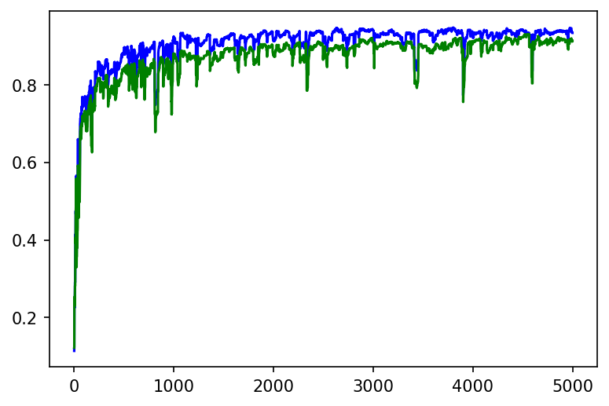
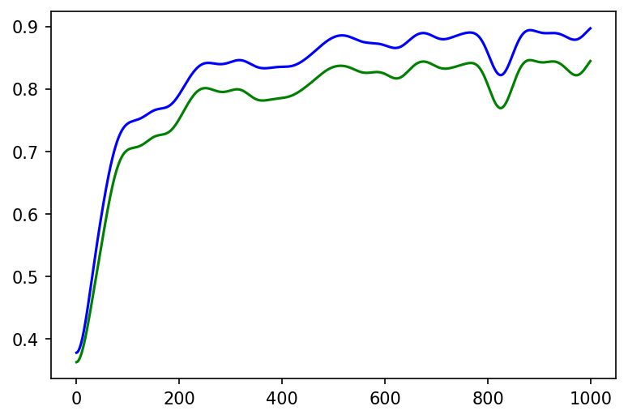
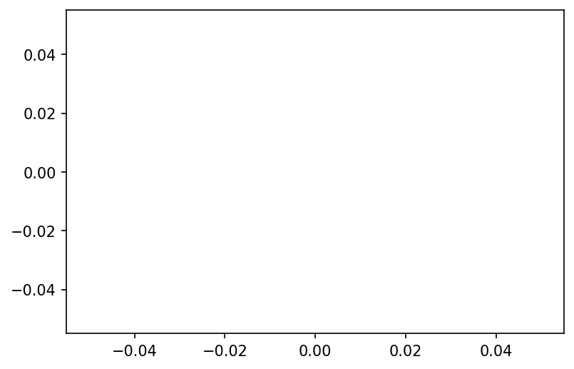
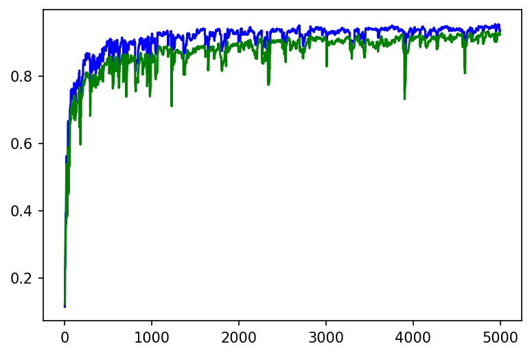
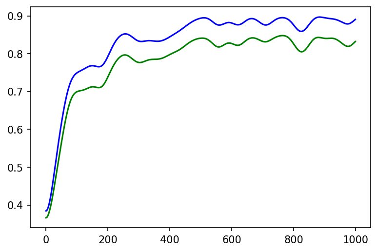

We use the EMNIST dataset of handwritten digits to test a simple
approach for few shot learning. Choosing a fully connected net with inputs
and layer outputs between 0 and 1 and no bias parameters we first trained
the network with a subset of the digits. The pre-trained net is used for few
shot learning with the untrained digits. Two basic idea were necessary:
first the training of the first layer was disabled (or very slow) during few
shot learning, and second using a shot consists of one untrained digit
together with four previously trained digits and perform a training up
to a predefined threshold. This way we reach a 90% accuracy for all
handwritten digits after 10 shots.

This jupyter notebook contains the generation of the tabels and images in the pdf: few_shot_paper.pdf


```python
%%writefile _code_.py ↔

```

    Overwriting _code_.py


```python
#!/usr/bin/env python3
# -*- coding: utf-8 -*-
"""
based on: https://towardsdatascience.com/inroduction-to-neural-networks-in-python-7e0b422e6c24
    and https://stackoverflow.com/questions/29888233/how-to-visualize-a-neural-network/29889993
    and https://towardsdatascience.com/how-to-build-your-own-neural-network-from-scratch-in-python-68998a08e4f6
    and https://www.python-course.eu/neural_network_mnist.php
Created on Sun Jul 19 15:45:02 2020

@author: detlef

INSTALLATION:
use it within anaconda and install cupy if cuda availible
you will need https://www.python-course.eu/data/mnist/mnist_train.csv and https://www.python-course.eu/data/mnist/mnist_test.csv (mnist in csv) in the data/mnist subdirectory
emnist not in anaconda at the moment, use pip install emnist

on Google Colab (turn on GPU!!)
!curl https://colab.chainer.org/install | sh -
!pip install emnist

REMARKS:
    
loss function used = 1/2 SUM(error**2) // making the derivative error
"""

import cupy as np # helps with the math (Cuda supported: faster for hidden_size > 256 probably and most mnist cases with batch training)
#import numpy as np # helps with the math (if no Cuda is availible or size is small for simple tests)
from matplotlib import pyplot
from math import cos, sin, atan
import random
import pickle
from datetime import datetime
from tqdm import tqdm
from emnist import extract_training_samples, extract_test_samples

def np_array(x):
    return np.array(x)# , dtype = np.float32) # float32 is 3 times faster on batch training with GTX1070Ti and 70 times faster than i7-4790K with float64, cpu does not help float32 a lot)
check_for_nan = True

pyplot.rcParams['figure.dpi'] = 150
pyplot.interactive(False) # seems not to fix memory issue

verbose = 0

do_check_all = 0 #1000            # 0 to turn off
check_output_limit = 128        # number of output combinations, as not every neural net is capable of learning input 0 0 0 -> output 1, if 128 the output to the first input is always 0    

multi_test = -1 #1000             # -1 to turn off
max_iter = 30

hidden_size = 64
two_hidden_layers = True
use_bias = False

lr = 2
lr_few_shot = 0.5
use_stability = False
stability_mean = 0.1
clip_weights = 1 # (clipping to 1 was used for most tests)
clip_bias = 1
init_rand_ampl = 0.1
init_rand_ampl0 = 0.1 #2 # for first layer    (2 was used for most tests to make the first layer a mostly random layer)

# drawing parameters
scale_linewidth = 0.1
weight_tanh_scale = 0.1
scale_for_neuron_diff = 1

scale_sigmoid = 3
shift_sigmoid = 1

few_shot_end = 0.2 # for early tests (no mnist)
few_shot_max_try = 100
few_shot_threshold_ratio = 1.5 # for mnist
few_shot_threshold = 0.3

# if 1 it is standard understanding of few shot learning, giving on data point at each shot, otherwize it adds more data points from availible training data to each shot
few_shot_more_at_once = 5
check_wrong = True

all_labels = [0, 1, 9, 3, 4, 5, 6, 7, 8, 2]
# random.shuffle(all_labels)    # if shuffeld, preloading can not work !!!!!
try_load_pretrained = False
few_shot_fast_load_num = 4000 # should also handle the batch_sizes for displaying batch training results properly

test_from_random_input = False
i_bits = 16

# input data
inputs = np_array([[0, 0, 0],
                   [0, 0, 1],
                   [0, 1, 0],
                   [0, 1, 1],
                   [1, 0, 0],
                   [1, 0, 1],
                   [1, 1, 0],
                   [1, 1, 1]])

# output data
outputs = np_array([[0], [0], [1], [0], [1], [1], [0], [1]])

# swith to tanh and making input and output 1 -1 instead of 1 0
do_pm = False

use_emnist = True
load_mnist = True

do_batch_training = 100000
do_drop_weights = [] # [0.9,0.9]
initial_net_first_layer_slow_learning = 1 # 0.1 # most tests are done with 0.1 here, just try if it was really necessary

first_n_to_use = 600000
label_to_one = 5

num_outputs = 10 # most early test need this to be 1, later with mnist dataset this can be set to 10 eg.

try_mnist_few_shot = 10
use_every_shot_n_times = 1 # every data is used n times. so one shot means the data from first shot is used n times
change_first_layers_slow_learning = [0, 1] # [0, 0.1]


disable_progressbar = False

# uncomment to run in jupyter notebook
%run -i _code_.py 
```

    Special few shot configuration, using additional data in every shot. Not the standard understanding of few shot!!!
    labels (last two are used for few_shot) [0, 1, 9, 3, 4, 5, 6, 7, 8, 2]


      0%|          | 0/100000 [00:00<?, ?it/s]

    start 18:21:24


    Err  0.002: 100%|██████████| 100000/100000 [1:18:19<00:00, 21.28it/s]


    end 19:39:44


    train 192000 batch_size 1000 correct 999.0 of 1000 Ratio 0.999 Error 0.0020608174511465515
    test 4000 batch_size 1000 correct 989.0 of 1000 Ratio 0.989 Error 0.01950864256808672
    Testing if new lables were not learned !!!!!!!!!
    new   4000 batch_size 1000 correct 0.0 of 1000 Ratio 0.0 Error 1.6566784770753793
    few shot accuracy results
    shot     try       old labels            new labels  new labels (forced)              over all
       1      1             0.895                 0.492                0.776                 0.815
       2      1             0.952                 0.574                0.754                 0.879
       3      1             0.950                 0.521                0.667                 0.870
       4      1             0.960                 0.535                0.730                 0.878
       5      1             0.856                 0.621                0.677                 0.818
       6      1             0.961                 0.708                0.839                 0.905
       7      1             0.958                 0.666                0.806                 0.900
       8      1             0.949                 0.747                0.844                 0.911
       9      1             0.954                 0.811                0.918                 0.923
      10      1             0.926                 0.836                0.919                 0.908


```python
<div class="burk">
#!/usr/bin/env python3
# -*- coding: utf-8 -*-
"""
based on: https://towardsdatascience.com/inroduction-to-neural-networks-in-python-7e0b422e6c24
    and https://stackoverflow.com/questions/29888233/how-to-visualize-a-neural-network/29889993
    and https://towardsdatascience.com/how-to-build-your-own-neural-network-from-scratch-in-python-68998a08e4f6
    and https://www.python-course.eu/neural_network_mnist.php
Created on Sun Jul 19 15:45:02 2020

@author: detlef

INSTALLATION:
use it within anaconda and install cupy if cuda availible
you will need https://www.python-course.eu/data/mnist/mnist_train.csv and https://www.python-course.eu/data/mnist/mnist_test.csv (mnist in csv) in the data/mnist subdirectory
emnist not in anaconda at the moment, use pip install emnist

on Google Colab (turn on GPU!!)
!curl https://colab.chainer.org/install | sh -
!pip install emnist

REMARKS:
    
loss function used = 1/2 SUM(error**2) // making the derivative error
"""

import cupy as np # helps with the math (Cuda supported: faster for hidden_size > 256 probably and most mnist cases with batch training)
#import numpy as np # helps with the math (if no Cuda is availible or size is small for simple tests)
from matplotlib import pyplot
from math import cos, sin, atan
import random
import pickle
from datetime import datetime
from tqdm import tqdm
from emnist import extract_training_samples, extract_test_samples

def np_array(x):
    return np.array(x)# , dtype = np.float32) # float32 is 3 times faster on batch training with GTX1070Ti and 70 times faster than i7-4790K with float64, cpu does not help float32 a lot)
check_for_nan = True

pyplot.rcParams['figure.dpi'] = 150
pyplot.interactive(False) # seems not to fix memory issue

verbose = 0

do_check_all = 0 #1000            # 0 to turn off
check_output_limit = 128        # number of output combinations, as not every neural net is capable of learning input 0 0 0 -> output 1, if 128 the output to the first input is always 0    

multi_test = -1 #1000             # -1 to turn off
max_iter = 30

hidden_size = 64
two_hidden_layers = True
use_bias = False

lr = 2
lr_few_shot = 0.5
use_stability = False
stability_mean = 0.1
clip_weights = 1 # (clipping to 1 was used for most tests)
clip_bias = 1
init_rand_ampl = 0.1
init_rand_ampl0 = 0.1 #2 # for first layer    (2 was used for most tests to make the first layer a mostly random layer)

# drawing parameters
scale_linewidth = 0.1
weight_tanh_scale = 0.1
scale_for_neuron_diff = 1

scale_sigmoid = 3
shift_sigmoid = 1

few_shot_end = 0.2 # for early tests (no mnist)
few_shot_max_try = 100
few_shot_threshold_ratio = 1.5 # for mnist
few_shot_threshold = 0.3

# if 1 it is standard understanding of few shot learning, giving on data point at each shot, otherwize it adds more data points from availible training data to each shot
few_shot_more_at_once = 5
check_wrong = True

all_labels = [0, 1, 9, 3, 4, 5, 6, 7, 8, 2]
# random.shuffle(all_labels)    # if shuffeld, preloading can not work !!!!!
try_load_pretrained = True
few_shot_fast_load_num = 4000 # should also handle the batch_sizes for displaying batch training results properly

test_from_random_input = False
i_bits = 16

# input data
inputs = np_array([[0, 0, 0],
                   [0, 0, 1],
                   [0, 1, 0],
                   [0, 1, 1],
                   [1, 0, 0],
                   [1, 0, 1],
                   [1, 1, 0],
                   [1, 1, 1]])

# output data
outputs = np_array([[0], [0], [1], [0], [1], [1], [0], [1]])

# swith to tanh and making input and output 1 -1 instead of 1 0
do_pm = False

use_emnist = True
load_mnist = True

do_batch_training = 100000
do_drop_weights = [] # [0.9,0.9]
initial_net_first_layer_slow_learning = 1 # 0.1 # most tests are done with 0.1 here, just try if it was really necessary

first_n_to_use = 600000
label_to_one = 5

num_outputs = 10 # most early test need this to be 1, later with mnist dataset this can be set to 10 eg.

try_mnist_few_shot = 10
use_every_shot_n_times = 1 # every data is used n times. so one shot means the data from first shot is used n times
change_first_layers_slow_learning = [1, 1] # [0, 0.1]


disable_progressbar = False

# uncomment to run in jupyter notebook
%run -i _code_.py </div><i class="fa fa-lightbulb-o "></i>
```

    Special few shot configuration, using additional data in every shot. Not the standard understanding of few shot!!!
    labels (last two are used for few_shot) [0, 1, 9, 3, 4, 5, 6, 7, 8, 2]
    Network parameters:  54912 dropped 0 real parameters 54912 drop definition []
    loaded pretrained net !!!!!!!!!!!!!!!!!!!!!!!!!!!!


    train 4000 batch_size 1000 correct 999.0 of 1000 Ratio 0.999 Error 0.0011126788119728693
    test 4000 batch_size 1000 correct 989.0 of 1000 Ratio 0.989 Error 0.01950864256808672
    Testing if new lables were not learned !!!!!!!!!
    new   4000 batch_size 1000 correct 0.0 of 1000 Ratio 0.0 Error 1.6566784770753793
    few shot accuracy results
    shot     try       old labels            new labels  new labels (forced)              over all
       1      1             0.485                 0.597                0.706                 0.496
       2      1             0.296                 0.669                0.716                 0.357
       3      1             0.288                 0.310                0.670                 0.289
       4      1             0.335                 0.677                0.727                 0.399
       5      1             0.387                 0.683                0.811                 0.443
       6      1             0.382                 0.720                0.806                 0.438
       7      1             0.400                 0.759                0.893                 0.474
       8      1             0.352                 0.845                0.900                 0.442
       9      1             0.487                 0.502                0.820                 0.479
      10      1             0.386                 0.617                0.947                 0.433


```python
<div class="girk">
#!/usr/bin/env python3
# -*- coding: utf-8 -*-
"""
based on: https://towardsdatascience.com/inroduction-to-neural-networks-in-python-7e0b422e6c24
    and https://stackoverflow.com/questions/29888233/how-to-visualize-a-neural-network/29889993
    and https://towardsdatascience.com/how-to-build-your-own-neural-network-from-scratch-in-python-68998a08e4f6
    and https://www.python-course.eu/neural_network_mnist.php
Created on Sun Jul 19 15:45:02 2020

@author: detlef

INSTALLATION:
use it within anaconda and install cupy if cuda availible
you will need https://www.python-course.eu/data/mnist/mnist_train.csv and https://www.python-course.eu/data/mnist/mnist_test.csv (mnist in csv) in the data/mnist subdirectory
emnist not in anaconda at the moment, use pip install emnist

on Google Colab (turn on GPU!!)
!curl https://colab.chainer.org/install | sh -
!pip install emnist

REMARKS:
    
loss function used = 1/2 SUM(error**2) // making the derivative error
"""

import cupy as np # helps with the math (Cuda supported: faster for hidden_size > 256 probably and most mnist cases with batch training)
#import numpy as np # helps with the math (if no Cuda is availible or size is small for simple tests)
from matplotlib import pyplot
from math import cos, sin, atan
import random
import pickle
from datetime import datetime
from tqdm import tqdm
from emnist import extract_training_samples, extract_test_samples

def np_array(x):
    return np.array(x)# , dtype = np.float32) # float32 is 3 times faster on batch training with GTX1070Ti and 70 times faster than i7-4790K with float64, cpu does not help float32 a lot)
check_for_nan = True

pyplot.rcParams['figure.dpi'] = 150
pyplot.interactive(False) # seems not to fix memory issue

verbose = 0

do_check_all = 0 #1000            # 0 to turn off
check_output_limit = 128        # number of output combinations, as not every neural net is capable of learning input 0 0 0 -> output 1, if 128 the output to the first input is always 0    

multi_test = -1 #1000             # -1 to turn off
max_iter = 30

hidden_size = 64
two_hidden_layers = True
use_bias = False

lr = 2
lr_few_shot = 0.5
use_stability = False
stability_mean = 0.1
clip_weights = 1 # (clipping to 1 was used for most tests)
clip_bias = 1
init_rand_ampl = 0.1
init_rand_ampl0 = 0.1 #2 # for first layer    (2 was used for most tests to make the first layer a mostly random layer)

# drawing parameters
scale_linewidth = 0.1
weight_tanh_scale = 0.1
scale_for_neuron_diff = 1

scale_sigmoid = 3
shift_sigmoid = 1

few_shot_end = 0.2 # for early tests (no mnist)
few_shot_max_try = 100
few_shot_threshold_ratio = 1.5 # for mnist
few_shot_threshold = 0.3

# if 1 it is standard understanding of few shot learning, giving on data point at each shot, otherwize it adds more data points from availible training data to each shot
few_shot_more_at_once = 1
check_wrong = True

all_labels = [0, 1, 9, 3, 4, 5, 6, 7, 8, 2]
# random.shuffle(all_labels)    # if shuffeld, preloading can not work !!!!!
try_load_pretrained = True
few_shot_fast_load_num = 4000 # should also handle the batch_sizes for displaying batch training results properly

test_from_random_input = False
i_bits = 16

# input data
inputs = np_array([[0, 0, 0],
                   [0, 0, 1],
                   [0, 1, 0],
                   [0, 1, 1],
                   [1, 0, 0],
                   [1, 0, 1],
                   [1, 1, 0],
                   [1, 1, 1]])

# output data
outputs = np_array([[0], [0], [1], [0], [1], [1], [0], [1]])

# swith to tanh and making input and output 1 -1 instead of 1 0
do_pm = False

use_emnist = True
load_mnist = True

do_batch_training = 100000
do_drop_weights = [] # [0.9,0.9]
initial_net_first_layer_slow_learning = 1 # 0.1 # most tests are done with 0.1 here, just try if it was really necessary

first_n_to_use = 600000
label_to_one = 5

num_outputs = 10 # most early test need this to be 1, later with mnist dataset this can be set to 10 eg.

try_mnist_few_shot = 10
use_every_shot_n_times = 1 # every data is used n times. so one shot means the data from first shot is used n times
change_first_layers_slow_learning = [0, 1] # [0, 0.1]


disable_progressbar = False

# uncomment to run in jupyter notebook
%run -i _code_.py </div><i class="fa fa-lightbulb-o "></i>
```

    labels (last two are used for few_shot) [0, 1, 9, 3, 4, 5, 6, 7, 8, 2]
    Network parameters:  54912 dropped 0 real parameters 54912 drop definition []
    loaded pretrained net !!!!!!!!!!!!!!!!!!!!!!!!!!!!


    train 4000 batch_size 1000 correct 999.0 of 1000 Ratio 0.999 Error 0.0011126788119728693
    test 4000 batch_size 1000 correct 989.0 of 1000 Ratio 0.989 Error 0.01950864256808672
    Testing if new lables were not learned !!!!!!!!!
    new   4000 batch_size 1000 correct 0.0 of 1000 Ratio 0.0 Error 1.6566784770753793
    few shot accuracy results
    shot     try       old labels            new labels  new labels (forced)              over all
       1      1             0.569                 0.508                0.517                 0.558
       2      1             0.672                 0.642                0.659                 0.661
       3      1             0.565                 0.505                0.517                 0.557
       4      1             0.649                 0.501                0.529                 0.626
       5      1             0.564                 0.642                0.661                 0.584
       6      1             0.684                 0.724                0.733                 0.696
       7      1             0.364                 0.515                0.517                 0.398
       8      1             0.458                 0.525                0.536                 0.474
       9      1             0.454                 0.532                0.541                 0.477
      10      1             0.451                 0.784                0.792                 0.508


```python
x = []
y = []
for xx in np.arange(-1,3,0.1):
    x.append(xx)
    y.append(sigmoid(xx))
pyplot.plot(x,y)
pyplot.show()
```


```python
hidden_size = 4
inputs= np.array([[0,0,0,0,0]])
num_outputs = 3
outputs= np.array([[0,0,0]])
NN2 = setup_net()
NN2.set_input(inputs[0],outputs[0])
NN2.forward()
NN2.draw()
```


```python
#!/usr/bin/env python3
# -*- coding: utf-8 -*-
"""
based on: https://towardsdatascience.com/inroduction-to-neural-networks-in-python-7e0b422e6c24
    and https://stackoverflow.com/questions/29888233/how-to-visualize-a-neural-network/29889993
    and https://towardsdatascience.com/how-to-build-your-own-neural-network-from-scratch-in-python-68998a08e4f6
    and https://www.python-course.eu/neural_network_mnist.php
Created on Sun Jul 19 15:45:02 2020

@author: detlef

INSTALLATION:
use it within anaconda and install cupy if cuda availible
you will need https://www.python-course.eu/data/mnist/mnist_train.csv and https://www.python-course.eu/data/mnist/mnist_test.csv (mnist in csv) in the data/mnist subdirectory
emnist not in anaconda at the moment, use pip install emnist

on Google Colab (turn on GPU!!)
!curl https://colab.chainer.org/install | sh -
!pip install emnist

REMARKS:
    
loss function used = 1/2 SUM(error**2) // making the derivative error
"""

import cupy as np # helps with the math (Cuda supported: faster for hidden_size > 256 probably and most mnist cases with batch training)
#import numpy as np # helps with the math (if no Cuda is availible or size is small for simple tests)
from matplotlib import pyplot
from math import cos, sin, atan
import random
import pickle
from datetime import datetime
from tqdm import tqdm
from emnist import extract_training_samples, extract_test_samples

def np_array(x):
    return np.array(x)# , dtype = np.float32) # float32 is 3 times faster on batch training with GTX1070Ti and 70 times faster than i7-4790K with float64, cpu does not help float32 a lot)
check_for_nan = True

pyplot.rcParams['figure.dpi'] = 150
pyplot.interactive(False) # seems not to fix memory issue

verbose = 0

do_check_all = 0 #1000            # 0 to turn off
check_output_limit = 128        # number of output combinations, as not every neural net is capable of learning input 0 0 0 -> output 1, if 128 the output to the first input is always 0    

multi_test = -1 #1000             # -1 to turn off
max_iter = 30

hidden_size = 64
two_hidden_layers = True
use_bias = False

lr = 2
lr_few_shot = 0.5
use_stability = False
stability_mean = 0.1
clip_weights = 1 # (clipping to 1 was used for most tests)
clip_bias = 1
init_rand_ampl = 0.1
init_rand_ampl0 = 0.1 #2 # for first layer    (2 was used for most tests to make the first layer a mostly random layer)

# drawing parameters
scale_linewidth = 0.1
weight_tanh_scale = 0.1
scale_for_neuron_diff = 1

scale_sigmoid = 3
shift_sigmoid = 1

few_shot_end = 0.2 # for early tests (no mnist)
few_shot_max_try = 100
few_shot_threshold_ratio = 1.5 # for mnist
few_shot_threshold = 0.3

# if 1 it is standard understanding of few shot learning, giving on data point at each shot, otherwize it adds more data points from availible training data to each shot
few_shot_more_at_once = 5
check_wrong = True

all_labels = [0, 1, 9, 3, 4, 5, 6, 7, 8, 2]
# random.shuffle(all_labels)    # if shuffeld, preloading can not work !!!!!
try_load_pretrained = False
few_shot_fast_load_num = 4000 # should also handle the batch_sizes for displaying batch training results properly

test_from_random_input = False
i_bits = 16

# input data
inputs = np_array([[0, 0, 0],
                   [0, 0, 1],
                   [0, 1, 0],
                   [0, 1, 1],
                   [1, 0, 0],
                   [1, 0, 1],
                   [1, 1, 0],
                   [1, 1, 1]])

# output data
outputs = np_array([[0], [0], [1], [0], [1], [1], [0], [1]])

# swith to tanh and making input and output 1 -1 instead of 1 0
do_pm = False

use_emnist = True
load_mnist = True

do_batch_training = 100000
do_drop_weights = [] # [0.9,0.9]
initial_net_first_layer_slow_learning = 0.01 # 0.1 # most tests are done with 0.1 here, just try if it was really necessary

first_n_to_use = 600000
label_to_one = 5

num_outputs = 10 # most early test need this to be 1, later with mnist dataset this can be set to 10 eg.

try_mnist_few_shot = 10
use_every_shot_n_times = 1 # every data is used n times. so one shot means the data from first shot is used n times
change_first_layers_slow_learning = [0.01, 1] # [0, 0.1]


disable_progressbar = False

# uncomment to run in jupyter notebook
%run -i _code_.py 
```

    Special few shot configuration, using additional data in every shot. Not the standard understanding of few shot!!!
    labels (last two are used for few_shot) [0, 1, 9, 3, 4, 5, 6, 7, 8, 2]


      0%|          | 0/100000 [00:00<?, ?it/s]

    start 15:55:56


    Err  0.007: 100%|██████████| 100000/100000 [1:17:58<00:00, 21.37it/s]


    end 17:13:55


    train 192000 batch_size 1000 correct 996.0 of 1000 Ratio 0.996 Error 0.008494603222037725
    test 4000 batch_size 1000 correct 989.0 of 1000 Ratio 0.989 Error 0.021232006355433916
    Testing if new lables were not learned !!!!!!!!!
    new   4000 batch_size 1000 correct 0.0 of 1000 Ratio 0.0 Error 1.5956471595383732
    few shot accuracy results
    shot     try       old labels            new labels  new labels (forced)              over all
       1      1             0.896                 0.409                0.645                 0.809
       2      1             0.754                 0.573                0.699                 0.722
       3      1             0.926                 0.484                0.667                 0.841
       4      1             0.855                 0.637                0.832                 0.816
       5      1             0.836                 0.730                0.821                 0.813
       6      1             0.890                 0.574                0.688                 0.830
       7      1             0.935                 0.683                0.893                 0.880
       8      1             0.879                 0.778                0.881                 0.860
       9      1             0.878                 0.806                0.914                 0.865
      10      1             0.874                 0.801                0.906                 0.862


# Data for discussion / outlook

# Demonstration using few shot procedure for pre-training
5000 shots used for pre-training (for 8 of the 10 labels), reaching about 85% accuracy.

The few shot learning is done with the same network, reaching 75% after 10 shots, and more than 80% after 100 shots.

The learning rate of the first layer was reduced by a factor of 0.25, the one of the second layer by a factor of 0.5


```python
#!/usr/bin/env python3
# -*- coding: utf-8 -*-
"""
based on: https://towardsdatascience.com/inroduction-to-neural-networks-in-python-7e0b422e6c24
    and https://stackoverflow.com/questions/29888233/how-to-visualize-a-neural-network/29889993
    and https://towardsdatascience.com/how-to-build-your-own-neural-network-from-scratch-in-python-68998a08e4f6
    and https://www.python-course.eu/neural_network_mnist.php
Created on Sun Jul 19 15:45:02 2020

@author: detlef

INSTALLATION:
use it within anaconda and install cupy if cuda availible
you will need https://www.python-course.eu/data/mnist/mnist_train.csv and https://www.python-course.eu/data/mnist/mnist_test.csv (mnist in csv) in the data/mnist subdirectory
emnist not in anaconda at the moment, use pip install emnist

on Google Colab (turn on GPU!!)
!curl https://colab.chainer.org/install | sh -
!pip install emnist

REMARKS:
    
loss function used = 1/2 SUM(error**2) // making the derivative error
"""

#import cupy as np # helps with the math (Cuda supported: faster for hidden_size > 256 probably and most mnist cases with batch training)
import numpy as np # helps with the math (if no Cuda is availible or size is small for simple tests)
from matplotlib import pyplot
from math import cos, sin, atan
import random
import pickle
from datetime import datetime
from tqdm import tqdm
from emnist import extract_training_samples, extract_test_samples

def np_array(x):
    return np.array(x)# , dtype = np.float32) # float32 is 3 times faster on batch training with GTX1070Ti and 70 times faster than i7-4790K with float64, cpu does not help float32 a lot)
check_for_nan = True

pyplot.rcParams['figure.dpi'] = 150
pyplot.interactive(False) # seems not to fix memory issue

verbose = 0

do_check_all = 0 #1000            # 0 to turn off
check_output_limit = 128        # number of output combinations, as not every neural net is capable of learning input 0 0 0 -> output 1, if 128 the output to the first input is always 0    

multi_test = -1 #1000             # -1 to turn off
max_iter = 30

hidden_size = 64
two_hidden_layers = 1 # additional hidden layers, totaly two_hidden_layers + 1
use_bias = False

lr = 2
lr_few_shot = 0.01
use_stability = False
stability_mean = 0.1
clip_weights = 1 # (clipping to 1 was used for most tests)
clip_bias = 1
init_rand_ampl = 0.5
init_rand_ampl0 = 0.1 # 2 # for first layer    (2 was used for most tests to make the first layer a mostly random layer)

# drawing parameters
scale_linewidth = 0.1
weight_tanh_scale = 0.1
scale_for_neuron_diff = 1

scale_sigmoid = 3
shift_sigmoid = 1

few_shot_end = 0.2 # for early tests (no mnist)
few_shot_max_try = 2000
few_shot_threshold_ratio = 1.5 # for mnist
few_shot_threshold = 0.3

# if 1 it is standard understanding of few shot learning, giving on data point at each shot, otherwize it adds more data points from availible training data to each shot
few_shot_more_at_once = 5
check_wrong = True

all_labels = [0, 1, 9, 3, 4, 5, 6, 7, 8, 2]
# random.shuffle(all_labels)    # if shuffeld, preloading can not work !!!!!
try_load_pretrained = False
few_shot_fast_load_num = 4000 # should also handle the batch_sizes for displaying batch training results properly

test_from_random_input = False
i_bits = 16

# input data
inputs = np_array([[0, 0, 0],
                   [0, 0, 1],
                   [0, 1, 0],
                   [0, 1, 1],
                   [1, 0, 0],
                   [1, 0, 1],
                   [1, 1, 0],
                   [1, 1, 1]])

# output data
outputs = np_array([[0], [0], [1], [0], [1], [1], [0], [1]])

# swith to tanh and making input and output 1 -1 instead of 1 0
do_pm = False

use_emnist = True
load_mnist = True

do_batch_training = -1
do_drop_weights = [] # [0.9,0.9]
initial_net_first_layer_slow_learning = 1 # 0.1 # most tests are done with 0.1 here, just try if it was really necessary

first_n_to_use = 600000
label_to_one = 5

num_outputs = 10 # most early test need this to be 1, later with mnist dataset this can be set to 10 eg.

try_mnist_few_shot = 5000
use_every_shot_n_times = 1 # every data is used n times. so one shot means the data from first shot is used n times
change_first_layers_slow_learning = [0.25, 0.5] # [0.04, 0.2] # [0, 0.1]


disable_progressbar = False

# uncomment to run in jupyter notebook
%run -i _code_.py 


def setup_net():
    NN2 = DrawNet()
    input_len = len(inputs[0])
    if test_from_random_input:
        input_len = i_bits
    NN2.add_layer(input_len, init_rand_ampl0 * np_array(np.random.rand(input_len, hidden_size) - 0.5), init_rand_ampl0 * np_array(np.random.rand(hidden_size) - 0.5), None, slow_learning = initial_net_first_layer_slow_learning)
    for _ in range(two_hidden_layers):
        if verbose > 0:
            print('additional hidden layer')
        NN2.add_layer(hidden_size, init_rand_ampl * np_array(np.random.rand(hidden_size, hidden_size) - 0.5), init_rand_ampl * np_array(np.random.rand(hidden_size) - 0.5), None)
    NN2.add_layer(hidden_size, init_rand_ampl * np_array(np.random.rand(hidden_size, num_outputs)- 0.5), init_rand_ampl * np_array(np.random.rand(num_outputs) - 0.5), None)
    NN2.add_layer(num_outputs, None, None, None)
    NN2.set_input(inputs, outputs)
    count_drops = 0
    for l in range(len(do_drop_weights)):
        if do_drop_weights[l] > 0:
            NN2.layers[l].drop_weights = np.random.rand(NN2.layers[l].weights.size).reshape(NN2.layers[l].weights.shape) > do_drop_weights[l]
            count_drops += NN2.layers[l].drop_weights.size - np.sum(NN2.layers[l].drop_weights)
    num_params, count_drops = NN2.count_parameters()
    print('Network parameters: ', num_params, 'dropped', count_drops, 'real parameters', num_params - count_drops, 'drop definition', do_drop_weights)
    
    return NN2

NN2 = setup_net()

pos_1 = 0
inputs = None
outputs = None
bbs = None
verbose = 1
(inputs, outputs, bbs) = run_load_mnist(use_test = False,limit_labels=all_labels[:-2])
(inputs_test, outputs_test, bbs_test) = run_load_mnist(use_test = True,limit_labels=all_labels[:-2], only_load_num=few_shot_fast_load_num)
verbose = 0
shot=[]
y1=[]
y2=[]
ttt = tqdm(range(try_mnist_few_shot), mininterval = 10, disable=disable_progressbar)
for i_shot in ttt: # some shots
    if change_first_layers_slow_learning is not None:
        for l in range(len(change_first_layers_slow_learning)):
            before = NN2.layers[l].slow_learning
            NN2.layers[l].slow_learning = change_first_layers_slow_learning[l]
            if verbose > 1:
                print('slow learning of layer',l,'changed from', before, 'to', NN2.layers[l].slow_learning)
    before = lr
    lr = lr_few_shot
    if verbose > 1:
        print('\n',i_shot + 1,'. shot --- lr changed from',before,'to', lr)
    begin = pos_1 - few_shot_more_at_once
    if begin < 0:
        begin = 0
    inp = inputs[begin:pos_1+1]
    outp = outputs[begin:pos_1+1]
    pos_1 += 1 # few_shot_more_at_once
    if verbose > 1:
        print('start training', outp)
    epoch = 0
    NN2.set_input(inp, outp)
    while epoch < few_shot_max_try:
        epoch += 1
        NN2.forward()
        NN2.backward()
        # criterium for stopping is only used for the first element, which is the one few shot is done for. The other elements are not checked, but only used for stabilizing old learned data
        if (NN2.layers[-1].values.argmax(axis = 1) == NN2.y.argmax(axis=1))[-1]: # -1 is the last
            biggest_two = np.partition(NN2.layers[-1].values[0], -2)[-2:]
            if do_pm:
                ratio = (biggest_two[-1] + 1) / (biggest_two[-2] + 1) / 2 # do_pm means rsults between -1 and 1
            else:
                ratio = biggest_two[-1] / biggest_two[-2]
            if verbose > 1:
                print(biggest_two, ratio)
            if ratio > few_shot_threshold_ratio and biggest_two[-1] > few_shot_threshold:
                break
    NN2.set_input(inputs, outputs, batch_size=1000)
    NN2.forward()
    acc_train = float((NN2.layers[-1].values.argmax(axis = 1) == NN2.y.argmax(axis=1)).sum()) / len(NN2.y)
    if verbose > 1:
        print('outputs', len(outputs), 'batch_size', NN2.batch_size,  'acc_train', acc_train, 'Error', float(np.sum(NN2.error**2) / len(NN2.error)))
    NN2.set_input(inputs_test, outputs_test, batch_size=1000)
    NN2.forward()
    acc_test = float((NN2.layers[-1].values.argmax(axis = 1) == NN2.y.argmax(axis=1)).sum()) / len(NN2.y)
    err = np.sum(NN2.error**2)
    ttt.set_description("Err %6.3f Acc %6.3f" % (err, acc_test), refresh=False)
    if verbose > 1:
        print('outputs', len(outputs), 'batch_size', NN2.batch_size, 'acc_test', acc_test, 'Error', err / len(NN2.error))
    if verbose > 0:
        print("%4d      %6d        %7.3f               %7.3f" % (i_shot + 1, epoch, acc_train, acc_test))
    shot.append(i_shot)
    y1.append(acc_train)
    y2.append(acc_test)
pyplot.plot(shot,y1,'b')
pyplot.plot(shot,y2,'g')
pyplot.show()

from scipy.ndimage.filters import gaussian_filter1d
y1s = gaussian_filter1d(y1, sigma=20)
y2s = gaussian_filter1d(y2, sigma=20)
pyplot.plot(shot[:1000],y1s[:1000],'b')
pyplot.plot(shot[:1000],y2s[:1000],'g')
pyplot.show()

y1s = gaussian_filter1d(y1, sigma=200)
y2s = gaussian_filter1d(y2, sigma=200)
pyplot.plot(shot[10000:],y1s[10000:],'b')
pyplot.plot(shot[10000:],y2s[10000:],'g')
pyplot.show()


try_mnist_few_shot = 100


NN2.set_input(inputs, outputs, batch_size=1000)
NN2.forward()
if num_outputs == 1:
    print('new  ', len(outputs), 'batch_size', NN2.batch_size, '1', int(np.sum(NN2.y > 0.5)), 'wrong', int(np.sum((NN2.y > 0.5) * (NN2.error**2 > 0.25))), 'Ratio', int(np.sum((NN2.y > 0.5) * (NN2.error**2 > 0.25))) / int(np.sum(NN2.y > 0.5)), 'Error', float(np.sum(NN2.error**2) / len(NN2.error)))
else:
    print('new  ', len(outputs), 'batch_size', NN2.batch_size, 'correct', float((NN2.layers[-1].values.argmax(axis = 1) == NN2.y.argmax(axis=1)).sum()), 'of', len(NN2.y), 'Ratio', float((NN2.layers[-1].values.argmax(axis = 1) == NN2.y.argmax(axis=1)).sum()) / len(NN2.y), 'Error', float(np.sum(NN2.error**2) / len(NN2.error)))

# now try a few shot learning for some steps
# load with labels [8,9] and train every to a measure
#
# criteria label correct: (NN2.layers[-1].values.argmax(axis = 1) == NN2.y.argmax(axis=1))[0] true
# distance to second largest label
# biggest_two = np.partition(NN2.layers[-1].values[0], -2)[-2:]
# ratio = biggest_two[-1] / [-2] > threshold

# max_iter is the maximal number of try's to optimize one data point in few_shot
pos_1 = 0
pos_2 = 0
try:
    print('few shot accuracy results')
    print('shot     try       old labels            new labels  new labels (forced)              over all')
    for i_shot in range(try_mnist_few_shot): # some shots
        if change_first_layers_slow_learning is not None:
            for l in range(len(change_first_layers_slow_learning)):
                before = NN2.layers[l].slow_learning
                NN2.layers[l].slow_learning = change_first_layers_slow_learning[l]
                if verbose > 0:
                    print('slow learning of layer',l,'changed from', before, 'to', NN2.layers[l].slow_learning)
        before = lr
        lr = lr_few_shot
        if verbose > 0:
            print('\n',i_shot + 1,'. shot --- lr changed from',before,'to', lr)
        (inputs, outputs, bbs) = run_load_mnist(use_test = False)
        few1 = all_labels[-2]
        few2 = all_labels[-1]
        ok1 = False
        while not ok1:
            while outputs[pos_1].argmax() != few1:
                pos_1 += 1
            inp_1 = inputs[pos_1:pos_1+few_shot_more_at_once]
            outp_1 = outputs[pos_1:pos_1+few_shot_more_at_once]
            pos_1 += few_shot_more_at_once # prepare the next shot
            ok1 = True
            if check_wrong:
                for ii in range(1, few_shot_more_at_once):
                    if outp_1[ii].argmax() == few2:
                        ok1 = False
        ok2 = False
        while not ok2:
            while outputs[pos_2].argmax() != few2:
                pos_2 += 1
            inp_2 = inputs[pos_2:pos_2+few_shot_more_at_once]
            outp_2 = outputs[pos_2:pos_2+few_shot_more_at_once]
            pos_2 += few_shot_more_at_once
            ok2 = True
            if check_wrong:
                for ii in range(1, few_shot_more_at_once):
                    if outp_2[ii].argmax() == few1:
                        ok1 = False
        for m in range(use_every_shot_n_times):
            for (inp,outp) in [(inp_1,outp_1), (inp_2,outp_2)]:
                if verbose > 0:
                    print('start training', outp)
                epoch = 0
                NN2.set_input(inp, outp)
                while epoch < few_shot_max_try:
                    NN2.forward()
                    NN2.backward()
                    # criterium for stopping is only used for the first element, which is the one few shot is done for. The other elements are not checked, but only used for stabilizing old learned data
                    if (NN2.layers[-1].values.argmax(axis = 1) == NN2.y.argmax(axis=1))[0]:
                        biggest_two = np.partition(NN2.layers[-1].values[0], -2)[-2:]
                        if do_pm:
                            ratio = (biggest_two[-1] + 1) / (biggest_two[-2] + 1) / 2 # do_pm means rsults between -1 and 1
                        else:
                            ratio = biggest_two[-1] / biggest_two[-2]
                        if verbose > 0:
                            print(biggest_two, ratio)
                        if ratio > few_shot_threshold_ratio and biggest_two[-1] > few_shot_threshold:
                            break
            if verbose > 0:
                print('Results after few shot', i_shot + 1, 'used the ', m + 1, '. time')
                (inputs, outputs, bbs) = run_load_mnist(use_test = False,limit_labels=all_labels[:-2], only_load_num=few_shot_fast_load_num)
                NN2.set_input(inputs, outputs, batch_size=1000)
                NN2.forward()
                print('outputs', len(outputs), 'batch_size', NN2.batch_size, 'few1:', np.sum(NN2.layers[-1].values.argmax(axis = 1) == few1), 'few2:', np.sum(NN2.layers[-1].values.argmax(axis = 1) == few2), 'correct', float((NN2.layers[-1].values.argmax(axis = 1) == NN2.y.argmax(axis=1)).sum()), 'of', len(NN2.y), 'Ratio', float((NN2.layers[-1].values.argmax(axis = 1) == NN2.y.argmax(axis=1)).sum()) / len(NN2.y), 'Error', float(np.sum(NN2.error**2) / len(NN2.error)))
                (inputs, outputs, bbs) = run_load_mnist(use_test = False,limit_labels=all_labels[-2:], only_load_num=few_shot_fast_load_num)
                NN2.set_input(inputs, outputs, batch_size=1000)
                NN2.forward()
                print('outputs', len(outputs), 'batch_size', NN2.batch_size, 'few1:', np.sum(NN2.layers[-1].values.argmax(axis = 1) == few1), 'few2:', np.sum(NN2.layers[-1].values.argmax(axis = 1) == few2), 'correct', float((NN2.layers[-1].values.argmax(axis = 1) == NN2.y.argmax(axis=1)).sum()), 'of', len(NN2.y), 'Ratio', float((NN2.layers[-1].values.argmax(axis = 1) == NN2.y.argmax(axis=1)).sum()) / len(NN2.y), 'Error', float(np.sum(NN2.error**2) / len(NN2.error)))
            (inputs, outputs, bbs) = run_load_mnist(use_test = True,limit_labels=all_labels[:-2], only_load_num=few_shot_fast_load_num)
            NN2.set_input(inputs, outputs, batch_size=1000)
            NN2.forward()
            acc_only_old_labels = float((NN2.layers[-1].values.argmax(axis = 1) == NN2.y.argmax(axis=1)).sum()) / len(NN2.y)
            if verbose > 0:
                print('outputs', len(outputs), 'batch_size', NN2.batch_size, 'few1:', np.sum(NN2.layers[-1].values.argmax(axis = 1) == few1), 'few2:', np.sum(NN2.layers[-1].values.argmax(axis = 1) == few2), 'correct', float((NN2.layers[-1].values.argmax(axis = 1) == NN2.y.argmax(axis=1)).sum()), 'of', len(NN2.y), 'Ratio', float((NN2.layers[-1].values.argmax(axis = 1) == NN2.y.argmax(axis=1)).sum()) / len(NN2.y), 'Error', float(np.sum(NN2.error**2) / len(NN2.error)))
            (inputs, outputs, bbs) = run_load_mnist(use_test = True,limit_labels=all_labels[-2:], only_load_num=few_shot_fast_load_num)
            NN2.set_input(inputs, outputs, batch_size=1000)
            NN2.forward()
            acc_only_new_labels = float((NN2.layers[-1].values.argmax(axis = 1) == NN2.y.argmax(axis=1)).sum()) / len(NN2.y)
            if verbose > 0:
                print('outputs', len(outputs), 'batch_size', NN2.batch_size, 'few1:', np.sum(NN2.layers[-1].values.argmax(axis = 1) == few1), 'few2:', np.sum(NN2.layers[-1].values.argmax(axis = 1) == few2), 'correct', float((NN2.layers[-1].values.argmax(axis = 1) == NN2.y.argmax(axis=1)).sum()), 'of', len(NN2.y), 'Ratio', float((NN2.layers[-1].values.argmax(axis = 1) == NN2.y.argmax(axis=1)).sum()) / len(NN2.y), 'Error', float(np.sum(NN2.error**2) / len(NN2.error)))

            # here only the few_shot trained lables are considdered
            res_values = NN2.layers[-1].values
            mask = [0] * len(all_labels)
            for l in all_labels[-2:]:
                mask[l] = 1
            mask = np_array([mask])
            res_values = res_values * mask
            # deb = float((res_values.argmax(axis = 1) == NN2.y.argmax(axis=1)).sum())
            acc_only_new_labels_forced = float((res_values.argmax(axis = 1) == NN2.y.argmax(axis=1)).sum()) / len(NN2.y)
            if verbose > 0:
                print('using only the few shot trained labels for possible output of neural net')
                print('outputs', len(outputs), 'batch_size', NN2.batch_size, 'few1:', np.sum(res_values.argmax(axis = 1) == few1), 'few2:', np.sum(res_values.argmax(axis = 1) == few2), 'correct', float((res_values.argmax(axis = 1) == NN2.y.argmax(axis=1)).sum()), 'of', len(NN2.y), 'Ratio', float((res_values.argmax(axis = 1) == NN2.y.argmax(axis=1)).sum()) / len(NN2.y), 'Error', float(np.sum(NN2.error**2) / len(NN2.error)))


            (inputs, outputs, bbs) = run_load_mnist(use_test = True, only_load_num=few_shot_fast_load_num)
            NN2.set_input(inputs, outputs, batch_size=1000)
            NN2.forward()
            acc_only_overall_labels = float((NN2.layers[-1].values.argmax(axis = 1) == NN2.y.argmax(axis=1)).sum()) / len(NN2.y)
            if verbose > 0:
                print('outputs', len(outputs), 'batch_size', NN2.batch_size, 'few1:', np.sum(NN2.layers[-1].values.argmax(axis = 1) == few1), 'few2:', np.sum(NN2.layers[-1].values.argmax(axis = 1) == few2), 'correct', float((NN2.layers[-1].values.argmax(axis = 1) == NN2.y.argmax(axis=1)).sum()), 'of', len(NN2.y), 'Ratio', float((NN2.layers[-1].values.argmax(axis = 1) == NN2.y.argmax(axis=1)).sum()) / len(NN2.y), 'Error', float(np.sum(NN2.error**2) / len(NN2.error)))
            print("%4d    %3d           %7.3f               %7.3f              %7.3f               %7.3f" % (i_shot + 1, m + 1, acc_only_old_labels, acc_only_new_labels, acc_only_new_labels_forced, acc_only_overall_labels))
except KeyboardInterrupt:
    print('Interrupted')

```

    Special few shot configuration, using additional data in every shot. Not the standard understanding of few shot!!!
    labels (last two are used for few_shot) [0, 1, 9, 3, 4, 5, 6, 7, 8, 2]
    Network parameters:  54912 dropped 0 real parameters 54912 drop definition []
    loaded mnist Train dataset  with 10 labels [0, 1, 9, 3, 4, 5, 6, 7]


      0%|          | 0/5000 [00:00<?, ?it/s]

    loaded mnist Test dataset  with 10 labels [0, 1, 9, 3, 4, 5, 6, 7]


    Err 151.246 Acc  0.914: 100%|██████████| 5000/5000 [01:34<00:00, 52.98it/s]











    new   192000 batch_size 1000 correct 934.0 of 1000 Ratio 0.934 Error 0.12432005788179887
    few shot accuracy results
    shot     try       old labels            new labels  new labels (forced)              over all
       1      1             0.786                 0.411                0.827                 0.700
       2      1             0.719                 0.519                0.753                 0.676
       3      1             0.793                 0.589                0.880                 0.745
       4      1             0.755                 0.630                0.873                 0.723
       5      1             0.761                 0.657                0.882                 0.732
       6      1             0.771                 0.651                0.884                 0.738
       7      1             0.778                 0.645                0.883                 0.744
       8      1             0.772                 0.674                0.852                 0.739
       9      1             0.765                 0.734                0.888                 0.751
      10      1             0.792                 0.714                0.888                 0.768
      11      1             0.828                 0.586                0.781                 0.774
      12      1             0.853                 0.525                0.759                 0.782
      13      1             0.869                 0.333                0.606                 0.764
      14      1             0.888                 0.529                0.828                 0.813
      15      1             0.811                 0.667                0.774                 0.778
      16      1             0.815                 0.672                0.788                 0.780
      17      1             0.871                 0.287                0.571                 0.767
      18      1             0.873                 0.500                0.795                 0.796
      19      1             0.873                 0.542                0.721                 0.807
      20      1             0.873                 0.548                0.726                 0.808
      21      1             0.876                 0.589                0.789                 0.816
      22      1             0.816                 0.548                0.628                 0.756
      23      1             0.887                 0.596                0.924                 0.822
      24      1             0.889                 0.601                0.919                 0.827
      25      1             0.896                 0.583                0.886                 0.829
      26      1             0.881                 0.610                0.868                 0.820
      27      1             0.880                 0.621                0.889                 0.821
      28      1             0.880                 0.671                0.913                 0.827
      29      1             0.877                 0.683                0.916                 0.826
      30      1             0.878                 0.689                0.924                 0.830
      31      1             0.878                 0.689                0.929                 0.829
      32      1             0.872                 0.700                0.938                 0.827
      33      1             0.874                 0.702                0.939                 0.832
      34      1             0.879                 0.636                0.881                 0.827
      35      1             0.877                 0.711                0.933                 0.834
      36      1             0.859                 0.739                0.951                 0.830
      37      1             0.867                 0.735                0.950                 0.838
      38      1             0.865                 0.736                0.948                 0.837
      39      1             0.865                 0.738                0.949                 0.838
      40      1             0.869                 0.728                0.953                 0.835
      41      1             0.853                 0.775                0.897                 0.824
      42      1             0.821                 0.797                0.951                 0.812
      43      1             0.819                 0.800                0.952                 0.810
      44      1             0.820                 0.793                0.947                 0.810
      45      1             0.809                 0.781                0.926                 0.791
      46      1             0.799                 0.796                0.923                 0.784
      47      1             0.834                 0.804                0.950                 0.818
      48      1             0.845                 0.792                0.948                 0.823
      49      1             0.845                 0.790                0.949                 0.823
      50      1             0.847                 0.793                0.948                 0.824
      51      1             0.858                 0.806                0.957                 0.839
      52      1             0.858                 0.780                0.898                 0.827
      53      1             0.840                 0.795                0.951                 0.821
      54      1             0.834                 0.824                0.960                 0.826
      55      1             0.833                 0.825                0.960                 0.825
      56      1             0.840                 0.821                0.962                 0.830
      57      1             0.842                 0.820                0.962                 0.830
      58      1             0.847                 0.819                0.964                 0.833
      59      1             0.860                 0.800                0.963                 0.840
      60      1             0.863                 0.756                0.968                 0.833
      61      1             0.865                 0.756                0.968                 0.834
      62      1             0.865                 0.753                0.969                 0.835
      63      1             0.861                 0.785                0.958                 0.837
      64      1             0.862                 0.794                0.963                 0.840
      65      1             0.860                 0.817                0.965                 0.840
      66      1             0.861                 0.815                0.968                 0.840
      67      1             0.831                 0.844                0.964                 0.822
      68      1             0.871                 0.704                0.871                 0.821
      69      1             0.866                 0.788                0.966                 0.838
      70      1             0.864                 0.793                0.967                 0.838
      71      1             0.863                 0.811                0.963                 0.841
      72      1             0.843                 0.652                0.965                 0.790
      73      1             0.847                 0.670                0.942                 0.796
      74      1             0.826                 0.746                0.910                 0.797
      75      1             0.826                 0.748                0.912                 0.798
      76      1             0.862                 0.729                0.917                 0.825
      77      1             0.868                 0.769                0.962                 0.838
      78      1             0.869                 0.768                0.961                 0.839
      79      1             0.862                 0.816                0.940                 0.841
      80      1             0.846                 0.824                0.935                 0.827
      81      1             0.816                 0.865                0.944                 0.805
      82      1             0.817                 0.867                0.945                 0.806
      83      1             0.808                 0.869                0.969                 0.805
      84      1             0.813                 0.866                0.968                 0.809
      85      1             0.816                 0.865                0.969                 0.809
      86      1             0.838                 0.847                0.956                 0.830
      87      1             0.795                 0.756                0.877                 0.780
      88      1             0.791                 0.760                0.878                 0.777
      89      1             0.831                 0.812                0.945                 0.815
      90      1             0.832                 0.815                0.948                 0.816
      91      1             0.816                 0.822                0.935                 0.802
      92      1             0.830                 0.851                0.964                 0.822
      93      1             0.831                 0.849                0.964                 0.822
      94      1             0.828                 0.858                0.954                 0.819
      95      1             0.830                 0.861                0.958                 0.821
      96      1             0.832                 0.859                0.958                 0.822
      97      1             0.840                 0.850                0.958                 0.827
      98      1             0.840                 0.852                0.959                 0.828
      99      1             0.840                 0.856                0.962                 0.830
     100      1             0.840                 0.856                0.963                 0.830


Showing, that hidden_size 128 gives roughly the same result (not used in the paper at the moment)


```python
#!/usr/bin/env python3
# -*- coding: utf-8 -*-
"""
based on: https://towardsdatascience.com/inroduction-to-neural-networks-in-python-7e0b422e6c24
    and https://stackoverflow.com/questions/29888233/how-to-visualize-a-neural-network/29889993
    and https://towardsdatascience.com/how-to-build-your-own-neural-network-from-scratch-in-python-68998a08e4f6
    and https://www.python-course.eu/neural_network_mnist.php
Created on Sun Jul 19 15:45:02 2020

@author: detlef

INSTALLATION:
use it within anaconda and install cupy if cuda availible
you will need https://www.python-course.eu/data/mnist/mnist_train.csv and https://www.python-course.eu/data/mnist/mnist_test.csv (mnist in csv) in the data/mnist subdirectory
emnist not in anaconda at the moment, use pip install emnist

on Google Colab (turn on GPU!!)
!curl https://colab.chainer.org/install | sh -
!pip install emnist

REMARKS:
    
loss function used = 1/2 SUM(error**2) // making the derivative error
"""

#import cupy as np # helps with the math (Cuda supported: faster for hidden_size > 256 probably and most mnist cases with batch training)
import numpy as np # helps with the math (if no Cuda is availible or size is small for simple tests)
from matplotlib import pyplot
from math import cos, sin, atan
import random
import pickle
from datetime import datetime
from tqdm import tqdm
from emnist import extract_training_samples, extract_test_samples

def np_array(x):
    return np.array(x)# , dtype = np.float32) # float32 is 3 times faster on batch training with GTX1070Ti and 70 times faster than i7-4790K with float64, cpu does not help float32 a lot)
check_for_nan = True

pyplot.rcParams['figure.dpi'] = 150
pyplot.interactive(False) # seems not to fix memory issue

verbose = 0

do_check_all = 0 #1000            # 0 to turn off
check_output_limit = 128        # number of output combinations, as not every neural net is capable of learning input 0 0 0 -> output 1, if 128 the output to the first input is always 0    

multi_test = -1 #1000             # -1 to turn off
max_iter = 30

hidden_size = 128
two_hidden_layers = 1 # additional hidden layers, totaly two_hidden_layers + 1
use_bias = False

lr = 2
lr_few_shot = 0.01
use_stability = False
stability_mean = 0.1
clip_weights = 1 # (clipping to 1 was used for most tests)
clip_bias = 1
init_rand_ampl = 0.5
init_rand_ampl0 = 0.1 # 2 # for first layer    (2 was used for most tests to make the first layer a mostly random layer)

# drawing parameters
scale_linewidth = 0.1
weight_tanh_scale = 0.1
scale_for_neuron_diff = 1

scale_sigmoid = 3
shift_sigmoid = 1

few_shot_end = 0.2 # for early tests (no mnist)
few_shot_max_try = 2000
few_shot_threshold_ratio = 1.1 # for mnist
few_shot_threshold = 0.3

# if 1 it is standard understanding of few shot learning, giving on data point at each shot, otherwize it adds more data points from availible training data to each shot
few_shot_more_at_once = 5
check_wrong = True

all_labels = [0, 1, 9, 3, 4, 5, 6, 7, 8, 2]
# random.shuffle(all_labels)    # if shuffeld, preloading can not work !!!!!
try_load_pretrained = False
few_shot_fast_load_num = 4000 # should also handle the batch_sizes for displaying batch training results properly

test_from_random_input = False
i_bits = 16

# input data
inputs = np_array([[0, 0, 0],
                   [0, 0, 1],
                   [0, 1, 0],
                   [0, 1, 1],
                   [1, 0, 0],
                   [1, 0, 1],
                   [1, 1, 0],
                   [1, 1, 1]])

# output data
outputs = np_array([[0], [0], [1], [0], [1], [1], [0], [1]])

# swith to tanh and making input and output 1 -1 instead of 1 0
do_pm = False

use_emnist = True
load_mnist = True

do_batch_training = -1
do_drop_weights = [] # [0.9,0.9]
initial_net_first_layer_slow_learning = 1 # 0.1 # most tests are done with 0.1 here, just try if it was really necessary

first_n_to_use = 600000
label_to_one = 5

num_outputs = 10 # most early test need this to be 1, later with mnist dataset this can be set to 10 eg.

try_mnist_few_shot = 5000
use_every_shot_n_times = 1 # every data is used n times. so one shot means the data from first shot is used n times
change_first_layers_slow_learning = [0.25, 0.5] # [0.04, 0.2] # [0, 0.1]


disable_progressbar = False

# uncomment to run in jupyter notebook
%run -i _code_.py 


def setup_net():
    NN2 = DrawNet()
    input_len = len(inputs[0])
    if test_from_random_input:
        input_len = i_bits
    NN2.add_layer(input_len, init_rand_ampl0 * np_array(np.random.rand(input_len, hidden_size) - 0.5), init_rand_ampl0 * np_array(np.random.rand(hidden_size) - 0.5), None, slow_learning = initial_net_first_layer_slow_learning)
    for _ in range(two_hidden_layers):
        if verbose > 0:
            print('additional hidden layer')
        NN2.add_layer(hidden_size, init_rand_ampl * np_array(np.random.rand(hidden_size, hidden_size) - 0.5), init_rand_ampl * np_array(np.random.rand(hidden_size) - 0.5), None)
    NN2.add_layer(hidden_size, init_rand_ampl * np_array(np.random.rand(hidden_size, num_outputs)- 0.5), init_rand_ampl * np_array(np.random.rand(num_outputs) - 0.5), None)
    NN2.add_layer(num_outputs, None, None, None)
    NN2.set_input(inputs, outputs)
    count_drops = 0
    for l in range(len(do_drop_weights)):
        if do_drop_weights[l] > 0:
            NN2.layers[l].drop_weights = np.random.rand(NN2.layers[l].weights.size).reshape(NN2.layers[l].weights.shape) > do_drop_weights[l]
            count_drops += NN2.layers[l].drop_weights.size - np.sum(NN2.layers[l].drop_weights)
    num_params, count_drops = NN2.count_parameters()
    print('Network parameters: ', num_params, 'dropped', count_drops, 'real parameters', num_params - count_drops, 'drop definition', do_drop_weights)
    
    return NN2

NN2 = setup_net()

pos_1 = 0
inputs = None
outputs = None
bbs = None
verbose = 1
(inputs, outputs, bbs) = run_load_mnist(use_test = False,limit_labels=all_labels[:-2])
(inputs_test, outputs_test, bbs_test) = run_load_mnist(use_test = True,limit_labels=all_labels[:-2], only_load_num=few_shot_fast_load_num)
verbose = 0
shot=[]
y1=[]
y2=[]
ttt = tqdm(range(try_mnist_few_shot), mininterval = 10, disable=disable_progressbar)
for i_shot in ttt: # some shots
    if change_first_layers_slow_learning is not None:
        for l in range(len(change_first_layers_slow_learning)):
            before = NN2.layers[l].slow_learning
            NN2.layers[l].slow_learning = change_first_layers_slow_learning[l]
            if verbose > 1:
                print('slow learning of layer',l,'changed from', before, 'to', NN2.layers[l].slow_learning)
    before = lr
    lr = lr_few_shot
    if verbose > 1:
        print('\n',i_shot + 1,'. shot --- lr changed from',before,'to', lr)
    begin = pos_1 - few_shot_more_at_once
    if begin < 0:
        begin = 0
    inp = inputs[begin:pos_1+1]
    outp = outputs[begin:pos_1+1]
    pos_1 += 1 # few_shot_more_at_once
    if verbose > 1:
        print('start training', outp)
    epoch = 0
    NN2.set_input(inp, outp)
    while epoch < few_shot_max_try:
        epoch += 1
        NN2.forward()
        NN2.backward()
        # criterium for stopping is only used for the first element, which is the one few shot is done for. The other elements are not checked, but only used for stabilizing old learned data
        if (NN2.layers[-1].values.argmax(axis = 1) == NN2.y.argmax(axis=1))[-1]: # -1 is the last
            biggest_two = np.partition(NN2.layers[-1].values[0], -2)[-2:]
            if do_pm:
                ratio = (biggest_two[-1] + 1) / (biggest_two[-2] + 1) / 2 # do_pm means rsults between -1 and 1
            else:
                ratio = biggest_two[-1] / biggest_two[-2]
            if verbose > 1:
                print(biggest_two, ratio)
            if ratio > few_shot_threshold_ratio and biggest_two[-1] > few_shot_threshold:
                break
    NN2.set_input(inputs, outputs, batch_size=1000)
    NN2.forward()
    acc_train = float((NN2.layers[-1].values.argmax(axis = 1) == NN2.y.argmax(axis=1)).sum()) / len(NN2.y)
    if verbose > 1:
        print('outputs', len(outputs), 'batch_size', NN2.batch_size,  'acc_train', acc_train, 'Error', float(np.sum(NN2.error**2) / len(NN2.error)))
    NN2.set_input(inputs_test, outputs_test, batch_size=1000)
    NN2.forward()
    acc_test = float((NN2.layers[-1].values.argmax(axis = 1) == NN2.y.argmax(axis=1)).sum()) / len(NN2.y)
    err = np.sum(NN2.error**2)
    ttt.set_description("Err %6.3f Acc %6.3f" % (err, acc_test), refresh=False)
    if verbose > 1:
        print('outputs', len(outputs), 'batch_size', NN2.batch_size, 'acc_test', acc_test, 'Error', err / len(NN2.error))
    if verbose > 0:
        print("%4d      %6d        %7.3f               %7.3f" % (i_shot + 1, epoch, acc_train, acc_test))
    shot.append(i_shot)
    y1.append(acc_train)
    y2.append(acc_test)
pyplot.plot(shot,y1,'b')
pyplot.plot(shot,y2,'g')
pyplot.show()

from scipy.ndimage.filters import gaussian_filter1d
y1s = gaussian_filter1d(y1, sigma=20)
y2s = gaussian_filter1d(y2, sigma=20)
pyplot.plot(shot[:1000],y1s[:1000],'b')
pyplot.plot(shot[:1000],y2s[:1000],'g')
pyplot.show()

y1s = gaussian_filter1d(y1, sigma=200)
y2s = gaussian_filter1d(y2, sigma=200)
pyplot.plot(shot[10000:],y1s[10000:],'b')
pyplot.plot(shot[10000:],y2s[10000:],'g')
pyplot.show()


try_mnist_few_shot = 100


NN2.set_input(inputs, outputs, batch_size=1000)
NN2.forward()
if num_outputs == 1:
    print('new  ', len(outputs), 'batch_size', NN2.batch_size, '1', int(np.sum(NN2.y > 0.5)), 'wrong', int(np.sum((NN2.y > 0.5) * (NN2.error**2 > 0.25))), 'Ratio', int(np.sum((NN2.y > 0.5) * (NN2.error**2 > 0.25))) / int(np.sum(NN2.y > 0.5)), 'Error', float(np.sum(NN2.error**2) / len(NN2.error)))
else:
    print('new  ', len(outputs), 'batch_size', NN2.batch_size, 'correct', float((NN2.layers[-1].values.argmax(axis = 1) == NN2.y.argmax(axis=1)).sum()), 'of', len(NN2.y), 'Ratio', float((NN2.layers[-1].values.argmax(axis = 1) == NN2.y.argmax(axis=1)).sum()) / len(NN2.y), 'Error', float(np.sum(NN2.error**2) / len(NN2.error)))

# now try a few shot learning for some steps
# load with labels [8,9] and train every to a measure
#
# criteria label correct: (NN2.layers[-1].values.argmax(axis = 1) == NN2.y.argmax(axis=1))[0] true
# distance to second largest label
# biggest_two = np.partition(NN2.layers[-1].values[0], -2)[-2:]
# ratio = biggest_two[-1] / [-2] > threshold

# max_iter is the maximal number of try's to optimize one data point in few_shot
pos_1 = 0
pos_2 = 0
try:
    print('few shot accuracy results')
    print('shot     try       old labels            new labels  new labels (forced)              over all')
    for i_shot in range(try_mnist_few_shot): # some shots
        if change_first_layers_slow_learning is not None:
            for l in range(len(change_first_layers_slow_learning)):
                before = NN2.layers[l].slow_learning
                NN2.layers[l].slow_learning = change_first_layers_slow_learning[l]
                if verbose > 0:
                    print('slow learning of layer',l,'changed from', before, 'to', NN2.layers[l].slow_learning)
        before = lr
        lr = lr_few_shot
        if verbose > 0:
            print('\n',i_shot + 1,'. shot --- lr changed from',before,'to', lr)
        (inputs, outputs, bbs) = run_load_mnist(use_test = False)
        few1 = all_labels[-2]
        few2 = all_labels[-1]
        ok1 = False
        while not ok1:
            while outputs[pos_1].argmax() != few1:
                pos_1 += 1
            inp_1 = inputs[pos_1:pos_1+few_shot_more_at_once]
            outp_1 = outputs[pos_1:pos_1+few_shot_more_at_once]
            pos_1 += few_shot_more_at_once # prepare the next shot
            ok1 = True
            if check_wrong:
                for ii in range(1, few_shot_more_at_once):
                    if outp_1[ii].argmax() == few2:
                        ok1 = False
        ok2 = False
        while not ok2:
            while outputs[pos_2].argmax() != few2:
                pos_2 += 1
            inp_2 = inputs[pos_2:pos_2+few_shot_more_at_once]
            outp_2 = outputs[pos_2:pos_2+few_shot_more_at_once]
            pos_2 += few_shot_more_at_once
            ok2 = True
            if check_wrong:
                for ii in range(1, few_shot_more_at_once):
                    if outp_2[ii].argmax() == few1:
                        ok1 = False
        for m in range(use_every_shot_n_times):
            for (inp,outp) in [(inp_1,outp_1), (inp_2,outp_2)]:
                if verbose > 0:
                    print('start training', outp)
                epoch = 0
                NN2.set_input(inp, outp)
                while epoch < few_shot_max_try:
                    NN2.forward()
                    NN2.backward()
                    # criterium for stopping is only used for the first element, which is the one few shot is done for. The other elements are not checked, but only used for stabilizing old learned data
                    if (NN2.layers[-1].values.argmax(axis = 1) == NN2.y.argmax(axis=1))[0]:
                        biggest_two = np.partition(NN2.layers[-1].values[0], -2)[-2:]
                        if do_pm:
                            ratio = (biggest_two[-1] + 1) / (biggest_two[-2] + 1) / 2 # do_pm means rsults between -1 and 1
                        else:
                            ratio = biggest_two[-1] / biggest_two[-2]
                        if verbose > 0:
                            print(biggest_two, ratio)
                        if ratio > few_shot_threshold_ratio and biggest_two[-1] > few_shot_threshold:
                            break
            if verbose > 0:
                print('Results after few shot', i_shot + 1, 'used the ', m + 1, '. time')
                (inputs, outputs, bbs) = run_load_mnist(use_test = False,limit_labels=all_labels[:-2], only_load_num=few_shot_fast_load_num)
                NN2.set_input(inputs, outputs, batch_size=1000)
                NN2.forward()
                print('outputs', len(outputs), 'batch_size', NN2.batch_size, 'few1:', np.sum(NN2.layers[-1].values.argmax(axis = 1) == few1), 'few2:', np.sum(NN2.layers[-1].values.argmax(axis = 1) == few2), 'correct', float((NN2.layers[-1].values.argmax(axis = 1) == NN2.y.argmax(axis=1)).sum()), 'of', len(NN2.y), 'Ratio', float((NN2.layers[-1].values.argmax(axis = 1) == NN2.y.argmax(axis=1)).sum()) / len(NN2.y), 'Error', float(np.sum(NN2.error**2) / len(NN2.error)))
                (inputs, outputs, bbs) = run_load_mnist(use_test = False,limit_labels=all_labels[-2:], only_load_num=few_shot_fast_load_num)
                NN2.set_input(inputs, outputs, batch_size=1000)
                NN2.forward()
                print('outputs', len(outputs), 'batch_size', NN2.batch_size, 'few1:', np.sum(NN2.layers[-1].values.argmax(axis = 1) == few1), 'few2:', np.sum(NN2.layers[-1].values.argmax(axis = 1) == few2), 'correct', float((NN2.layers[-1].values.argmax(axis = 1) == NN2.y.argmax(axis=1)).sum()), 'of', len(NN2.y), 'Ratio', float((NN2.layers[-1].values.argmax(axis = 1) == NN2.y.argmax(axis=1)).sum()) / len(NN2.y), 'Error', float(np.sum(NN2.error**2) / len(NN2.error)))
            (inputs, outputs, bbs) = run_load_mnist(use_test = True,limit_labels=all_labels[:-2], only_load_num=few_shot_fast_load_num)
            NN2.set_input(inputs, outputs, batch_size=1000)
            NN2.forward()
            acc_only_old_labels = float((NN2.layers[-1].values.argmax(axis = 1) == NN2.y.argmax(axis=1)).sum()) / len(NN2.y)
            if verbose > 0:
                print('outputs', len(outputs), 'batch_size', NN2.batch_size, 'few1:', np.sum(NN2.layers[-1].values.argmax(axis = 1) == few1), 'few2:', np.sum(NN2.layers[-1].values.argmax(axis = 1) == few2), 'correct', float((NN2.layers[-1].values.argmax(axis = 1) == NN2.y.argmax(axis=1)).sum()), 'of', len(NN2.y), 'Ratio', float((NN2.layers[-1].values.argmax(axis = 1) == NN2.y.argmax(axis=1)).sum()) / len(NN2.y), 'Error', float(np.sum(NN2.error**2) / len(NN2.error)))
            (inputs, outputs, bbs) = run_load_mnist(use_test = True,limit_labels=all_labels[-2:], only_load_num=few_shot_fast_load_num)
            NN2.set_input(inputs, outputs, batch_size=1000)
            NN2.forward()
            acc_only_new_labels = float((NN2.layers[-1].values.argmax(axis = 1) == NN2.y.argmax(axis=1)).sum()) / len(NN2.y)
            if verbose > 0:
                print('outputs', len(outputs), 'batch_size', NN2.batch_size, 'few1:', np.sum(NN2.layers[-1].values.argmax(axis = 1) == few1), 'few2:', np.sum(NN2.layers[-1].values.argmax(axis = 1) == few2), 'correct', float((NN2.layers[-1].values.argmax(axis = 1) == NN2.y.argmax(axis=1)).sum()), 'of', len(NN2.y), 'Ratio', float((NN2.layers[-1].values.argmax(axis = 1) == NN2.y.argmax(axis=1)).sum()) / len(NN2.y), 'Error', float(np.sum(NN2.error**2) / len(NN2.error)))

            # here only the few_shot trained lables are considdered
            res_values = NN2.layers[-1].values
            mask = [0] * len(all_labels)
            for l in all_labels[-2:]:
                mask[l] = 1
            mask = np_array([mask])
            res_values = res_values * mask
            # deb = float((res_values.argmax(axis = 1) == NN2.y.argmax(axis=1)).sum())
            acc_only_new_labels_forced = float((res_values.argmax(axis = 1) == NN2.y.argmax(axis=1)).sum()) / len(NN2.y)
            if verbose > 0:
                print('using only the few shot trained labels for possible output of neural net')
                print('outputs', len(outputs), 'batch_size', NN2.batch_size, 'few1:', np.sum(res_values.argmax(axis = 1) == few1), 'few2:', np.sum(res_values.argmax(axis = 1) == few2), 'correct', float((res_values.argmax(axis = 1) == NN2.y.argmax(axis=1)).sum()), 'of', len(NN2.y), 'Ratio', float((res_values.argmax(axis = 1) == NN2.y.argmax(axis=1)).sum()) / len(NN2.y), 'Error', float(np.sum(NN2.error**2) / len(NN2.error)))


            (inputs, outputs, bbs) = run_load_mnist(use_test = True, only_load_num=few_shot_fast_load_num)
            NN2.set_input(inputs, outputs, batch_size=1000)
            NN2.forward()
            acc_only_overall_labels = float((NN2.layers[-1].values.argmax(axis = 1) == NN2.y.argmax(axis=1)).sum()) / len(NN2.y)
            if verbose > 0:
                print('outputs', len(outputs), 'batch_size', NN2.batch_size, 'few1:', np.sum(NN2.layers[-1].values.argmax(axis = 1) == few1), 'few2:', np.sum(NN2.layers[-1].values.argmax(axis = 1) == few2), 'correct', float((NN2.layers[-1].values.argmax(axis = 1) == NN2.y.argmax(axis=1)).sum()), 'of', len(NN2.y), 'Ratio', float((NN2.layers[-1].values.argmax(axis = 1) == NN2.y.argmax(axis=1)).sum()) / len(NN2.y), 'Error', float(np.sum(NN2.error**2) / len(NN2.error)))
            print("%4d    %3d           %7.3f               %7.3f              %7.3f               %7.3f" % (i_shot + 1, m + 1, acc_only_old_labels, acc_only_new_labels, acc_only_new_labels_forced, acc_only_overall_labels))
except KeyboardInterrupt:
    print('Interrupted')

```

    Special few shot configuration, using additional data in every shot. Not the standard understanding of few shot!!!
    labels (last two are used for few_shot) [0, 1, 9, 3, 4, 5, 6, 7, 8, 2]
    Network parameters:  118016 dropped 0 real parameters 118016 drop definition []
    loaded mnist Train dataset  with 10 labels [0, 1, 9, 3, 4, 5, 6, 7]


      0%|          | 0/5000 [00:00<?, ?it/s]

    loaded mnist Test dataset  with 10 labels [0, 1, 9, 3, 4, 5, 6, 7]


    Err 141.538 Acc  0.923: 100%|██████████| 5000/5000 [02:26<00:00, 34.10it/s]








    new   192000 batch_size 1000 correct 933.0 of 1000 Ratio 0.933 Error 0.11759154637022251
    few shot accuracy results
    shot     try       old labels            new labels  new labels (forced)              over all
       1      1             0.838                 0.367                0.656                 0.750
       2      1             0.730                 0.478                0.541                 0.673
       3      1             0.842                 0.486                0.740                 0.780
       4      1             0.777                 0.560                0.731                 0.726
       5      1             0.783                 0.608                0.788                 0.745
       6      1             0.805                 0.592                0.790                 0.762
       7      1             0.816                 0.585                0.805                 0.768
       8      1             0.816                 0.624                0.790                 0.776
       9      1             0.818                 0.642                0.818                 0.783
      10      1             0.844                 0.612                0.817                 0.796
      11      1             0.856                 0.626                0.855                 0.809
      12      1             0.846                 0.627                0.783                 0.797
      13      1             0.854                 0.618                0.789                 0.804
      14      1             0.857                 0.616                0.795                 0.806
      15      1             0.782                 0.664                0.782                 0.756
      16      1             0.796                 0.689                0.818                 0.766
      17      1             0.846                 0.592                0.780                 0.795
      18      1             0.853                 0.608                0.872                 0.807
      19      1             0.863                 0.599                0.802                 0.816
      20      1             0.860                 0.613                0.793                 0.812
      21      1             0.863                 0.624                0.811                 0.820
      22      1             0.800                 0.503                0.571                 0.742
      23      1             0.896                 0.581                0.883                 0.837
      24      1             0.897                 0.571                0.860                 0.835
      25      1             0.894                 0.582                0.874                 0.837
      26      1             0.859                 0.668                0.875                 0.818
      27      1             0.865                 0.671                0.891                 0.820
      28      1             0.866                 0.697                0.897                 0.825
      29      1             0.866                 0.705                0.901                 0.830
      30      1             0.875                 0.707                0.903                 0.838
      31      1             0.876                 0.706                0.904                 0.840
      32      1             0.866                 0.732                0.909                 0.837
      33      1             0.873                 0.725                0.908                 0.842
      34      1             0.894                 0.634                0.873                 0.843
      35      1             0.881                 0.695                0.903                 0.844
      36      1             0.878                 0.706                0.906                 0.842
      37      1             0.876                 0.682                0.906                 0.838
      38      1             0.877                 0.721                0.916                 0.848
      39      1             0.879                 0.726                0.912                 0.849
      40      1             0.885                 0.710                0.911                 0.849
      41      1             0.856                 0.612                0.691                 0.804
      42      1             0.837                 0.700                0.879                 0.813
      43      1             0.833                 0.718                0.886                 0.812
      44      1             0.832                 0.716                0.886                 0.811
      45      1             0.817                 0.712                0.860                 0.795
      46      1             0.817                 0.724                0.868                 0.797
      47      1             0.858                 0.755                0.919                 0.833
      48      1             0.864                 0.753                0.920                 0.838
      49      1             0.859                 0.753                0.921                 0.833
      50      1             0.857                 0.762                0.921                 0.832
      51      1             0.860                 0.759                0.920                 0.832
      52      1             0.872                 0.777                0.924                 0.852
      53      1             0.847                 0.733                0.889                 0.820
      54      1             0.845                 0.744                0.900                 0.821
      55      1             0.850                 0.816                0.938                 0.833
      56      1             0.861                 0.799                0.935                 0.841
      57      1             0.861                 0.797                0.937                 0.842
      58      1             0.884                 0.751                0.944                 0.851
      59      1             0.894                 0.756                0.953                 0.862
      60      1             0.881                 0.760                0.931                 0.852
      61      1             0.881                 0.760                0.936                 0.852
      62      1             0.882                 0.766                0.938                 0.854
      63      1             0.877                 0.795                0.954                 0.855
      64      1             0.875                 0.799                0.953                 0.853
      65      1             0.865                 0.814                0.947                 0.849
      66      1             0.868                 0.809                0.950                 0.849
      67      1             0.859                 0.794                0.944                 0.839
      68      1             0.867                 0.607                0.817                 0.802
      69      1             0.860                 0.749                0.933                 0.832
      70      1             0.861                 0.777                0.944                 0.834
      71      1             0.862                 0.788                0.949                 0.840
      72      1             0.873                 0.728                0.928                 0.838
      73      1             0.876                 0.718                0.940                 0.838
      74      1             0.870                 0.766                0.941                 0.844
      75      1             0.870                 0.764                0.939                 0.845
      76      1             0.880                 0.736                0.929                 0.844
      77      1             0.867                 0.780                0.939                 0.839
      78      1             0.865                 0.776                0.943                 0.835
      79      1             0.858                 0.827                0.945                 0.838
      80      1             0.859                 0.832                0.944                 0.839
      81      1             0.839                 0.837                0.931                 0.825
      82      1             0.818                 0.845                0.945                 0.819
      83      1             0.797                 0.798                0.918                 0.791
      84      1             0.806                 0.807                0.939                 0.802
      85      1             0.811                 0.812                0.942                 0.806
      86      1             0.823                 0.812                0.946                 0.816
      87      1             0.799                 0.769                0.906                 0.791
      88      1             0.793                 0.775                0.907                 0.787
      89      1             0.803                 0.784                0.917                 0.795
      90      1             0.813                 0.779                0.922                 0.804
      91      1             0.811                 0.791                0.929                 0.804
      92      1             0.831                 0.807                0.950                 0.819
      93      1             0.833                 0.807                0.955                 0.821
      94      1             0.831                 0.843                0.949                 0.821
      95      1             0.838                 0.841                0.952                 0.826
      96      1             0.840                 0.841                0.952                 0.828
      97      1             0.843                 0.836                0.952                 0.830
      98      1             0.844                 0.837                0.952                 0.831
      99      1             0.848                 0.835                0.954                 0.835
     100      1             0.849                 0.836                0.955                 0.836

