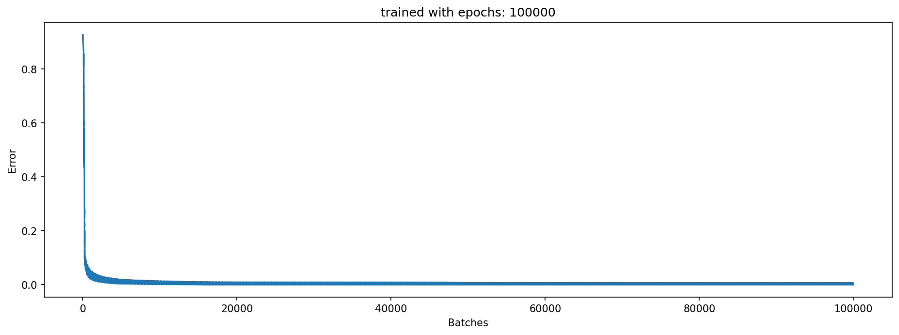
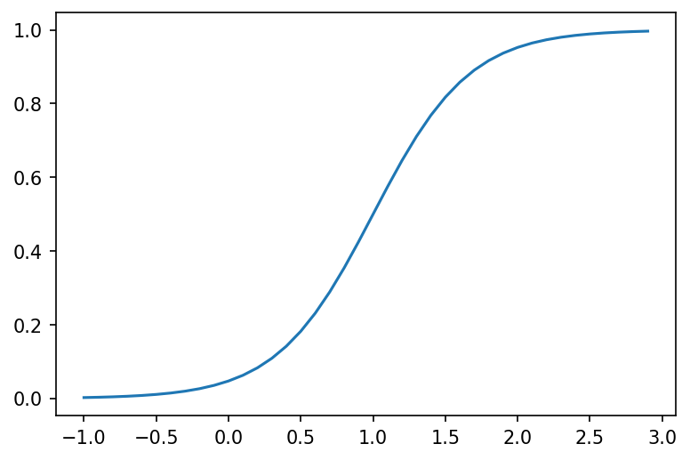
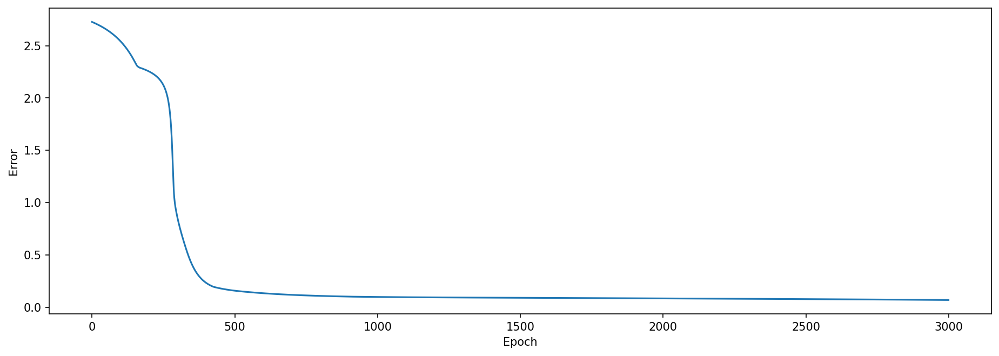
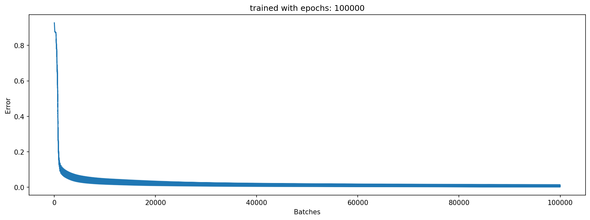

We use the EMNIST dataset of handwritten digits to test a simple
approach for few shot learning. Choosing a fully connected net with inputs
and layer outputs between 0 and 1 and no bias parameters we first trained
the network with a subset of the digits. The pre-trained net is used for few
shot learning with the untrained digits. Two basic idea were necessary:
first the training of the first layer was disabled (or very slow) during few
shot learning, and second using a shot consists of one untrained digit
together with four previously trained digits and perform a training up
to a predefined threshold. This way we reach a 90% accuracy for all
handwritten digits after 10 shots.

This jupyter notebook contains the generation of the tabels and images in the pdf: few_shot_paper.pdf


```python
%%writefile _code_.py ↔

```

    Overwriting _code_.py


```python
#!/usr/bin/env python3
# -*- coding: utf-8 -*-
"""
based on: https://towardsdatascience.com/inroduction-to-neural-networks-in-python-7e0b422e6c24
    and https://stackoverflow.com/questions/29888233/how-to-visualize-a-neural-network/29889993
    and https://towardsdatascience.com/how-to-build-your-own-neural-network-from-scratch-in-python-68998a08e4f6
    and https://www.python-course.eu/neural_network_mnist.php
Created on Sun Jul 19 15:45:02 2020

@author: detlef

INSTALLATION:
use it within anaconda and install cupy if cuda availible
you will need https://www.python-course.eu/data/mnist/mnist_train.csv and https://www.python-course.eu/data/mnist/mnist_test.csv (mnist in csv) in the data/mnist subdirectory
emnist not in anaconda at the moment, use pip install emnist

on Google Colab (turn on GPU!!)
!curl https://colab.chainer.org/install | sh -
!pip install emnist

REMARKS:
    
loss function used = 1/2 SUM(error**2) // making the derivative error
"""

import cupy as np # helps with the math (Cuda supported: faster for hidden_size > 256 probably and most mnist cases with batch training)
#import numpy as np # helps with the math (if no Cuda is availible or size is small for simple tests)
from matplotlib import pyplot
from math import cos, sin, atan
import random
import pickle
from datetime import datetime
from tqdm import tqdm
from emnist import extract_training_samples, extract_test_samples

def np_array(x):
    return np.array(x)# , dtype = np.float32) # float32 is 3 times faster on batch training with GTX1070Ti and 70 times faster than i7-4790K with float64, cpu does not help float32 a lot)
check_for_nan = True

pyplot.rcParams['figure.dpi'] = 150
pyplot.interactive(False) # seems not to fix memory issue

verbose = 0

do_check_all = 0 #1000            # 0 to turn off
check_output_limit = 128        # number of output combinations, as not every neural net is capable of learning input 0 0 0 -> output 1, if 128 the output to the first input is always 0    

multi_test = -1 #1000             # -1 to turn off
max_iter = 30

hidden_size = 64
two_hidden_layers = True
use_bias = False

lr = 2
lr_few_shot = 0.5
use_stability = False
stability_mean = 0.1
clip_weights = 1 # (clipping to 1 was used for most tests)
clip_bias = 1
init_rand_ampl = 0.1
init_rand_ampl0 = 0.1 #2 # for first layer    (2 was used for most tests to make the first layer a mostly random layer)

# drawing parameters
scale_linewidth = 0.1
weight_tanh_scale = 0.1
scale_for_neuron_diff = 1

scale_sigmoid = 3
shift_sigmoid = 1

few_shot_end = 0.2 # for early tests (no mnist)
few_shot_max_try = 100
few_shot_threshold_ratio = 1.5 # for mnist
few_shot_threshold = 0.3

# if 1 it is standard understanding of few shot learning, giving on data point at each shot, otherwize it adds more data points from availible training data to each shot
few_shot_more_at_once = 5
check_wrong = True

all_labels = [0, 1, 9, 3, 4, 5, 6, 7, 8, 2]
# random.shuffle(all_labels)    # if shuffeld, preloading can not work !!!!!
try_load_pretrained = False
few_shot_fast_load_num = 4000 # should also handle the batch_sizes for displaying batch training results properly

test_from_random_input = False
i_bits = 16

# input data
inputs = np_array([[0, 0, 0],
                   [0, 0, 1],
                   [0, 1, 0],
                   [0, 1, 1],
                   [1, 0, 0],
                   [1, 0, 1],
                   [1, 1, 0],
                   [1, 1, 1]])

# output data
outputs = np_array([[0], [0], [1], [0], [1], [1], [0], [1]])

# swith to tanh and making input and output 1 -1 instead of 1 0
do_pm = False

use_emnist = True
load_mnist = True

do_batch_training = 100000
do_drop_weights = [] # [0.9,0.9]
initial_net_first_layer_slow_learning = 1 # 0.1 # most tests are done with 0.1 here, just try if it was really necessary

first_n_to_use = 600000
label_to_one = 5

num_outputs = 10 # most early test need this to be 1, later with mnist dataset this can be set to 10 eg.

try_mnist_few_shot = 10
use_every_shot_n_times = 1 # every data is used n times. so one shot means the data from first shot is used n times
change_first_layers_slow_learning = [0, 1] # [0, 0.1]


disable_progressbar = False

# uncomment to run in jupyter notebook
%run -i _code_.py 
```

    Special few shot configuration, using additional data in every shot. Not the standard understanding of few shot!!!
    labels (last two are used for few_shot) [0, 1, 9, 3, 4, 5, 6, 7, 8, 2]


      0%|          | 0/100000 [00:00<?, ?it/s]

    start 18:21:24


    Err  0.002: 100%|██████████| 100000/100000 [1:18:19<00:00, 21.28it/s]


    end 19:39:44





    train 192000 batch_size 1000 correct 999.0 of 1000 Ratio 0.999 Error 0.0020608174511465515
    test 4000 batch_size 1000 correct 989.0 of 1000 Ratio 0.989 Error 0.01950864256808672
    Testing if new lables were not learned !!!!!!!!!
    new   4000 batch_size 1000 correct 0.0 of 1000 Ratio 0.0 Error 1.6566784770753793
    few shot accuracy results
    shot     try       old labels            new labels  new labels (forced)              over all
       1      1             0.895                 0.492                0.776                 0.815
       2      1             0.952                 0.574                0.754                 0.879
       3      1             0.950                 0.521                0.667                 0.870
       4      1             0.960                 0.535                0.730                 0.878
       5      1             0.856                 0.621                0.677                 0.818
       6      1             0.961                 0.708                0.839                 0.905
       7      1             0.958                 0.666                0.806                 0.900
       8      1             0.949                 0.747                0.844                 0.911
       9      1             0.954                 0.811                0.918                 0.923
      10      1             0.926                 0.836                0.919                 0.908


```python
<div class="burk">
#!/usr/bin/env python3
# -*- coding: utf-8 -*-
"""
based on: https://towardsdatascience.com/inroduction-to-neural-networks-in-python-7e0b422e6c24
    and https://stackoverflow.com/questions/29888233/how-to-visualize-a-neural-network/29889993
    and https://towardsdatascience.com/how-to-build-your-own-neural-network-from-scratch-in-python-68998a08e4f6
    and https://www.python-course.eu/neural_network_mnist.php
Created on Sun Jul 19 15:45:02 2020

@author: detlef

INSTALLATION:
use it within anaconda and install cupy if cuda availible
you will need https://www.python-course.eu/data/mnist/mnist_train.csv and https://www.python-course.eu/data/mnist/mnist_test.csv (mnist in csv) in the data/mnist subdirectory
emnist not in anaconda at the moment, use pip install emnist

on Google Colab (turn on GPU!!)
!curl https://colab.chainer.org/install | sh -
!pip install emnist

REMARKS:
    
loss function used = 1/2 SUM(error**2) // making the derivative error
"""

import cupy as np # helps with the math (Cuda supported: faster for hidden_size > 256 probably and most mnist cases with batch training)
#import numpy as np # helps with the math (if no Cuda is availible or size is small for simple tests)
from matplotlib import pyplot
from math import cos, sin, atan
import random
import pickle
from datetime import datetime
from tqdm import tqdm
from emnist import extract_training_samples, extract_test_samples

def np_array(x):
    return np.array(x)# , dtype = np.float32) # float32 is 3 times faster on batch training with GTX1070Ti and 70 times faster than i7-4790K with float64, cpu does not help float32 a lot)
check_for_nan = True

pyplot.rcParams['figure.dpi'] = 150
pyplot.interactive(False) # seems not to fix memory issue

verbose = 0

do_check_all = 0 #1000            # 0 to turn off
check_output_limit = 128        # number of output combinations, as not every neural net is capable of learning input 0 0 0 -> output 1, if 128 the output to the first input is always 0    

multi_test = -1 #1000             # -1 to turn off
max_iter = 30

hidden_size = 64
two_hidden_layers = True
use_bias = False

lr = 2
lr_few_shot = 0.5
use_stability = False
stability_mean = 0.1
clip_weights = 1 # (clipping to 1 was used for most tests)
clip_bias = 1
init_rand_ampl = 0.1
init_rand_ampl0 = 0.1 #2 # for first layer    (2 was used for most tests to make the first layer a mostly random layer)

# drawing parameters
scale_linewidth = 0.1
weight_tanh_scale = 0.1
scale_for_neuron_diff = 1

scale_sigmoid = 3
shift_sigmoid = 1

few_shot_end = 0.2 # for early tests (no mnist)
few_shot_max_try = 100
few_shot_threshold_ratio = 1.5 # for mnist
few_shot_threshold = 0.3

# if 1 it is standard understanding of few shot learning, giving on data point at each shot, otherwize it adds more data points from availible training data to each shot
few_shot_more_at_once = 5
check_wrong = True

all_labels = [0, 1, 9, 3, 4, 5, 6, 7, 8, 2]
# random.shuffle(all_labels)    # if shuffeld, preloading can not work !!!!!
try_load_pretrained = True
few_shot_fast_load_num = 4000 # should also handle the batch_sizes for displaying batch training results properly

test_from_random_input = False
i_bits = 16

# input data
inputs = np_array([[0, 0, 0],
                   [0, 0, 1],
                   [0, 1, 0],
                   [0, 1, 1],
                   [1, 0, 0],
                   [1, 0, 1],
                   [1, 1, 0],
                   [1, 1, 1]])

# output data
outputs = np_array([[0], [0], [1], [0], [1], [1], [0], [1]])

# swith to tanh and making input and output 1 -1 instead of 1 0
do_pm = False

use_emnist = True
load_mnist = True

do_batch_training = 100000
do_drop_weights = [] # [0.9,0.9]
initial_net_first_layer_slow_learning = 1 # 0.1 # most tests are done with 0.1 here, just try if it was really necessary

first_n_to_use = 600000
label_to_one = 5

num_outputs = 10 # most early test need this to be 1, later with mnist dataset this can be set to 10 eg.

try_mnist_few_shot = 10
use_every_shot_n_times = 1 # every data is used n times. so one shot means the data from first shot is used n times
change_first_layers_slow_learning = [1, 1] # [0, 0.1]


disable_progressbar = False

# uncomment to run in jupyter notebook
%run -i _code_.py </div><i class="fa fa-lightbulb-o "></i>
```

    Special few shot configuration, using additional data in every shot. Not the standard understanding of few shot!!!
    labels (last two are used for few_shot) [0, 1, 9, 3, 4, 5, 6, 7, 8, 2]
    Network parameters:  54912 dropped 0 real parameters 54912 drop definition []
    loaded pretrained net !!!!!!!!!!!!!!!!!!!!!!!!!!!!


    train 4000 batch_size 1000 correct 999.0 of 1000 Ratio 0.999 Error 0.0011126788119728693
    test 4000 batch_size 1000 correct 989.0 of 1000 Ratio 0.989 Error 0.01950864256808672
    Testing if new lables were not learned !!!!!!!!!
    new   4000 batch_size 1000 correct 0.0 of 1000 Ratio 0.0 Error 1.6566784770753793
    few shot accuracy results
    shot     try       old labels            new labels  new labels (forced)              over all
       1      1             0.485                 0.597                0.706                 0.496
       2      1             0.296                 0.669                0.716                 0.357
       3      1             0.288                 0.310                0.670                 0.289
       4      1             0.335                 0.677                0.727                 0.399
       5      1             0.387                 0.683                0.811                 0.443
       6      1             0.382                 0.720                0.806                 0.438
       7      1             0.400                 0.759                0.893                 0.474
       8      1             0.352                 0.845                0.900                 0.442
       9      1             0.487                 0.502                0.820                 0.479
      10      1             0.386                 0.617                0.947                 0.433


```python
<div class="girk">
#!/usr/bin/env python3
# -*- coding: utf-8 -*-
"""
based on: https://towardsdatascience.com/inroduction-to-neural-networks-in-python-7e0b422e6c24
    and https://stackoverflow.com/questions/29888233/how-to-visualize-a-neural-network/29889993
    and https://towardsdatascience.com/how-to-build-your-own-neural-network-from-scratch-in-python-68998a08e4f6
    and https://www.python-course.eu/neural_network_mnist.php
Created on Sun Jul 19 15:45:02 2020

@author: detlef

INSTALLATION:
use it within anaconda and install cupy if cuda availible
you will need https://www.python-course.eu/data/mnist/mnist_train.csv and https://www.python-course.eu/data/mnist/mnist_test.csv (mnist in csv) in the data/mnist subdirectory
emnist not in anaconda at the moment, use pip install emnist

on Google Colab (turn on GPU!!)
!curl https://colab.chainer.org/install | sh -
!pip install emnist

REMARKS:
    
loss function used = 1/2 SUM(error**2) // making the derivative error
"""

import cupy as np # helps with the math (Cuda supported: faster for hidden_size > 256 probably and most mnist cases with batch training)
#import numpy as np # helps with the math (if no Cuda is availible or size is small for simple tests)
from matplotlib import pyplot
from math import cos, sin, atan
import random
import pickle
from datetime import datetime
from tqdm import tqdm
from emnist import extract_training_samples, extract_test_samples

def np_array(x):
    return np.array(x)# , dtype = np.float32) # float32 is 3 times faster on batch training with GTX1070Ti and 70 times faster than i7-4790K with float64, cpu does not help float32 a lot)
check_for_nan = True

pyplot.rcParams['figure.dpi'] = 150
pyplot.interactive(False) # seems not to fix memory issue

verbose = 0

do_check_all = 0 #1000            # 0 to turn off
check_output_limit = 128        # number of output combinations, as not every neural net is capable of learning input 0 0 0 -> output 1, if 128 the output to the first input is always 0    

multi_test = -1 #1000             # -1 to turn off
max_iter = 30

hidden_size = 64
two_hidden_layers = True
use_bias = False

lr = 2
lr_few_shot = 0.5
use_stability = False
stability_mean = 0.1
clip_weights = 1 # (clipping to 1 was used for most tests)
clip_bias = 1
init_rand_ampl = 0.1
init_rand_ampl0 = 0.1 #2 # for first layer    (2 was used for most tests to make the first layer a mostly random layer)

# drawing parameters
scale_linewidth = 0.1
weight_tanh_scale = 0.1
scale_for_neuron_diff = 1

scale_sigmoid = 3
shift_sigmoid = 1

few_shot_end = 0.2 # for early tests (no mnist)
few_shot_max_try = 100
few_shot_threshold_ratio = 1.5 # for mnist
few_shot_threshold = 0.3

# if 1 it is standard understanding of few shot learning, giving on data point at each shot, otherwize it adds more data points from availible training data to each shot
few_shot_more_at_once = 1
check_wrong = True

all_labels = [0, 1, 9, 3, 4, 5, 6, 7, 8, 2]
# random.shuffle(all_labels)    # if shuffeld, preloading can not work !!!!!
try_load_pretrained = True
few_shot_fast_load_num = 4000 # should also handle the batch_sizes for displaying batch training results properly

test_from_random_input = False
i_bits = 16

# input data
inputs = np_array([[0, 0, 0],
                   [0, 0, 1],
                   [0, 1, 0],
                   [0, 1, 1],
                   [1, 0, 0],
                   [1, 0, 1],
                   [1, 1, 0],
                   [1, 1, 1]])

# output data
outputs = np_array([[0], [0], [1], [0], [1], [1], [0], [1]])

# swith to tanh and making input and output 1 -1 instead of 1 0
do_pm = False

use_emnist = True
load_mnist = True

do_batch_training = 100000
do_drop_weights = [] # [0.9,0.9]
initial_net_first_layer_slow_learning = 1 # 0.1 # most tests are done with 0.1 here, just try if it was really necessary

first_n_to_use = 600000
label_to_one = 5

num_outputs = 10 # most early test need this to be 1, later with mnist dataset this can be set to 10 eg.

try_mnist_few_shot = 10
use_every_shot_n_times = 1 # every data is used n times. so one shot means the data from first shot is used n times
change_first_layers_slow_learning = [0, 1] # [0, 0.1]


disable_progressbar = False

# uncomment to run in jupyter notebook
%run -i _code_.py </div><i class="fa fa-lightbulb-o "></i>
```

    labels (last two are used for few_shot) [0, 1, 9, 3, 4, 5, 6, 7, 8, 2]
    Network parameters:  54912 dropped 0 real parameters 54912 drop definition []
    loaded pretrained net !!!!!!!!!!!!!!!!!!!!!!!!!!!!


    train 4000 batch_size 1000 correct 999.0 of 1000 Ratio 0.999 Error 0.0011126788119728693
    test 4000 batch_size 1000 correct 989.0 of 1000 Ratio 0.989 Error 0.01950864256808672
    Testing if new lables were not learned !!!!!!!!!
    new   4000 batch_size 1000 correct 0.0 of 1000 Ratio 0.0 Error 1.6566784770753793
    few shot accuracy results
    shot     try       old labels            new labels  new labels (forced)              over all
       1      1             0.569                 0.508                0.517                 0.558
       2      1             0.672                 0.642                0.659                 0.661
       3      1             0.565                 0.505                0.517                 0.557
       4      1             0.649                 0.501                0.529                 0.626
       5      1             0.564                 0.642                0.661                 0.584
       6      1             0.684                 0.724                0.733                 0.696
       7      1             0.364                 0.515                0.517                 0.398
       8      1             0.458                 0.525                0.536                 0.474
       9      1             0.454                 0.532                0.541                 0.477
      10      1             0.451                 0.784                0.792                 0.508


```python
x = []
y = []
for xx in np.arange(-1,3,0.1):
    x.append(xx)
    y.append(sigmoid(xx))
pyplot.plot(x,y)
pyplot.show()
```





```python
hidden_size = 4
inputs= np.array([[0,0,0,0,0]])
num_outputs = 3
outputs= np.array([[0,0,0]])
NN2 = setup_net()
NN2.set_input(inputs[0],outputs[0])
NN2.forward()
NN2.draw()
```





```python
#!/usr/bin/env python3
# -*- coding: utf-8 -*-
"""
based on: https://towardsdatascience.com/inroduction-to-neural-networks-in-python-7e0b422e6c24
    and https://stackoverflow.com/questions/29888233/how-to-visualize-a-neural-network/29889993
    and https://towardsdatascience.com/how-to-build-your-own-neural-network-from-scratch-in-python-68998a08e4f6
    and https://www.python-course.eu/neural_network_mnist.php
Created on Sun Jul 19 15:45:02 2020

@author: detlef

INSTALLATION:
use it within anaconda and install cupy if cuda availible
you will need https://www.python-course.eu/data/mnist/mnist_train.csv and https://www.python-course.eu/data/mnist/mnist_test.csv (mnist in csv) in the data/mnist subdirectory
emnist not in anaconda at the moment, use pip install emnist

on Google Colab (turn on GPU!!)
!curl https://colab.chainer.org/install | sh -
!pip install emnist

REMARKS:
    
loss function used = 1/2 SUM(error**2) // making the derivative error
"""

import cupy as np # helps with the math (Cuda supported: faster for hidden_size > 256 probably and most mnist cases with batch training)
#import numpy as np # helps with the math (if no Cuda is availible or size is small for simple tests)
from matplotlib import pyplot
from math import cos, sin, atan
import random
import pickle
from datetime import datetime
from tqdm import tqdm
from emnist import extract_training_samples, extract_test_samples

def np_array(x):
    return np.array(x)# , dtype = np.float32) # float32 is 3 times faster on batch training with GTX1070Ti and 70 times faster than i7-4790K with float64, cpu does not help float32 a lot)
check_for_nan = True

pyplot.rcParams['figure.dpi'] = 150
pyplot.interactive(False) # seems not to fix memory issue

verbose = 0

do_check_all = 0 #1000            # 0 to turn off
check_output_limit = 128        # number of output combinations, as not every neural net is capable of learning input 0 0 0 -> output 1, if 128 the output to the first input is always 0    

multi_test = -1 #1000             # -1 to turn off
max_iter = 30

hidden_size = 64
two_hidden_layers = True
use_bias = False

lr = 2
lr_few_shot = 0.5
use_stability = False
stability_mean = 0.1
clip_weights = 1 # (clipping to 1 was used for most tests)
clip_bias = 1
init_rand_ampl = 0.1
init_rand_ampl0 = 0.1 #2 # for first layer    (2 was used for most tests to make the first layer a mostly random layer)

# drawing parameters
scale_linewidth = 0.1
weight_tanh_scale = 0.1
scale_for_neuron_diff = 1

scale_sigmoid = 3
shift_sigmoid = 1

few_shot_end = 0.2 # for early tests (no mnist)
few_shot_max_try = 100
few_shot_threshold_ratio = 1.5 # for mnist
few_shot_threshold = 0.3

# if 1 it is standard understanding of few shot learning, giving on data point at each shot, otherwize it adds more data points from availible training data to each shot
few_shot_more_at_once = 5
check_wrong = True

all_labels = [0, 1, 9, 3, 4, 5, 6, 7, 8, 2]
# random.shuffle(all_labels)    # if shuffeld, preloading can not work !!!!!
try_load_pretrained = False
few_shot_fast_load_num = 4000 # should also handle the batch_sizes for displaying batch training results properly

test_from_random_input = False
i_bits = 16

# input data
inputs = np_array([[0, 0, 0],
                   [0, 0, 1],
                   [0, 1, 0],
                   [0, 1, 1],
                   [1, 0, 0],
                   [1, 0, 1],
                   [1, 1, 0],
                   [1, 1, 1]])

# output data
outputs = np_array([[0], [0], [1], [0], [1], [1], [0], [1]])

# swith to tanh and making input and output 1 -1 instead of 1 0
do_pm = False

use_emnist = True
load_mnist = True

do_batch_training = 100000
do_drop_weights = [] # [0.9,0.9]
initial_net_first_layer_slow_learning = 0.01 # 0.1 # most tests are done with 0.1 here, just try if it was really necessary

first_n_to_use = 600000
label_to_one = 5

num_outputs = 10 # most early test need this to be 1, later with mnist dataset this can be set to 10 eg.

try_mnist_few_shot = 10
use_every_shot_n_times = 1 # every data is used n times. so one shot means the data from first shot is used n times
change_first_layers_slow_learning = [0.01, 1] # [0, 0.1]


disable_progressbar = False

# uncomment to run in jupyter notebook
%run -i _code_.py 
```

    Special few shot configuration, using additional data in every shot. Not the standard understanding of few shot!!!
    labels (last two are used for few_shot) [0, 1, 9, 3, 4, 5, 6, 7, 8, 2]


      0%|          | 0/100000 [00:00<?, ?it/s]

    start 15:55:56


    Err  0.007: 100%|██████████| 100000/100000 [1:17:58<00:00, 21.37it/s]


    end 17:13:55





    train 192000 batch_size 1000 correct 996.0 of 1000 Ratio 0.996 Error 0.008494603222037725
    test 4000 batch_size 1000 correct 989.0 of 1000 Ratio 0.989 Error 0.021232006355433916
    Testing if new lables were not learned !!!!!!!!!
    new   4000 batch_size 1000 correct 0.0 of 1000 Ratio 0.0 Error 1.5956471595383732
    few shot accuracy results
    shot     try       old labels            new labels  new labels (forced)              over all
       1      1             0.896                 0.409                0.645                 0.809
       2      1             0.754                 0.573                0.699                 0.722
       3      1             0.926                 0.484                0.667                 0.841
       4      1             0.855                 0.637                0.832                 0.816
       5      1             0.836                 0.730                0.821                 0.813
       6      1             0.890                 0.574                0.688                 0.830
       7      1             0.935                 0.683                0.893                 0.880
       8      1             0.879                 0.778                0.881                 0.860
       9      1             0.878                 0.806                0.914                 0.865
      10      1             0.874                 0.801                0.906                 0.862

