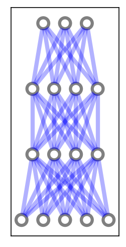

## towards_few_shot_learning
Jupyter notebook with some steps towards few shot learning

We run this jupyter notebook within conda and have installed cupy (using conda) and emnist (using pip).

We start defining some functions for later use. They are code folded here to keep the notebook readable.


```python
%%writefile _code_.py↔

```

    Overwriting _code_.py


Here a set of constants are defined, which control the configuration of the test network. There are a number of constants, which are not important at the moment, as it the code is a playing tool.


```python
#import cupy as np # helps with the math (Cuda supported: faster for hidden_size > 256 probably and most mnist cases with batch training)
import numpy as np # helps with the math (if no Cuda is availible or size is small for simple tests)
from matplotlib import pyplot
from math import cos, sin, atan
import random
import pickle
from datetime import datetime
from tqdm import tqdm
from emnist import extract_training_samples, extract_test_samples

def np_array(x):
    return np.array(x)# , dtype = np.float32) # float32 is 3 times faster on batch training with GTX1070Ti and 70 times faster than i7-4790K with float64, cpu does not help float32 a lot)
check_for_nan = True

pyplot.rcParams['figure.dpi'] = 150
pyplot.interactive(False) # seems not to fix memory issue

verbose = 0

do_check_all = 0 #1000            # 0 to turn off
check_output_limit = 128        # number of output combinations, as not every neural net is capable of learning input 0 0 0 -> output 1, if 128 the output to the first input is always 0    

multi_test = -1 #1000             # -1 to turn off
max_iter = 30

hidden_size = 8
two_hidden_layers = True
use_bias = False

lr = 2
lr_few_shot = 0.5
use_stability = False
stability_mean = 0.1
clip_weights = 1 # (clipping to 1 was used for most tests)
clip_bias = 1
init_rand_ampl = 0.1
init_rand_ampl0 = 0.1 # for first layer    (2 was used for most tests to make the first layer a mostly random layer)

# drawing parameters
scale_linewidth = 0.1
weight_tanh_scale = 0.1
scale_for_neuron_diff = 1

scale_sigmoid = 3
shift_sigmoid = 1

few_shot_end = 0.7 # for early tests (no mnist)
few_shot_max_try = 100
few_shot_threshold_ratio = 1.5 # for mnist
few_shot_threshold = 0.3

# if 1 it is standard understanding of few shot learning, giving on data point at each shot, otherwize it adds more data points from availible training data to each shot
few_shot_more_at_once = 1


all_labels = [0, 1, 9, 3, 4, 5, 6, 7, 8, 2]
# random.shuffle(all_labels)    # if shuffeld, preloading can not work !!!!!

try_load_pretrained = False
few_shot_fast_load_num = 4000 # should also handle the batch_sizes for displaying batch training results properly

test_from_random_input = False
i_bits = 8

# input data
inputs = np_array([[0, 0, 0],
                   [0, 0, 1],
                   [0, 1, 0],
                   [0, 1, 1],
                   [1, 0, 0],
                   [1, 0, 1],
                   [1, 1, 0],
                   [1, 1, 1]])

# output data
outputs = np_array([[0], [0], [0], [0], [1], [1], [0], [1]])

# swith to tanh and making input and output 1 -1 instead of 1 0
do_pm = False

use_emnist = False
load_mnist = False

do_batch_training = 0
do_drop_weights = [] # [0.9,0.9]
initial_net_first_layer_slow_learning = 0.1 # most tests are done with 0.1 here, just try if it was really necessary

first_n_to_use = 600000
label_to_one = 5

num_outputs = 1 # most early test need this to be 1, later with mnist dataset this can be set to 10 eg.

try_mnist_few_shot = 10
use_every_shot_n_times = 10 # every data is used n times. so one shot means the data from first shot is used n times
change_first_layers_slow_learning = [0.1, 1] # [0, 0.1]

disable_progressbar = True
# End of constant definitions
```

We define a input output combination, which should be learned


```python
for i in range(len(outputs)):
    print(inputs[i][0], inputs[i][1], inputs[i][2], '-->', outputs[i])
```

    0 0 0 --> [0]
    0 0 1 --> [0]
    0 1 0 --> [0]
    0 1 1 --> [0]
    1 0 0 --> [1]
    1 0 1 --> [1]
    1 1 0 --> [0]
    1 1 1 --> [1]


Now let's test training the net and draw the result


```python
NN2 = setup_net()
NN2.set_input(inputs, outputs)
NN2.train(3000)
NN2.plot_train_history()
NN2.set_input(inputs[5], outputs[5])
NN2.forward()
NN2.draw(outputs[5])
```





Here you see propagating the input up to the output. The big circle around the output is the 'correct' answer, we trained for.
If one tries different input -> output relations it can be seen, that not all are trained correct every time. Here it starts to become interesting, as the training success depends on the random initialization of the weights within the layers. It might also be possible, that the network is not capable to learn the input output relation. For example we choose a network, which is not very powerfull, as it does not contain bias and uses sigmoid activation layers. If all inputs are 0 the output must be 0 therefore. We check all other input output combinations and see, that the network is capable of learning them:


```python
lr = 2
hidden_size = 8
missed = 0
stats = {}
for k in range(8):
    stats[k] = 0
for i in range(128):
    for k in range(8):
        NN2 = setup_net()
        bbs = ('{0:0'+str(i_bits)+'b}').format(i)
        outputs = bbs_to_output(bbs)
        NN2.set_input(inputs, outputs)
        NN2.train(5000 * 2 ** k)
        errsum = np.sum(NN2.error**2)
        if errsum <= 0.25:
            break
    stats[k] += 1
    if errsum > 0.25:
        missed += 1
    print('%4d %8s %6.3f %3d %d' % (i, bbs, errsum, missed, k))
print('tried %4d  missed: %3d' % (i + 1, missed), stats)
```

       0 00000000  0.002   0 0
       1 00000001  0.016   0 0
       2 00000010  0.035   0 0
       3 00000011  0.012   0 0
       4 00000100  0.037   0 0
       5 00000101  0.010   0 0
       6 00000110  0.013   0 0
       7 00000111  0.021   0 0
       8 00001000  0.034   0 0
       9 00001001  0.013   0 1
      10 00001010  0.043   0 0
      11 00001011  0.024   0 0
      12 00001100  0.039   0 0
      13 00001101  0.017   0 0
      14 00001110  0.036   0 0
      15 00001111  0.030   0 0
      16 00010000  0.044   0 0
      17 00010001  0.009   0 0
      18 00010010  0.037   0 0
      19 00010011  0.008   0 0
      20 00010100  0.043   0 0
      21 00010101  0.018   0 0
      22 00010110  0.016   0 0
      23 00010111  0.009   0 0
      24 00011000  0.006   0 2
      25 00011001  0.018   0 1
      26 00011010  0.083   0 0
      27 00011011  0.059   0 0
      28 00011100  0.113   0 0
      29 00011101  0.011   0 0
      30 00011110  0.155   0 1
      31 00011111  0.029   0 0
      32 00100000  0.036   0 0
      33 00100001  0.027   0 0
      34 00100010  0.038   0 0
      35 00100011  0.020   0 0
      36 00100100  0.006   0 2
      37 00100101  0.021   0 1
      38 00100110  0.067   0 0
      39 00100111  0.073   0 0
      40 00101000  0.065   0 0
      41 00101001  0.200   0 0
      42 00101010  0.044   0 0
      43 00101011  0.034   0 0
      44 00101100  0.065   0 0
      45 00101101  0.130   0 1
      46 00101110  0.046   0 0
      47 00101111  0.034   0 0
      48 00110000  0.039   0 0
      49 00110001  0.028   0 0
      50 00110010  0.048   0 0
      51 00110011  0.029   0 0
      52 00110100  0.145   0 0
      53 00110101  0.017   0 0
      54 00110110  0.019   0 2
      55 00110111  0.038   0 0
      56 00111000  0.059   0 0
      57 00111001  0.097   0 3
      58 00111010  0.049   0 0
      59 00111011  0.032   0 0
      60 00111100  0.063   0 0
      61 00111101  0.076   0 0
      62 00111110  0.013   0 0
      63 00111111  0.019   0 0
      64 01000000  0.035   0 0
      65 01000001  0.054   0 0
      66 01000010  0.017   0 1
      67 01000011  0.013   0 2
      68 01000100  0.038   0 0
      69 01000101  0.022   0 0
      70 01000110  0.154   0 0
      71 01000111  0.032   0 0
      72 01001000  0.066   0 0
      73 01001001  0.108   0 0
      74 01001010  0.063   0 0
      75 01001011  0.096   0 4
      76 01001100  0.038   0 0
      77 01001101  0.031   0 0
      78 01001110  0.040   0 0
      79 01001111  0.034   0 0
      80 01010000  0.036   0 0
      81 01010001  0.010   0 0
      82 01010010  0.121   0 0
      83 01010011  0.044   0 0
      84 01010100  0.048   0 0
      85 01010101  0.029   0 0
      86 01010110  0.072   0 1
      87 01010111  0.045   0 0
      88 01011000  0.172   0 0
      89 01011001  0.011   0 3
      90 01011010  0.064   0 0
      91 01011011  0.028   0 0
      92 01011100  0.036   0 0
      93 01011101  0.037   0 0
      94 01011110  0.046   0 0
      95 01011111  0.020   0 0
      96 01100000  0.057   0 0
      97 01100001  0.063   0 1
      98 01100010  0.129   0 0
      99 01100011  0.012   0 2
     100 01100100  0.077   0 0
     101 01100101  0.137   0 3
     102 01100110  0.054   0 0
     103 01100111  0.099   0 0
     104 01101000  0.079   0 0
     105 01101001  0.071   0 2
     106 01101010  0.165   0 1
     107 01101011  0.101   0 0
     108 01101100  0.162   0 1
     109 01101101  0.063   0 0
     110 01101110  0.052   0 0
     111 01101111  0.036   0 0
     112 01110000  0.044   0 0
     113 01110001  0.032   0 0
     114 01110010  0.045   0 0
     115 01110011  0.034   0 0
     116 01110100  0.051   0 0
     117 01110101  0.033   0 0
     118 01110110  0.048   0 0
     119 01110111  0.020   0 0
     120 01111000  0.061   0 1
     121 01111001  0.047   0 1
     122 01111010  0.055   0 0
     123 01111011  0.029   0 0
     124 01111100  0.056   0 0
     125 01111101  0.036   0 0
     126 01111110  0.034   0 0
     127 01111111  0.014   0 0
    tried  128  missed:   0 {0: 106, 1: 12, 2: 6, 3: 3, 4: 1, 5: 0, 6: 0, 7: 0}


 From the list one can identify difficult combinations to train. If one runs them, sometimes it fails...


```python
lr = 1
NN2 = setup_net()
outputs = bbs_to_output('01101100')
NN2.set_input(inputs, outputs)
NN2.train(30000)
NN2.plot_train_history()
i=3
NN2.set_input(inputs[i],outputs[i])
NN2.forward()
NN2.draw(outputs[i])
```


Now we will try so called few shot learning. As you can see from the training graph abough, usually the network uses every input output combination a very big number of times till the training is good. This is different from humans, which usualy learn a task with very few examples. We try this now


```python
multi_test = 30 
%run -i _code_.py
```

      0 Label 00100001 Error  1.501     Ready   1
      1 Label 01010010 Error  1.679     Ready   2
      2 Label 00000100 Error  0.396     Ready   1
      3 Label 00111100 Error  0.504     Ready   2
      4 Label 00010001 Error  0.268     Ready   2
      5 Label 01000011 Error  1.339     Ready   7
      6 Label 01100001 Error  1.701     Ready   1
      7 Label 00000000 Error  0.010     Ready   0
      8 Label 00101000 Error  1.147     Ready   1
      9 Label 00011110 Error  1.153     Ready   2
     10 Label 01110001 Error  0.209     Ready   1
     11 Label 00011111 Error  0.297     Ready   2
     12 Label 01011110 Error  0.307     Ready   3
     13 Label 01111001 Error  0.298     Ready   1
     14 Label 01000110 Error  0.292     Ready   5
     15 Label 00111111 Error  0.131     Ready   3
     16 Label 01001100 Error  0.125     Ready   3
     17 Label 01011111 Error  0.103     Ready   1
     18 Label 00001011 Error  0.024     Ready   3
     19 Label 00011100 Error  0.174     Ready   5
     20 Label 01110101 Error  0.091     Ready   2
     21 Label 00110101 Error  0.181     Ready   3
     22 Label 01001010 Error  0.240     Ready   8
     23 Label 00000110 Error  1.769     Ready  30
     24 Label 01110001 Error  0.045     Ready   5
     25 Label 00000001 Error  0.071     Ready   5
     26 Label 00100011 Error  0.045     Ready   3
     27 Label 00100101 Error  0.491     Ready   2
     28 Label 00111010 Error  0.082     Ready   4
     29 Label 01001011 Error  0.076     Ready   4
     30 Label 00010101 Error  0.114     Ready   3


as you can see, with seeing every data point only a small number of times, this trains the model. We use a very simple straight forward approach. With one data point we do a training up to a treshold, than we take the next data point. From the table you can see, that most of the time the training is successfull, but sometimes it is not.

In fact the training here is a little more improved: For every test we reinitialize the random weights of the last layer and train with a different randomly chosen output combination. We train the first layer with a slower learning rate, but this is not yet important. This simple examples work even without this additional improvments.

Now we will start using emnist data, which will result in few shot learning of handwritten digit recognition.
